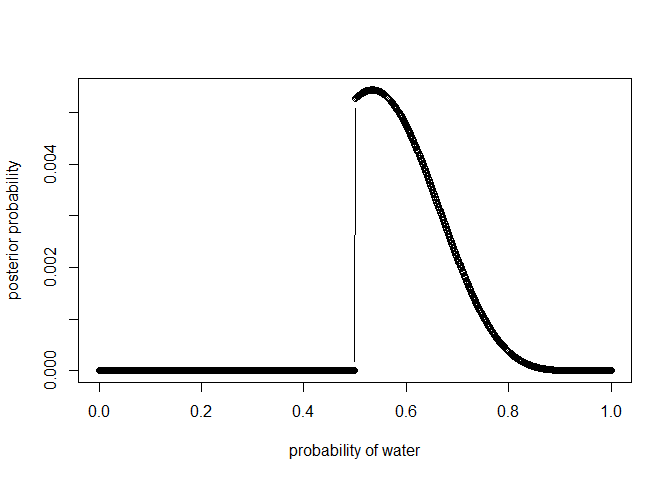

# Statistical Rethinking Chapter 3 problems

__Name: Jessica Tucci__

## 3E1

```r
p_grid <- seq( from=0 , to=1 , length.out=1000 ) 
prior <- rep( 1 , 1000 )
likelihood <- dbinom( 6 , size=9 , prob=p_grid )
posterior <- likelihood * prior
posterior <- posterior / sum(posterior)
set.seed(100)
samples <- sample( p_grid , prob=posterior , size=1e4 , replace=TRUE )

sum(samples<0.2)/1e4
```

```
## [1] 5e-04
```

## 3E2

```r
sum(samples>0.8)/1e4
```

```
## [1] 0.1117
```
## 3E3

```r
sum(samples > 0.2 & samples < 0.8)/1e4
```

```
## [1] 0.8878
```
## 3E4

```r
quantile( samples , 0.2 )
```

```
##       20% 
## 0.5195195
```
## 3E5

```r
quantile( samples , 0.8 )
```

```
##       80% 
## 0.7567568
```
## 3E6

```r
suppressMessages(library(rethinking))
HPDI( samples , prob=0.66 )
```

```
##     |0.66     0.66| 
## 0.5205205 0.7847848
```
## 3E7

```r
library(rethinking)
PI( samples , prob=0.66 )
```

```
##       17%       83% 
## 0.5005005 0.7687688
```
## 3M1

```r
p_grid <- seq( from=0 , to=1 , length.out=1000 ) 
prior <- rep( 1 , 1000 )
likelihood <- dbinom( 8 , size=15 , prob=p_grid )
posterior <- likelihood * prior
posterior <- posterior / sum(posterior)
plot( p_grid , posterior , type="b" ,
xlab="probability of water" , ylab="posterior probability")
```


## 3M2

```r
set.seed(100)
samples <- sample( p_grid , prob=posterior , size=1e4 , replace=TRUE )
HPDI( samples , prob=0.9 )
```

```
##      |0.9      0.9| 
## 0.3243243 0.7157157
```

_STOP AFTER 3M2 FOR 02/25 ASSIGNMENT_

## 3M3

```r
w <- rbinom( 1e4 , size=15 , prob=samples )
simplehist(w)
```


```r
sum(w==8)/length(w)
```

```
## [1] 0.1475
```

## 3M4

```r
w <- rbinom( 1e4 , size=9 , prob=samples )
simplehist(w)
```


```r
sum(w==6)/length(w)
```

```
## [1] 0.1766
```

## 3M5
#1

```r
p_grid <- seq( from=0 , to=1 , length.out=1000 )
prior <- ifelse( p_grid < 0.5 , 0 , 1 )
likelihood <- dbinom( 8 , size=15 , prob=p_grid )
posterior <- likelihood * prior
posterior <- posterior / sum(posterior)
plot( p_grid , posterior , type="b" ,
xlab="probability of water" , ylab="posterior probability")
```



#2

```r
set.seed(100)
samples <- sample( p_grid , prob=posterior , size=1e4 , replace=TRUE )
HPDI( samples , prob=0.9 )
```

```
##      |0.9      0.9| 
## 0.5005005 0.7077077
```

#3

```r
w <- rbinom( 1e4 , size=15 , prob=samples )
simplehist(w)
```


```r
sum(w==8)/length(w)
```

```
## [1] 0.1617
```

#4

```r
w <- rbinom( 1e4 , size=9 , prob=samples )
simplehist(w)
```


```r
sum(w==6)/length(w)
```

```
## [1] 0.2376
```

The HPDI becomes a smaller interval when using the second prior.

## 3H1

```r
library(rethinking)
data(homeworkch3)

p_grid <- seq( from=0 , to=1 , length.out=1000 ) 
prior <- rep( 1 , 1000 )
totalboys=sum(birth1)+sum(birth2)
totalbirths=length(birth1)+length(birth2)
likelihood <- dbinom( totalboys , size=totalbirths , prob=p_grid )
posterior <- likelihood * prior
posterior <- posterior / sum(posterior)

plot( p_grid , posterior , type="b" ,
xlab="probability of boy" , ylab="posterior probability")
```


```r
p_grid[which.max(posterior)]
```

```
## [1] 0.5545546
```

## 3H2

```r
samples <- sample( p_grid , prob=posterior , size=10000 , replace=TRUE )
HPDI( samples , prob=0.5 )
```

```
##      |0.5      0.5| 
## 0.5305305 0.5765766
```

```r
HPDI( samples , prob=0.89 )
```

```
##     |0.89     0.89| 
## 0.4994995 0.6106106
```

```r
HPDI( samples , prob=0.97 )
```

```
##     |0.97     0.97| 
## 0.4824825 0.6326326
```

## 3H3

```r
b <- rbinom( 10000 , size=200 , prob=samples )
simplehist(b)
```


Yes, the model seems to fit the data of 111 boys out of 200 births well.

## 3H4

```r
b <- rbinom( 10000 , size=100 , prob=samples )
simplehist(b)
```


The model seems slightly skewed right when compared to 51 boys out of 100 in birth1.

## 3H5

```r
#simulated counts of boys following girls:
firstgirl=sum(birth1==0)
b <- rbinom( 10000 , size=firstgirl , prob=samples )
simplehist(b)
```


```r
#acctual count of boys following girls
sum(subset(birth2,birth1==0))
```

```
## [1] 39
```

The acctual count is much higher than the model would predict. The likelihood of having a boy after having a first born girl seems to be higher than expected. The assumption of independence may not be true.
