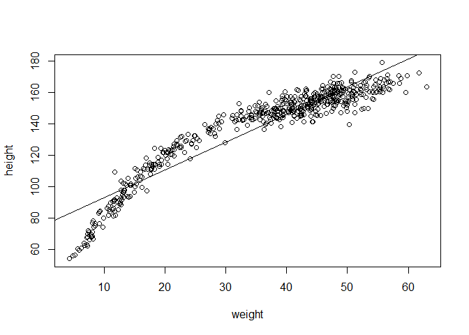
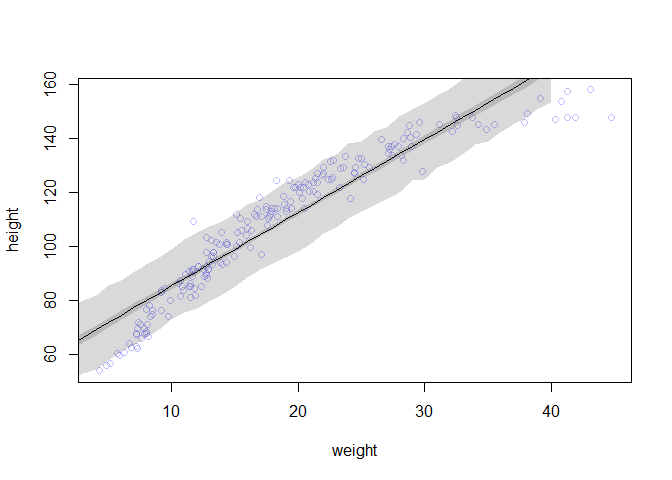
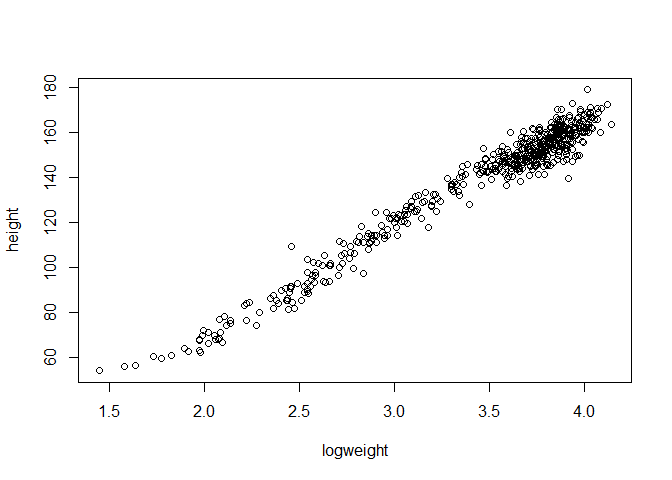
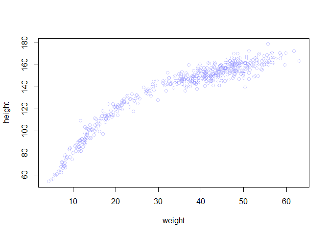

# Statistical Rethinking Chapter 4 problems

__Name:__


# For 03/17/16

## 4E1
line one

## 4E2
two (Mu and Sigma)

## 4E3
Posterior=(Likelihood X Prior)/Average Likelihood

pr(μ,σ|y) = ∏i Normal(yi|μ,σ)Normal(μ|0,10)Uniform(σ|0,10) / ∫∫ ∏i Normal(yi|μ, σ)Normal(μ|0, 10)Uniform(σ|0, 50)dμdσ

## 4M1


```r
library("rethinking")
```

```
## Loading required package: rstan
```

```
## Warning: package 'rstan' was built under R version 3.2.3
```

```
## Loading required package: ggplot2
```

```
## Warning: package 'ggplot2' was built under R version 3.2.3
```

```
## rstan (Version 2.9.0, packaged: 2016-01-05 16:17:47 UTC, GitRev: 05c3d0058b6a)
```

```
## For execution on a local, multicore CPU with excess RAM we recommend calling
## rstan_options(auto_write = TRUE)
## options(mc.cores = parallel::detectCores())
```

```
## Loading required package: parallel
```

```
## rethinking (Version 1.58)
```

```r
sample_mu <- rnorm( 1e4 , 0 , 10 )
sample_sigma <- runif( 1e4 , 0 , 10 )
prior_y <- rnorm( 1e4 , sample_mu , sample_sigma )
dens( prior_y )
```


## 4M2


```r
library(rethinking)
data(Howell1)
d <- Howell1
d2 <- d[ d$age >= 18 , ]


flist <- alist(
height ~ dnorm( mu , sigma ) ,
mu ~ dnorm( 0 , 10 ) ,
sigma ~ dunif( 0 , 10 )
)
m4.1 <- map( flist , data=d2 )
precis( m4.1 )
```

```
##         Mean StdDev   5.5%  94.5%
## mu    154.33   0.41 153.68 154.99
## sigma   7.74   0.29   7.27   8.20
```

# For 03/24/16

## 4E4
line 2
## 4E5
Three: α,β,and σ

## 4M3
yi ~Normal(μ,σ)

μi= α + βxi

α~Normal(0, 50)

β~Normal(0, 10)

σ~Uniform(0, 50)

## 4M4
hi=height
xi=year

hi ~Normal(μi,σ)

μi= α + βxi

α~Normal(178, 100)

β~Normal(0, 10)

σ~Uniform(0, 50)

## 4M5
hi ~Normal(μi,σ)

μi= α + βxi

α~Normal(120, 100)

β~Normal(10, 10)

σ~Uniform(0, 50)

Center α around the mean given from the first year instead.

Assume that there is some positive effect between year and height, so change from a 0 prior for β's mean to 10.

## 4M6
hi ~Normal(μi,σ)

μi= α + βxi

α~Normal(120, 64)

β~Normal(10, 10)

σ~Uniform(0, 50)

I would change the prior for α's variance to 64.

# For 03/31/16

## 4H1


```r
# load data
library(rethinking)
data(Howell1)
d <- Howell1

# fit model linear regression
m1 <- map(
alist(
height ~ dnorm( mu , sigma ) ,
mu <- a + b*weight ,
a ~ dnorm( 156 , 100 ) ,
b ~ dnorm( 0 , 10 ) ,
sigma ~ dunif( 0 , 50 )
) ,
data=d)

#plot
plot( height ~ weight , data=d )
abline( a=coef(m1)["a"] , b=coef(m1)["b"] )
```



```r
#sample

post <- extract.samples(m1)

#Prediction
weight.seq <- c(46.95, 43.72, 64.78, 32.59, 54.63)
mu <- link( m1 , data=data.frame(weight=weight.seq) )
```

```
## [ 100 / 1000 ]
[ 200 / 1000 ]
[ 300 / 1000 ]
[ 400 / 1000 ]
[ 500 / 1000 ]
[ 600 / 1000 ]
[ 700 / 1000 ]
[ 800 / 1000 ]
[ 900 / 1000 ]
[ 1000 / 1000 ]
```

```r
mu.mean <- apply( mu , 2 , mean )
mu.HPDI <- apply( mu , 2 , HPDI , prob=0.89 )
mu.mean
```

```
## [1] 158.2783 152.5823 189.7205 132.9552 171.8215
```

```r
mu.HPDI[,1]
```

```
##    |0.89    0.89| 
## 157.4493 159.0496
```

```r
mu.HPDI[,2]
```

```
##    |0.89    0.89| 
## 151.8902 153.3447
```

```r
mu.HPDI[,3]
```

```
##    |0.89    0.89| 
## 188.2652 191.0557
```

```r
mu.HPDI[,4]
```

```
##    |0.89    0.89| 
## 132.3373 133.6151
```

```r
mu.HPDI[,5]
```

```
##    |0.89    0.89| 
## 170.8753 172.9482
```


## 4H2

#A


```r
# load data
library(rethinking)
data(Howell1)
d <- Howell1
d2=d[d$age < 18, ]
nrow(d2)
```

```
## [1] 192
```

```r
# fit model linear regression
m2 <- map(
alist(
height ~ dnorm( mu , sigma ) ,
mu <- a + b*weight ,
a ~ dnorm( 100 , 100 ) ,
b ~ dnorm( 0 , 10 ) ,
sigma ~ dunif( 0 , 50 )
) ,
data=d2)

#estimates
precis( m2 )
```

```
##        Mean StdDev  5.5% 94.5%
## a     58.24   1.40 56.01 60.47
## b      2.72   0.07  2.61  2.83
## sigma  8.44   0.43  7.75  9.13
```

The slope is parameter b in the table. For every 10 units of increase in weight a child gets about 27cm taller.

#B


```r
#sample
weight.seq <- seq(0, 40, by=1)

post <- extract.samples(m2)

mu <- link( m2 , data=data.frame(weight=weight.seq) )
```

```
## [ 100 / 1000 ]
[ 200 / 1000 ]
[ 300 / 1000 ]
[ 400 / 1000 ]
[ 500 / 1000 ]
[ 600 / 1000 ]
[ 700 / 1000 ]
[ 800 / 1000 ]
[ 900 / 1000 ]
[ 1000 / 1000 ]
```

```r
mu.mean <- apply( mu , 2 , mean )
mu.HPDI <- apply( mu , 2 , HPDI , prob=0.89 )


#plot
plot( height ~ weight , data=d2 , col=col.alpha(rangi2,0.5) )
lines( weight.seq , mu.mean )
shade( mu.HPDI , weight.seq )

sim.height <- sim(m2, data = list(weight=weight.seq))
```

```
## [ 100 / 1000 ]
[ 200 / 1000 ]
[ 300 / 1000 ]
[ 400 / 1000 ]
[ 500 / 1000 ]
[ 600 / 1000 ]
[ 700 / 1000 ]
[ 800 / 1000 ]
[ 900 / 1000 ]
[ 1000 / 1000 ]
```

```r
height.PI <- apply(sim.height, 2, PI, prob=0.89)
shade(height.PI, weight.seq)
```



#C

The model might be better fit with a curve instead of linear regression.

## 4H3

#A


```r
# load data
library(rethinking)
data(Howell1)
d <- Howell1

# fit model linear regression
logweight=log(d$weight)

m3 <- map(
alist(
height ~ dnorm( mu , sigma ) ,
mu <- a + b*logweight ,
a ~ dnorm( 156 , 100 ) ,
b ~ dnorm( 0 , 10 ) ,
sigma ~ dunif( 0 , 50 )
) ,
data=d)

precis(m3)
```

```
##         Mean StdDev   5.5%  94.5%
## a     -23.55   1.33 -25.69 -21.42
## b      47.01   0.38  46.40  47.62
## sigma   5.13   0.16   4.89   5.38
```

```r
#plot
plot( height ~ logweight , data=d )
```



#B


```r
plot( height ~ weight , data=Howell1 ,
col=col.alpha(rangi2,0.4) )


post <- extract.samples(m3)


mu.link <- function(weight) {
log=log(weight)
post$a + post$b*log}

weight.seq <- seq( from=1 , to=70 , by=1 )
mu <- sapply( weight.seq , mu.link )
mu.mean <- apply( mu , 2 , mean )
mu.HPDI <- apply( mu , 2 , HPDI , prob=0.89 )


lines( weight.seq , mu.mean )
shade( mu.HPDI , weight.seq )

sim<-function(x) {
L=log(x)
rnorm(
n=nrow(post) ,
mean=post$a + post$b*L ,
sd=post$sigma )}

sim.height <- sapply( weight.seq ,sim )

height.PI <- apply( sim.height , 2 , PI , prob=0.89 )
height.PI <- apply(sim.height, 2, PI, prob=0.89)
shade(height.PI, weight.seq)
```



