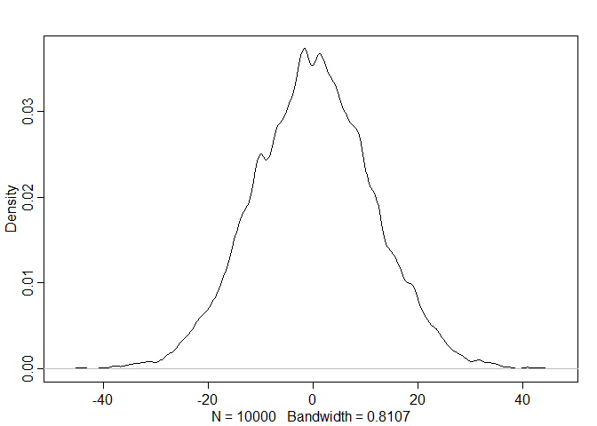

# Statistical Rethinking Chapter 4 problems

__Name:__


# For 03/17/16

## 4E1
line one

## 4E2
two (Mu and Sigma)

## 4E3
Posterior=(Likelihood X Prior)/Average Likelihood

pr(μ,σ|y) = ∏i Normal(yi|μ,σ)Normal(μ|0,10)Uniform(σ|0,10) / ∫∫ ∏i Normal(yi|μ, σ)Normal(μ|0, 10)Uniform(σ|0, 50)dμdσ

## 4M1


```r
library("rethinking")
```

```
## Loading required package: rstan
```

```
## Warning: package 'rstan' was built under R version 3.2.3
```

```
## Loading required package: ggplot2
```

```
## Warning: package 'ggplot2' was built under R version 3.2.3
```

```
## rstan (Version 2.9.0, packaged: 2016-01-05 16:17:47 UTC, GitRev: 05c3d0058b6a)
```

```
## For execution on a local, multicore CPU with excess RAM we recommend calling
## rstan_options(auto_write = TRUE)
## options(mc.cores = parallel::detectCores())
```

```
## Loading required package: parallel
```

```
## rethinking (Version 1.58)
```

```r
sample_mu <- rnorm( 1e4 , 0 , 10 )
sample_sigma <- runif( 1e4 , 0 , 10 )
prior_y <- rnorm( 1e4 , sample_mu , sample_sigma )
dens( prior_y )
```



## 4M2


```r
library(rethinking)
data(Howell1)
d <- Howell1
d2 <- d[ d$age >= 18 , ]


flist <- alist(
height ~ dnorm( mu , sigma ) ,
mu ~ dnorm( 0 , 10 ) ,
sigma ~ dunif( 0 , 10 )
)
m4.1 <- map( flist , data=d2 )
precis( m4.1 )
```

```
##         Mean StdDev   5.5%  94.5%
## mu    154.33   0.41 153.68 154.99
## sigma   7.74   0.29   7.27   8.20
```

# For 03/24/16

## 4E4

## 4E5

## 4M3

## 4M4

## 4M5

## 4M6

# For 03/31/16

## 4H1

## 4H2

## 4H3
