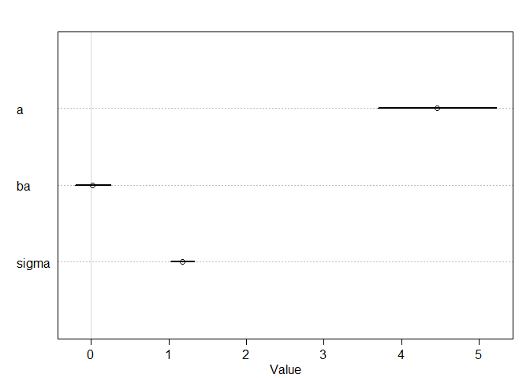
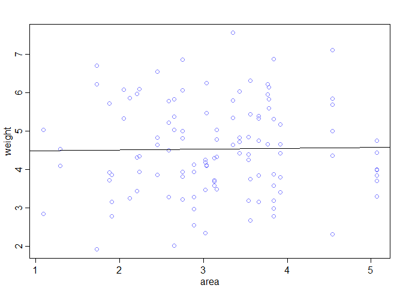
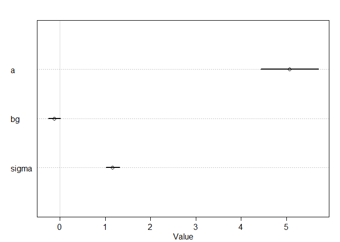
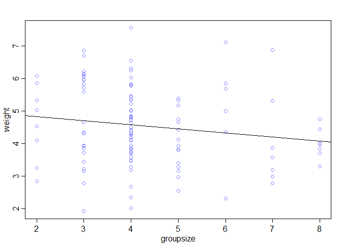
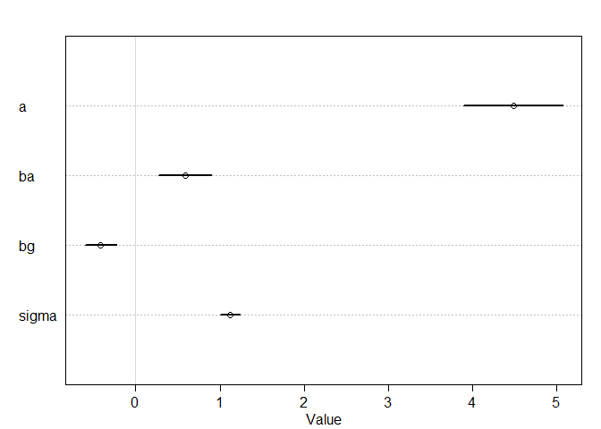
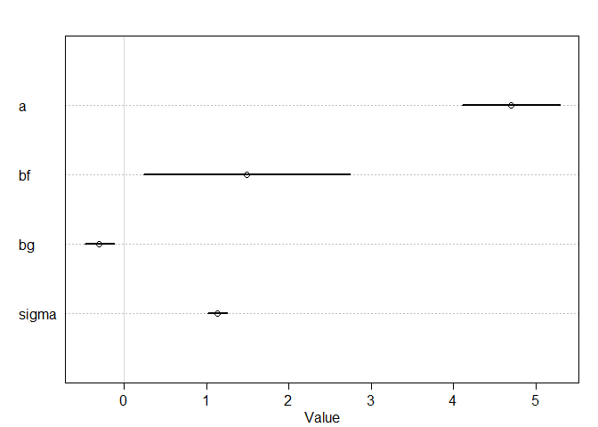
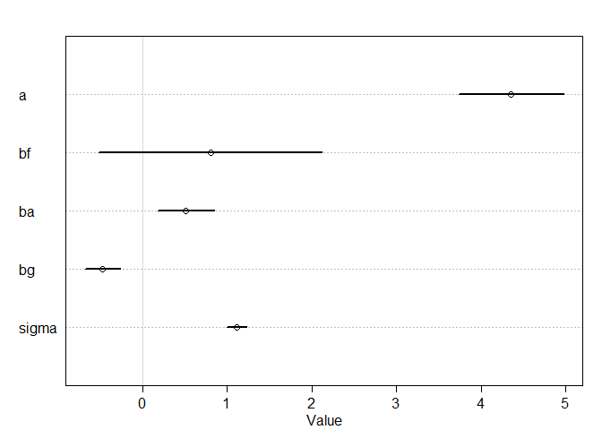

# Chapter-05-part2-assignment
# Statistical Rethinking Chapter 4 problems

__Name:__ Jessica


# For 04/18/2016

## 5M2

Age and cell phone use with the outcome variable of number of car accidents.

Higher age is negatively correlated with number of car accidents.

Higher cell phone use is positively correlated with number of car accidents.

Age and cell phone ussage are correlated to each other.

## 5H1

Fit two bivariate Gaussian regressions, using map: (1) body weight as a linear function of territory
size (area), and (2) body weight as a linear function of groupsize. Plot the results of these
regressions, displaying the MAP regression line and the 95% interval of the mean. Is either variable
important for predicting fox body weight?


```r
library(rethinking)
```

```
## Loading required package: rstan
```

```
## Warning: package 'rstan' was built under R version 3.2.3
```

```
## Loading required package: ggplot2
```

```
## Warning: package 'ggplot2' was built under R version 3.2.3
```

```
## rstan (Version 2.9.0, packaged: 2016-01-05 16:17:47 UTC, GitRev: 05c3d0058b6a)
```

```
## For execution on a local, multicore CPU with excess RAM we recommend calling
## rstan_options(auto_write = TRUE)
## options(mc.cores = parallel::detectCores())
```

```
## Loading required package: parallel
```

```
## rethinking (Version 1.58)
```

```r
data(foxes)

#fit model 1
model1 <- map(
alist(
weight ~ dnorm( mu , sigma ) ,
mu <- a + ba*area ,
a ~ dnorm( 10 , 10 ) ,
ba ~ dnorm( 0 , 1 ) ,
sigma ~ dunif( 0 , 10 )
) ,
data=foxes )

precis(model1, prob = 0.95)
```

```
##       Mean StdDev  2.5% 97.5%
## a     4.46   0.39  3.70  5.22
## ba    0.02   0.12 -0.21  0.25
## sigma 1.18   0.08  1.03  1.33
```

```r
plot( precis(model1, prob = 0.95))
```



```r
plot( weight ~ area , data=foxes , col=rangi2 )
abline(model1)
```

```
## Warning in abline(model1): only using the first two of 3 regression
## coefficients
```



```r
#fit model 2
model2 <- map(
alist(
weight ~ dnorm( mu , sigma ) ,
mu <- a + bg*groupsize ,
a ~ dnorm( 10 , 10 ) ,
bg ~ dnorm( 0 , 1 ) ,
sigma ~ dunif( 0 , 10 )
) ,
data=foxes )

 precis(model2, prob = 0.95)
```

```
##        Mean StdDev  2.5% 97.5%
## a      5.07   0.32  4.44  5.71
## bg    -0.12   0.07 -0.26  0.01
## sigma  1.16   0.08  1.01  1.31
```

```r
 plot( precis(model2, prob = 0.95))
```



```r
plot( weight ~ groupsize , data=foxes , col=rangi2 )
abline(model2)
```

```
## Warning in abline(model2): only using the first two of 3 regression
## coefficients
```



It looks like groupsize is important, but area is not.


## 5H2

Now fit a multiple linear regression with weight as the outcome and both area and groupsize
as predictor variables. Plot the predictions of the model for each predictor, holding the other predictor
constant at its mean. What does this model say about the importance of each variable? Why do you
get different results than you got in the exercise just above?


```r
#model3
model3 <- map(
alist(
weight ~ dnorm( mu , sigma ) ,
mu <- a + ba*area + bg*groupsize ,
a ~ dnorm( 10 , 10 ) ,
ba ~ dnorm( 0 , 1 ) ,
bg ~ dnorm( 0 , 1 ) ,
sigma ~ dunif( 0 , 10 )
) ,
data=foxes )

precis(model3,prob=0.95)
```

```
##        Mean StdDev  2.5% 97.5%
## a      4.48   0.37  3.76  5.20
## ba     0.58   0.20  0.20  0.97
## bg    -0.41   0.12 -0.65 -0.18
## sigma  1.12   0.07  0.97  1.26
```

```r
plot(precis(model3))
```



Now it looks like both variables might be important. I think this is a masked relationship, because area has a positive correlation while groupsize has a negative correlation to weight.

Note: Not sure how to generate plots where one variable is held constant at the mean?


## 5H3

Finally, consider the avgfood variable. Fit two more multiple regressions: (1) body weight
as an additive function of avgfood and groupsize, and (2) body weight as an additive function of
all three variables, avgfood and groupsize and area. Compare the results of these models to the
previous models you’ve fit, in the first two exercises. (a) Is avgfood or area a better predictor of body
weight? If you had to choose one or the other to include in a model, which would it be? Support your
assessment with any tables or plots you choose. (b) When both avgfood or area are in the same
model, their effects are reduced (closer to zero) and their standard errors are larger than when they
are included in separate models. Can you explain this result?


```r
#model4
model4 <- map(
alist(
weight ~ dnorm( mu , sigma ) ,
mu <- a + bf*avgfood + bg*groupsize ,
a ~ dnorm( 10 , 10 ) ,
bf ~ dnorm( 0 , 1 ) ,
bg ~ dnorm( 0 , 1 ) ,
sigma ~ dunif( 0 , 10 )
) ,
data=foxes )

precis(model4,prob=0.95)
```

```
##        Mean StdDev  2.5% 97.5%
## a      4.70   0.37  3.97  5.43
## bf     1.49   0.78 -0.04  3.03
## bg    -0.30   0.11 -0.52 -0.07
## sigma  1.13   0.08  0.99  1.28
```

```r
plot(precis(model4))
```



```r
#model5
model5 <- map(
alist(
weight ~ dnorm( mu , sigma ) ,
mu <- a + bf*avgfood+ ba*area + bg*groupsize ,
a ~ dnorm( 10 , 10 ) ,
bf ~ dnorm( 0 , 1 ),
ba ~ dnorm( 0 , 1 ) ,
bg ~ dnorm( 0 , 1 ) ,
sigma ~ dunif( 0 , 10 )
) ,
data=foxes )

precis(model5,prob=0.95)
```

```
##        Mean StdDev  2.5% 97.5%
## a      4.35   0.39  3.59  5.12
## bf     0.80   0.82 -0.81  2.42
## ba     0.51   0.21  0.10  0.92
## bg    -0.47   0.13 -0.73 -0.21
## sigma  1.11   0.07  0.97  1.25
```

```r
plot(precis(model5))
```



a) I think avgfood is probably a better predictor than area, though the variance seems high for avgfood.

b) I think this is because the two variables are strongly associated with one another.
