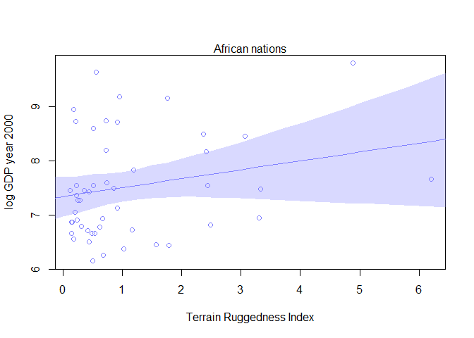
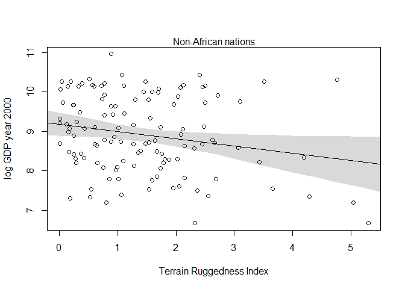
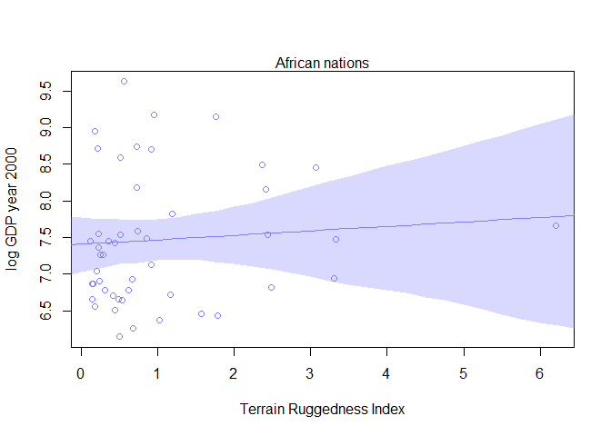
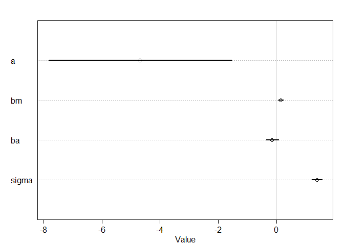
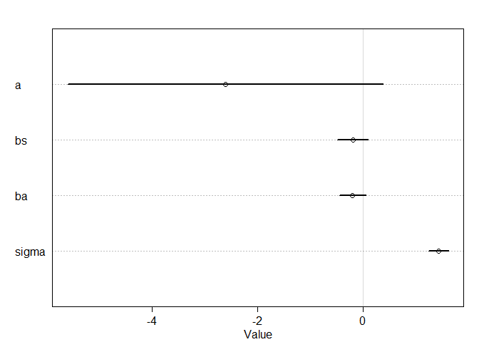
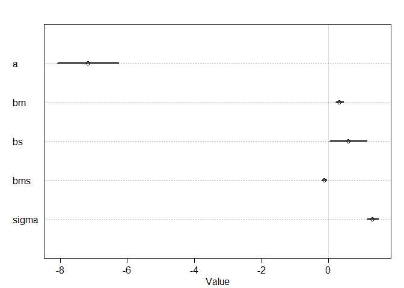

# Chapter_07_Problems


##Easy:

#7E1.

*For each of the causal relationships below, name a hypothetical third variable that would lead to an interaction effect.*

**1. Bread dough rises because of yeast.**

```
Temperature

```

**2. Education leads to higher income.**

```
Job Market

```
**3. Gasoline makes a car go.**

```
Engine type

```

#7E2

*Which of the following explanations invokes an interaction?*

**1. Caramelizing onions requires cooking over low heat and making sure the onions do not dry out.**

**2. A car will go faster when it has more cylinders or when it has a better fuel injector.**

**3. Most people acquire their political beliefs from their parents, unless they get them instead from their friends.**

**4. Intelligent animal species tend to be either highly social or have manipulative appendages (hands, tentacles, etc.).**

```
1,2,4

```

#7E3

*For each of the explanations in 7E2, write a linear model that expresses the stated relationship.*


```r
#1. 

model_onions <- lm( onion_quality ~ heat + moisture+ heat:moisture , data=d )

#2.

model_car <- lm( speed ~ cylinder_number + fuel_injector , data=d )

#3.

model_politics <- lm(political_belief ~ friends_belief + parents_belief, data=d )
                       
#4.

model_intelligence <-lm(animal intelligence ~ sociality + apendage_type, data=d )  
```

##Medium

#7M1

*Recall the tulips example from the chapter. Suppose another set of treatments adjusted the temperature in the greenhouse over two levels: cold and hot. The data in the chapter were collected at the cold temperature. You find none of the plants grown under the hot temperature developed any blooms at all, regardless of the water and shade levels. Can you explain this result in terms of interactions between water, shade, and temperature?*

From the chapter we learned that tullips need both light and water to produce blooms. If water is not a limiting factor, then you can see a large effect of shade and if shade is not a limiting factor you can see a large effect of water. Therefore these two variables are interacting. This new information about tempature seems to indicate that temperature is also a limiting factor for development of the blooms, therefore the temparture variable would also be interacting with water and shade, in a three-way interaction.


#7M2

*Can you invent a regression equation that would make the bloom size zero, whenever the temperature is hot?*


```r
model_blooms <-lm(blooms~ water:shade+ temperature:water+ water:shade:temperature, data=d )
```

#7M3

*In parts of North America, ravens depend upon wolves for their food. This is because ravens are carnivorous but cannot usually kill or open carcasses of prey. Wolves however can and do kill and tear open animals, and they tolerate ravens co-feeding at their kills. This species relationship is generally described as a "species interaction." Can you invent a hypothetical set of data on raven population size in which this relationship would manifest as a statistical interaction? Do you think the biological interaction could be linear? Why or why not?*

```
Data would be a yearly count of the number of ravens and wolves in an area of North America.

As wolf population rises, raven population would also rise, as these two species would be positively correlated.


```

##Hard

#7H1

*Return to the data(tulips) example in the chapter. Now include the bed variable as a predictor in the interaction model. Don't interact bed with the other predictors; just include it as a main effect. Note that bed is categorical. So to use it properly, you will need to either construct dummy variables or rather an index variable, as explained in Chapter 6.*


```r
#reading in data
library(rethinking)
```

```
## Loading required package: rstan
```

```
## Warning: package 'rstan' was built under R version 3.2.3
```

```
## Loading required package: ggplot2
```

```
## Warning: package 'ggplot2' was built under R version 3.2.3
```

```
## rstan (Version 2.9.0, packaged: 2016-01-05 16:17:47 UTC, GitRev: 05c3d0058b6a)
```

```
## For execution on a local, multicore CPU with excess RAM we recommend calling
## rstan_options(auto_write = TRUE)
## options(mc.cores = parallel::detectCores())
```

```
## Loading required package: parallel
```

```
## rethinking (Version 1.58)
```

```r
data(tulips)
d <- tulips

#centering
d$shade.c <- d$shade - mean(d$shade)
d$water.c <- d$water - mean(d$water)

#creating dummy variables

d$bed.a <- ifelse( d$bed=="a" , 1 , 0 )
d$bed.b <- ifelse( d$bed=="b" , 1 , 0 )

model_7H1 <- map(
alist(
blooms ~ dnorm( mu , sigma ) ,
mu <- a + bA*bed.a + bB*bed.b + bW*water.c + bS*shade.c + bWS*water.c*shade.c ,
a ~ dnorm( 130 , 100 ) ,
bA ~ dnorm( 0 , 1 ),
bB ~ dnorm( 0 , 1 ),
bW ~ dnorm( 0 , 100 ) ,
bS ~ dnorm( 0 , 100 ) ,
bWS ~ dnorm( 0 , 100 ) ,
sigma ~ dunif( 0 , 100 )
) ,
data=d ,
start=list(a=mean(d$blooms),bW=0,bS=0,bWS=0,sigma=sd(d$blooms)) )

precis(model_7H1)
```

```
##         Mean StdDev   5.5%  94.5%
## a     129.03   8.68 115.16 142.90
## bW     74.95  10.60  58.01  91.89
## bS    -41.13  10.60 -58.07 -24.20
## bWS   -51.95  12.94 -72.63 -31.26
## sigma  45.21   6.16  35.36  55.05
## bA     -0.14   1.00  -1.74   1.46
## bB      0.06   1.00  -1.54   1.66
```


#7H2

*Use WAIC to compare the model from 7H1 to a model that omits bed. What do you infer from this comparison? Can you reconcile the WAIC results with the posterior distribution of the bed coefficients?*


```r
#model without bed from chapter:
m7.9 <- map(
alist(
blooms ~ dnorm( mu , sigma ) ,
mu <- a + bW*water.c + bS*shade.c + bWS*water.c*shade.c ,
a ~ dnorm( 130 , 100 ) ,
bW ~ dnorm( 0 , 100 ) ,
bS ~ dnorm( 0 , 100 ) ,
bWS ~ dnorm( 0 , 100 ) ,
sigma ~ dunif( 0 , 100 )
) ,
data=d ,
start=list(a=mean(d$blooms),bW=0,bS=0,bWS=0,sigma=sd(d$blooms)) )


coeftab(model_7H1,m7.9)
```

```
##       model_7H1 m7.9   
## a      129.03    129.01
## bW      74.95     74.96
## bS     -41.13    -41.14
## bWS    -51.95    -51.87
## sigma   45.21     45.22
## bA      -0.14        NA
## bB       0.06        NA
## nobs       27        27
```

```r
compare( model_7H1 , m7.9 )
```

```
##            WAIC pWAIC dWAIC weight    SE  dSE
## m7.9      296.1   6.7   0.0   0.55 10.45   NA
## model_7H1 296.5   6.8   0.4   0.45 10.56 0.46
```


#7H3

*Consider again the data(rugged) data on economic development and terrain ruggedness, examined in this chapter. One of the African countries in that example, Seychelles, is far outside the cloud of other nations, being a rare country with both relatively high GDP and high ruggedness. Seychelles is also unusual, in that it is a group of islands far from the coast of mainland Africa, and its main economic activity is tourism. One might suspect that this one nation is exerting a strong influence on the conclusions. In this problem, I want you to drop Seychelles from the data and re-evaluate the hypothesis that the relationship of African economies with ruggedness is different from that on other continents.*

**a. Begin by using map to fit just the interaction model. Choose your own priors. Compare the inference from this model fit to the data without Seychelles to the same model fit to the full data. Does it still seem like the effect of ruggedness depends upon continent? How much has the expected relationship changed?**


```r
#setting up the data
library(rethinking)
data(rugged)
d <- rugged
# make log version of outcome
d$log_gdp <- log( d$rgdppc_2000 )
# extract countries with GDP data
dd <- d[ complete.cases(d$rgdppc_2000) , ]

dd_dropped<-subset(dd,dd$"country"!="Seychelles")

model_full <- map(
alist(
log_gdp ~ dnorm( mu , sigma ) ,
mu <- a + gamma*rugged + bA*cont_africa ,
gamma <- bR + bAR*cont_africa ,
a ~ dnorm( 8 , 100 ) ,
bA ~ dnorm( 0 , 1 ) ,
bR ~ dnorm( 0 , 1 ) ,
bAR ~ dnorm( 0 , 1 ) ,
sigma ~ dunif( 0 , 10 )
) ,
data=dd )

model_dropped<- map(
alist(
log_gdp ~ dnorm( mu , sigma ) ,
mu <- a + gamma*rugged + bA*cont_africa ,
gamma <- bR + bAR*cont_africa ,
a ~ dnorm( 8 , 100 ) ,
bA ~ dnorm( 0 , 1 ) ,
bR ~ dnorm( 0 , 1 ) ,
bAR ~ dnorm( 0 , 1 ) ,
sigma ~ dunif( 0 , 10 )
),
data=dd_dropped )

coeftab(model_full,model_dropped)
```

```
##       model_full model_dropped
## a        9.18       9.19      
## bA      -1.85      -1.78      
## bR      -0.18      -0.19      
## bAR      0.35       0.25      
## sigma    0.93       0.93      
## nobs      170        169
```


**b. Now plot the predictions of the interaction model, with and without Seychelles. Does it still seem like the effect of ruggedness depends upon continent? How much has the expected relationship changed?**


```r
#plots for full model
rugged.seq <- seq(from=-1,to=8,by=0.25) 
mu.Africa <- link( model_full , data=data.frame(cont_africa=1,rugged=rugged.seq) )
```

```
## [ 100 / 1000 ]
[ 200 / 1000 ]
[ 300 / 1000 ]
[ 400 / 1000 ]
[ 500 / 1000 ]
[ 600 / 1000 ]
[ 700 / 1000 ]
[ 800 / 1000 ]
[ 900 / 1000 ]
[ 1000 / 1000 ]
```

```r
mu.Africa.mean <- apply( mu.Africa , 2 , mean )
mu.Africa.PI <- apply( mu.Africa , 2 , PI , prob=0.97 )
mu.NotAfrica <- link( model_full , data=data.frame(cont_africa=0,rugged=rugged.seq) )
```

```
## [ 100 / 1000 ]
[ 200 / 1000 ]
[ 300 / 1000 ]
[ 400 / 1000 ]
[ 500 / 1000 ]
[ 600 / 1000 ]
[ 700 / 1000 ]
[ 800 / 1000 ]
[ 900 / 1000 ]
[ 1000 / 1000 ]
```

```r
mu.NotAfrica.mean <- apply( mu.NotAfrica , 2 , mean )
mu.NotAfrica.PI <- apply( mu.NotAfrica , 2 , PI , prob=0.97 )
d.A1 <- dd[dd$cont_africa==1,]
plot( log(rgdppc_2000) ~ rugged , data=d.A1 ,
col=rangi2 , ylab="log GDP year 2000" ,
xlab="Terrain Ruggedness Index" )
mtext( "African nations" , 3 )
lines( rugged.seq , mu.Africa.mean , col=rangi2 )
shade( mu.Africa.PI , rugged.seq , col=col.alpha(rangi2,0.3) )
```



```r
# plot non-African nations with regression
d.A0 <- dd[dd$cont_africa==0,]
plot( log(rgdppc_2000) ~ rugged , data=d.A0 ,
col="black" , ylab="log GDP year 2000" ,
xlab="Terrain Ruggedness Index" )
mtext( "Non-African nations" , 3 )
lines( rugged.seq , mu.NotAfrica.mean )
shade( mu.NotAfrica.PI , rugged.seq )
```



```r
#Plots for model with dropped data:
rugged.seq <- seq(from=-1,to=8,by=0.25) 
mu.Africa <- link( model_dropped , data=data.frame(cont_africa=1,rugged=rugged.seq) )
```

```
## [ 100 / 1000 ]
[ 200 / 1000 ]
[ 300 / 1000 ]
[ 400 / 1000 ]
[ 500 / 1000 ]
[ 600 / 1000 ]
[ 700 / 1000 ]
[ 800 / 1000 ]
[ 900 / 1000 ]
[ 1000 / 1000 ]
```

```r
mu.Africa.mean <- apply( mu.Africa , 2 , mean )
mu.Africa.PI <- apply( mu.Africa , 2 , PI , prob=0.97 )
mu.NotAfrica <- link( model_dropped , data=data.frame(cont_africa=0,rugged=rugged.seq) )
```

```
## [ 100 / 1000 ]
[ 200 / 1000 ]
[ 300 / 1000 ]
[ 400 / 1000 ]
[ 500 / 1000 ]
[ 600 / 1000 ]
[ 700 / 1000 ]
[ 800 / 1000 ]
[ 900 / 1000 ]
[ 1000 / 1000 ]
```

```r
mu.NotAfrica.mean <- apply( mu.NotAfrica , 2 , mean )
mu.NotAfrica.PI <- apply( mu.NotAfrica , 2 , PI , prob=0.97 )
d.A1 <- dd_dropped[dd_dropped$cont_africa==1,]
plot( log(rgdppc_2000) ~ rugged , data=d.A1 ,
col=rangi2 , ylab="log GDP year 2000" ,
xlab="Terrain Ruggedness Index" )
mtext( "African nations" , 3 )
lines( rugged.seq , mu.Africa.mean , col=rangi2 )
shade( mu.Africa.PI , rugged.seq , col=col.alpha(rangi2,0.3) )
```



```r
# plot non-African nations with regression
d.A0 <- dd_dropped[dd_dropped$cont_africa==0,]
plot( log(rgdppc_2000) ~ rugged , data=d.A0 ,
col="black" , ylab="log GDP year 2000" ,
xlab="Terrain Ruggedness Index" )
mtext( "Non-African nations" , 3 )
lines( rugged.seq , mu.NotAfrica.mean )
shade( mu.NotAfrica.PI , rugged.seq )
```


**c. Finally, conduct a model comparison analysis, using WAIC. Fit three models to the data without Seychelles. Use whatever priors you think are sensible. Plot the model-averaged predictions of this model set. Do your inferences differ from those in (b)? Why or why not?**


#7H4 

*The values in data(nettle) are data on language diversity in 74 nations.The meaning of each column is given below.*

*1. country: Name of the country*
*2. num.lang: Number of recognized languages spoken*
*3. area: Area in square kilometers*
*4. k.pop: Population, in thousands*
*5. num.stations: Number of weather stations that provided data for the next two columns*
*6. mean.growing.season: Average length of growing season, in months*
*7. sd.growing.season: Standard deviation of length of growing season, in months*

*Use these data to evaluate the hypothesis that language diversity is partly a product of food security.*

*The notion is that, in productive ecologies, people don't need large social networks to buffer them against risk of food shortfalls. This means ethnic groups can be smaller and more self-sufficient, leading to more languages per capita. In contrast, in a poor ecology, there is more subsistence risk, and so human societies have adapted by building larger networks of mutual obligation to provide food insurance. This in turn creates social forces that help prevent languages from diversifying. Specifically, you will try to model the number of languages per capita as the outcome variable:*


```r
d$lang.per.cap <- d$num.lang / d$k.pop
```

*Use the logarithm of this new variable as your regression outcome. (A count model would be better here, but you'll learn those later, in Chapter 10.) This problem is open ended, allowing you to decide how you address the hypotheses and the uncertain advice the modeling provides. If you think you need to use WAIC anyplace, please do. If you think you need certain priors, argue for them. If you think you need to plot predictions in a certain way, please do. Just try to honestly  evaluate the main effects of both mean.growing.season and sd.growing.season, as well as their two-way interaction, as outlined in parts (a), (b), and (c) below. If you are not sure which approach to use, try several.*

**(a) Evaluate the hypothesis that language diversity, as measured by log(lang.per.cap), is positively associated with the average length of the growing season, mean.growing.season. Consider log(area) in your regression(s) as a covariate (not an interaction). Interpret your results.**


```r
data(nettle)
d=nettle
library(rethinking)
d$lang.per.cap <- d$num.lang / d$k.pop
d$log.lang.per.cap<-log(d$lang.per.cap)
d$log.area<-log(d$area)

model_a <- map(
alist(
log.lang.per.cap ~ dnorm( mu , sigma ) ,
mu <- a + bm*mean.growing.season +ba*log.area,
a ~ dnorm( 8 , 100 ) ,
bm ~ dnorm( 7 , 4 ) ,
ba ~ dnorm(12,2),
sigma ~ dunif( 0 , 10 )
) ,
data=d )

precis(model_a)
```

```
##        Mean StdDev  5.5% 94.5%
## a     -4.69   1.97 -7.83 -1.55
## bm     0.15   0.06  0.06  0.24
## ba    -0.14   0.14 -0.36  0.08
## sigma  1.39   0.11  1.21  1.57
```

```r
plot(precis(model_a))
```




**(b) Now evaluate the hypothesis that language diversity is negatively associated with the standard deviation of length of growing season, sd.growing.season. This hypothesis follows from uncertainty in harvest favoring social insurance through larger social networks and therefore fewer languages. Again, consider log(area) as a covariate (not an interaction). Interpret your results.**


```r
model_b <- map(
alist(
log.lang.per.cap ~ dnorm( mu , sigma ) ,
mu <- a + bs*sd.growing.season + ba*log.area,
a ~ dnorm( 8 , 100 ) ,
bs ~ dnorm( 1.7 , 1 ) ,
ba ~ dnorm(12,2),
sigma ~ dunif( 0 , 10 )
) ,
data=d )

precis(model_b)
```

```
##        Mean StdDev  5.5% 94.5%
## a     -2.61   1.87 -5.61  0.38
## bs    -0.19   0.18 -0.48  0.10
## ba    -0.19   0.16 -0.44  0.05
## sigma  1.44   0.12  1.25  1.63
```

```r
plot(precis(model_b))
```




**(c) Finally, evaluate the hypothesis that mean.growing.season and sd.growing.season interact to synergistically reduce language diversity. The idea is that, in nations with longer average growing seasons, high variance makes storage and redistribution even more important than it would be otherwise. That way, people can cooperate to preserve and protect windfalls to be used during the droughts. These forces in turn may lead to greater social integration and fewer languages.**


```r
model_c <- map(
alist(
log.lang.per.cap ~ dnorm( mu , sigma ) ,
mu <- a + bm*mean.growing.season + bs*sd.growing.season+bms*mean.growing.season*sd.growing.season ,
a ~ dnorm( 8 , 100 ),
bm ~ dnorm( 7 , 4 ) ,
bs ~ dnorm( 1.7 , 1 ),
bms~ dnorm(1,10),
sigma ~ dunif( 0 , 10 )
) ,
data=d )

precis(model_c)
```

```
##        Mean StdDev  5.5% 94.5%
## a     -7.18   0.57 -8.09 -6.26
## bm     0.32   0.07  0.21  0.43
## bs     0.58   0.35  0.02  1.14
## bms   -0.13   0.04 -0.20 -0.06
## sigma  1.31   0.11  1.14  1.48
```

```r
plot(precis(model_c))
```



