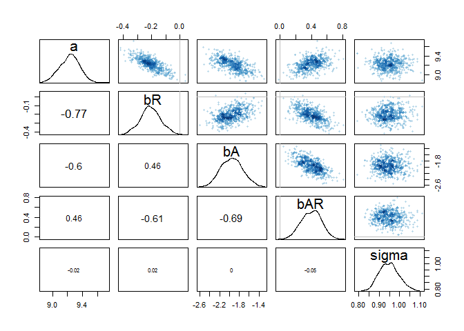
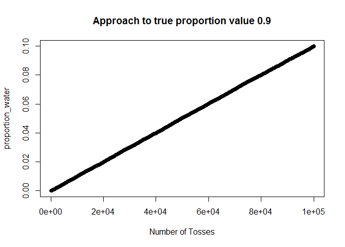

# Chapter_8
##Easy.

#8E1. Which of the following is a requirement of the simple Metropolis algorithm?

1. The parameters must be discrete.

2. The likelihood function must be Gaussian.

3. The proposal distribution must be symmetric.

```
3
```

#8E2. Gibbs sampling is more efficient than the Metropolis algorithm. How does it achieve this extra efficiency? Are there any limitations to the Gibbs sampling strategy?

Gibbs sampling is more efficient because it uses adaptive proposals in which the distributions of a proposed paramter can adjust itself depending on the values that parameter may have in the moment. Gibbs does this using conjugate pairs, which are combinations of prior distributions and likelihoods, and have analytical solutions of the posterior distribution for a single paramter.

The limiations to Gibbs are that it requires the use of conjugate priors and as model complexity increases Gibbs becomes inefficient.


#8E3. Which sort of parameters can Hamiltonian Monte Carlo not handle? Can you explain why?


HMC requires continuous parameters and can not handle discrete parameters, this is because it works by running over the data continuously and spending more time on areas where it is more likely.


#8E4. Explain the difference between the effective number of samples, n_eff as calculated by Stan,and the actual number of samples.

The effective number of samples is an estimate of the number of independent samples you managed to get from the posterior distribution.The effective number of samples matters more than the raw number of samples, as typically Markov chains are autocorrelated. (sequential samples are not independent)

#8E5. Which value should Rhat approach, when a chain is sampling the posterior distribution correctly?

1

#8E6. Sketch a good trace plot for a Markov chain, one that is effectively sampling from the posterior distribution. What is good about its shape? Then sketch a trace plot for a malfunctioning Markov chain. What about its shape indicates malfunction?


##Medium.


#8M1. Re-estimate the terrain ruggedness model from the chapter, but now using a uniform prior and an exponential prior for the standard deviation, sigma. The uniform prior should be dunif(0,10) and the exponential should be dexp(1). Do the different priors have any detectible influence on the posterior distribution?


```r
library(rethinking)
```

```
## Loading required package: rstan
```

```
## Warning: package 'rstan' was built under R version 3.2.5
```

```
## Loading required package: ggplot2
```

```
## Warning: package 'ggplot2' was built under R version 3.2.5
```

```
## Loading required package: StanHeaders
```

```
## Warning: package 'StanHeaders' was built under R version 3.2.5
```

```
## rstan (Version 2.10.1, packaged: 2016-06-24 13:22:16 UTC, GitRev: 85f7a56811da)
```

```
## For execution on a local, multicore CPU with excess RAM we recommend calling
## rstan_options(auto_write = TRUE)
## options(mc.cores = parallel::detectCores())
```

```
## Loading required package: parallel
```

```
## rethinking (Version 1.59)
```

```r
data(rugged)
d <- rugged
d$log_gdp <- log(d$rgdppc_2000)
dd <- d[ complete.cases(d$rgdppc_2000) , ]

dd.trim <- dd[ , c("log_gdp","rugged","cont_africa") ]
str(dd.trim)
```

```
## 'data.frame':	170 obs. of  3 variables:
##  $ log_gdp    : num  7.49 8.22 9.93 9.41 7.79 ...
##  $ rugged     : num  0.858 3.427 0.769 0.775 2.688 ...
##  $ cont_africa: int  1 0 0 0 0 0 0 0 0 1 ...
```

```r
m8.1stan_uniform <- map2stan( 
                      alist(
                        log_gdp ~ dnorm( mu , sigma ) ,
                        mu <- a + bR*rugged + bA*cont_africa + bAR*rugged*cont_africa ,
                        a ~ dnorm(0,100),
                        bR ~ dnorm(0,10),
                        bA ~ dnorm(0,10),
                        bAR ~ dnorm(0,10),
                        sigma ~ dunif(0,10)
                      ) ,
                      data=dd.trim )
```

```
## C:/Users/Jessica/Documents/R/win-library/3.2/StanHeaders/include/stan/math/rev/core/set_zero_all_adjoints.hpp:14:17: warning: 'void stan::math::set_zero_all_adjoints()' defined but not used [-Wunused-function]
## 
## SAMPLING FOR MODEL 'log_gdp ~ dnorm(mu, sigma)' NOW (CHAIN 1).
## 
## Chain 1, Iteration:    1 / 2000 [  0%]  (Warmup)
## Chain 1, Iteration:  200 / 2000 [ 10%]  (Warmup)
## Chain 1, Iteration:  400 / 2000 [ 20%]  (Warmup)
## Chain 1, Iteration:  600 / 2000 [ 30%]  (Warmup)
## Chain 1, Iteration:  800 / 2000 [ 40%]  (Warmup)
## Chain 1, Iteration: 1000 / 2000 [ 50%]  (Warmup)
## Chain 1, Iteration: 1001 / 2000 [ 50%]  (Sampling)
## Chain 1, Iteration: 1200 / 2000 [ 60%]  (Sampling)
## Chain 1, Iteration: 1400 / 2000 [ 70%]  (Sampling)
## Chain 1, Iteration: 1600 / 2000 [ 80%]  (Sampling)
## Chain 1, Iteration: 1800 / 2000 [ 90%]  (Sampling)
## Chain 1, Iteration: 2000 / 2000 [100%]  (Sampling)
##  Elapsed Time: 0.878 seconds (Warm-up)
##                0.674 seconds (Sampling)
##                1.552 seconds (Total)
## 
## 
## SAMPLING FOR MODEL 'log_gdp ~ dnorm(mu, sigma)' NOW (CHAIN 1).
## WARNING: No variance estimation is
##          performed for num_warmup < 20
## 
## 
## Chain 1, Iteration: 1 / 1 [100%]  (Sampling)
##  Elapsed Time: 0 seconds (Warm-up)
##                0.001 seconds (Sampling)
##                0.001 seconds (Total)
```

```
## Computing WAIC
```

```
## Constructing posterior predictions
```

```
## [ 100 / 1000 ]
[ 200 / 1000 ]
[ 300 / 1000 ]
[ 400 / 1000 ]
[ 500 / 1000 ]
[ 600 / 1000 ]
[ 700 / 1000 ]
[ 800 / 1000 ]
[ 900 / 1000 ]
[ 1000 / 1000 ]
```

```r
m8.1stan_exp <- map2stan( 
                      alist(
                        log_gdp ~ dnorm( mu , sigma ) ,
                        mu <- a + bR*rugged + bA*cont_africa + bAR*rugged*cont_africa ,
                        a ~ dnorm(0,100),
                        bR ~ dnorm(0,10),
                        bA ~ dnorm(0,10),
                        bAR ~ dnorm(0,10),
                        sigma ~ dexp(1)
                      ) ,
                      data=dd.trim )
```

```
## C:/Users/Jessica/Documents/R/win-library/3.2/StanHeaders/include/stan/math/rev/core/set_zero_all_adjoints.hpp:14:17: warning: 'void stan::math::set_zero_all_adjoints()' defined but not used [-Wunused-function]
## 
## SAMPLING FOR MODEL 'log_gdp ~ dnorm(mu, sigma)' NOW (CHAIN 1).
## 
## Chain 1, Iteration:    1 / 2000 [  0%]  (Warmup)
## Chain 1, Iteration:  200 / 2000 [ 10%]  (Warmup)
## Chain 1, Iteration:  400 / 2000 [ 20%]  (Warmup)
## Chain 1, Iteration:  600 / 2000 [ 30%]  (Warmup)
## Chain 1, Iteration:  800 / 2000 [ 40%]  (Warmup)
## Chain 1, Iteration: 1000 / 2000 [ 50%]  (Warmup)
## Chain 1, Iteration: 1001 / 2000 [ 50%]  (Sampling)
## Chain 1, Iteration: 1200 / 2000 [ 60%]  (Sampling)
## Chain 1, Iteration: 1400 / 2000 [ 70%]  (Sampling)
## Chain 1, Iteration: 1600 / 2000 [ 80%]  (Sampling)
## Chain 1, Iteration: 1800 / 2000 [ 90%]  (Sampling)
## Chain 1, Iteration: 2000 / 2000 [100%]  (Sampling)
##  Elapsed Time: 0.813 seconds (Warm-up)
##                0.671 seconds (Sampling)
##                1.484 seconds (Total)
## 
## 
## SAMPLING FOR MODEL 'log_gdp ~ dnorm(mu, sigma)' NOW (CHAIN 1).
## WARNING: No variance estimation is
##          performed for num_warmup < 20
## 
## 
## Chain 1, Iteration: 1 / 1 [100%]  (Sampling)
##  Elapsed Time: 0 seconds (Warm-up)
##                0 seconds (Sampling)
##                0 seconds (Total)
```

```
## Computing WAIC
## Constructing posterior predictions
```

```
## [ 100 / 1000 ]
[ 200 / 1000 ]
[ 300 / 1000 ]
[ 400 / 1000 ]
[ 500 / 1000 ]
[ 600 / 1000 ]
[ 700 / 1000 ]
[ 800 / 1000 ]
[ 900 / 1000 ]
[ 1000 / 1000 ]
```

```r
precis(m8.1stan_uniform)
```

```
##        Mean StdDev lower 0.89 upper 0.89 n_eff Rhat
## a      9.22   0.13       9.01       9.43   257    1
## bR    -0.20   0.07      -0.31      -0.09   294    1
## bA    -1.94   0.23      -2.31      -1.59   311    1
## bAR    0.39   0.13       0.18       0.58   323    1
## sigma  0.95   0.05       0.87       1.04   656    1
```

```r
precis(m8.1stan_exp)
```

```
##        Mean StdDev lower 0.89 upper 0.89 n_eff Rhat
## a      9.23   0.14       9.02       9.48   344    1
## bR    -0.21   0.08      -0.33      -0.07   378    1
## bA    -1.97   0.23      -2.38      -1.65   371    1
## bAR    0.40   0.13       0.21       0.62   417    1
## sigma  0.95   0.05       0.87       1.04   537    1
```

```r
pairs(m8.1stan_uniform)
```


```r
pairs(m8.1stan_exp)
```


#8M2. The Cauchy and exponential priors from the terrain ruggedness model are very weak. They can be made more informative by reducing their scale. Compare the dcauchy and dexp priors for progressively smaller values of the scaling parameter. As these priors become stronger, how does each influence the posterior distribution?


```r
#cauchy original
m8.1stan <- map2stan( 
                      alist(
                        log_gdp ~ dnorm( mu , sigma ) ,
                        mu <- a + bR*rugged + bA*cont_africa + bAR*rugged*cont_africa ,
                        a ~ dnorm(0,100),
                        bR ~ dnorm(0,10),
                        bA ~ dnorm(0,10),
                        bAR ~ dnorm(0,10),
                        sigma ~ dcauchy(0,2)
                      ) ,
                      data=dd.trim )
```

```
## C:/Users/Jessica/Documents/R/win-library/3.2/StanHeaders/include/stan/math/rev/core/set_zero_all_adjoints.hpp:14:17: warning: 'void stan::math::set_zero_all_adjoints()' defined but not used [-Wunused-function]
## 
## SAMPLING FOR MODEL 'log_gdp ~ dnorm(mu, sigma)' NOW (CHAIN 1).
## 
## Chain 1, Iteration:    1 / 2000 [  0%]  (Warmup)
## Chain 1, Iteration:  200 / 2000 [ 10%]  (Warmup)
## Chain 1, Iteration:  400 / 2000 [ 20%]  (Warmup)
## Chain 1, Iteration:  600 / 2000 [ 30%]  (Warmup)
## Chain 1, Iteration:  800 / 2000 [ 40%]  (Warmup)
## Chain 1, Iteration: 1000 / 2000 [ 50%]  (Warmup)
## Chain 1, Iteration: 1001 / 2000 [ 50%]  (Sampling)
## Chain 1, Iteration: 1200 / 2000 [ 60%]  (Sampling)
## Chain 1, Iteration: 1400 / 2000 [ 70%]  (Sampling)
## Chain 1, Iteration: 1600 / 2000 [ 80%]  (Sampling)
## Chain 1, Iteration: 1800 / 2000 [ 90%]  (Sampling)
## Chain 1, Iteration: 2000 / 2000 [100%]  (Sampling)
##  Elapsed Time: 0.686 seconds (Warm-up)
##                0.651 seconds (Sampling)
##                1.337 seconds (Total)
## 
## 
## SAMPLING FOR MODEL 'log_gdp ~ dnorm(mu, sigma)' NOW (CHAIN 1).
## WARNING: No variance estimation is
##          performed for num_warmup < 20
## 
## 
## Chain 1, Iteration: 1 / 1 [100%]  (Sampling)
##  Elapsed Time: 0 seconds (Warm-up)
##                0 seconds (Sampling)
##                0 seconds (Total)
```

```
## Computing WAIC
```

```
## Constructing posterior predictions
```

```
## [ 100 / 1000 ]
[ 200 / 1000 ]
[ 300 / 1000 ]
[ 400 / 1000 ]
[ 500 / 1000 ]
[ 600 / 1000 ]
[ 700 / 1000 ]
[ 800 / 1000 ]
[ 900 / 1000 ]
[ 1000 / 1000 ]
```

```r
#cauchy stricter prior
m8.1stan2 <- map2stan( 
                      alist(
                        log_gdp ~ dnorm( mu , sigma ) ,
                        mu <- a + bR*rugged + bA*cont_africa + bAR*rugged*cont_africa ,
                        a ~ dnorm(0,100),
                        bR ~ dnorm(0,10),
                        bA ~ dnorm(0,10),
                        bAR ~ dnorm(0,10),
                        sigma ~ dcauchy(0,1)
                      ) ,

                                           data=dd.trim )
```

```
## C:/Users/Jessica/Documents/R/win-library/3.2/StanHeaders/include/stan/math/rev/core/set_zero_all_adjoints.hpp:14:17: warning: 'void stan::math::set_zero_all_adjoints()' defined but not used [-Wunused-function]
## 
## SAMPLING FOR MODEL 'log_gdp ~ dnorm(mu, sigma)' NOW (CHAIN 1).
## 
## Chain 1, Iteration:    1 / 2000 [  0%]  (Warmup)
## Chain 1, Iteration:  200 / 2000 [ 10%]  (Warmup)
## Chain 1, Iteration:  400 / 2000 [ 20%]  (Warmup)
## Chain 1, Iteration:  600 / 2000 [ 30%]  (Warmup)
## Chain 1, Iteration:  800 / 2000 [ 40%]  (Warmup)
## Chain 1, Iteration: 1000 / 2000 [ 50%]  (Warmup)
## Chain 1, Iteration: 1001 / 2000 [ 50%]  (Sampling)
## Chain 1, Iteration: 1200 / 2000 [ 60%]  (Sampling)
## Chain 1, Iteration: 1400 / 2000 [ 70%]  (Sampling)
## Chain 1, Iteration: 1600 / 2000 [ 80%]  (Sampling)
## Chain 1, Iteration: 1800 / 2000 [ 90%]  (Sampling)
## Chain 1, Iteration: 2000 / 2000 [100%]  (Sampling)
##  Elapsed Time: 0.663 seconds (Warm-up)
##                0.502 seconds (Sampling)
##                1.165 seconds (Total)
## 
## 
## SAMPLING FOR MODEL 'log_gdp ~ dnorm(mu, sigma)' NOW (CHAIN 1).
## WARNING: No variance estimation is
##          performed for num_warmup < 20
## 
## 
## Chain 1, Iteration: 1 / 1 [100%]  (Sampling)
##  Elapsed Time: 0 seconds (Warm-up)
##                0 seconds (Sampling)
##                0 seconds (Total)
```

```
## Computing WAIC
## Constructing posterior predictions
```

```
## [ 100 / 1000 ]
[ 200 / 1000 ]
[ 300 / 1000 ]
[ 400 / 1000 ]
[ 500 / 1000 ]
[ 600 / 1000 ]
[ 700 / 1000 ]
[ 800 / 1000 ]
[ 900 / 1000 ]
[ 1000 / 1000 ]
```

```r
precis(m8.1stan)
```

```
##        Mean StdDev lower 0.89 upper 0.89 n_eff Rhat
## a      9.23   0.13       9.02       9.44   408    1
## bR    -0.20   0.07      -0.31      -0.09   399    1
## bA    -1.95   0.21      -2.27      -1.60   426    1
## bAR    0.39   0.12       0.17       0.55   346    1
## sigma  0.95   0.05       0.86       1.02   759    1
```

```r
precis(m8.1stan2)
```

```
##        Mean StdDev lower 0.89 upper 0.89 n_eff Rhat
## a      9.23   0.13       9.01       9.43   288    1
## bR    -0.21   0.07      -0.32      -0.07   272    1
## bA    -1.95   0.22      -2.31      -1.59   316    1
## bAR    0.40   0.13       0.20       0.60   308    1
## sigma  0.95   0.05       0.87       1.02   772    1
```

```r
pairs(m8.1stan)
```


```r
pairs(m8.1stan2)
```



```r
#exp original
precis(m8.1stan_exp)
```

```
##        Mean StdDev lower 0.89 upper 0.89 n_eff Rhat
## a      9.23   0.14       9.02       9.48   344    1
## bR    -0.21   0.08      -0.33      -0.07   378    1
## bA    -1.97   0.23      -2.38      -1.65   371    1
## bAR    0.40   0.13       0.21       0.62   417    1
## sigma  0.95   0.05       0.87       1.04   537    1
```

```r
#exp stricter prior
m8.1stan_exp <- map2stan( 
                      alist(
                        log_gdp ~ dnorm( mu , sigma ) ,
                        mu <- a + bR*rugged + bA*cont_africa + bAR*rugged*cont_africa ,
                        a ~ dnorm(0,100),
                        bR ~ dnorm(0,10),
                        bA ~ dnorm(0,10),
                        bAR ~ dnorm(0,10),
                        sigma ~ dexp(0.5)
                      ) ,
                      data=dd.trim )
```

```
## C:/Users/Jessica/Documents/R/win-library/3.2/StanHeaders/include/stan/math/rev/core/set_zero_all_adjoints.hpp:14:17: warning: 'void stan::math::set_zero_all_adjoints()' defined but not used [-Wunused-function]
## 
## SAMPLING FOR MODEL 'log_gdp ~ dnorm(mu, sigma)' NOW (CHAIN 1).
## 
## Chain 1, Iteration:    1 / 2000 [  0%]  (Warmup)
## Chain 1, Iteration:  200 / 2000 [ 10%]  (Warmup)
## Chain 1, Iteration:  400 / 2000 [ 20%]  (Warmup)
## Chain 1, Iteration:  600 / 2000 [ 30%]  (Warmup)
## Chain 1, Iteration:  800 / 2000 [ 40%]  (Warmup)
## Chain 1, Iteration: 1000 / 2000 [ 50%]  (Warmup)
## Chain 1, Iteration: 1001 / 2000 [ 50%]  (Sampling)
## Chain 1, Iteration: 1200 / 2000 [ 60%]  (Sampling)
## Chain 1, Iteration: 1400 / 2000 [ 70%]  (Sampling)
## Chain 1, Iteration: 1600 / 2000 [ 80%]  (Sampling)
## Chain 1, Iteration: 1800 / 2000 [ 90%]  (Sampling)
## Chain 1, Iteration: 2000 / 2000 [100%]  (Sampling)
##  Elapsed Time: 0.795 seconds (Warm-up)
##                0.918 seconds (Sampling)
##                1.713 seconds (Total)
## 
## 
## SAMPLING FOR MODEL 'log_gdp ~ dnorm(mu, sigma)' NOW (CHAIN 1).
## WARNING: No variance estimation is
##          performed for num_warmup < 20
## 
## 
## Chain 1, Iteration: 1 / 1 [100%]  (Sampling)
##  Elapsed Time: 0 seconds (Warm-up)
##                0 seconds (Sampling)
##                0 seconds (Total)
```

```
## Computing WAIC
## Constructing posterior predictions
```

```
## [ 100 / 1000 ]
[ 200 / 1000 ]
[ 300 / 1000 ]
[ 400 / 1000 ]
[ 500 / 1000 ]
[ 600 / 1000 ]
[ 700 / 1000 ]
[ 800 / 1000 ]
[ 900 / 1000 ]
[ 1000 / 1000 ]
```

```r
precis(m8.1stan_uniform)
```

```
##        Mean StdDev lower 0.89 upper 0.89 n_eff Rhat
## a      9.22   0.13       9.01       9.43   257    1
## bR    -0.20   0.07      -0.31      -0.09   294    1
## bA    -1.94   0.23      -2.31      -1.59   311    1
## bAR    0.39   0.13       0.18       0.58   323    1
## sigma  0.95   0.05       0.87       1.04   656    1
```

```r
precis(m8.1stan_exp)
```

```
##        Mean StdDev lower 0.89 upper 0.89 n_eff Rhat
## a      9.22   0.13       9.02       9.44   411    1
## bR    -0.20   0.07      -0.32      -0.09   424    1
## bA    -1.96   0.22      -2.29      -1.60   399    1
## bAR    0.40   0.13       0.20       0.60   393    1
## sigma  0.95   0.05       0.87       1.03   599    1
```

```r
pairs(m8.1stan_uniform)
```


```r
pairs(m8.1stan_exp)
```


#8M3. Re-estimate one of the Stan models from the chapter, but at different numbers of warmup iterations. Be sure to use the same number of sampling iterations in each case. Compare the n_eff values. How much warmup is enough?


```r
#original example from chapter
y <- rnorm( 100 , mean=0 , sd=1 )
m8.5 <- map2stan( 
alist(
y ~ dnorm( mu , sigma ) ,
mu <- a1 + a2 ,
a1 ~ dnorm( 0 , 10 ) ,
a2 ~ dnorm( 0 , 10 ) ,
sigma ~ dcauchy( 0 , 1 )
) ,
data=list(y=y) , start=list(a1=0,a2=0,sigma=1) ,
chains=2 , iter=4000 , warmup=1000 )
```

```
## C:/Users/Jessica/Documents/R/win-library/3.2/StanHeaders/include/stan/math/rev/core/set_zero_all_adjoints.hpp:14:17: warning: 'void stan::math::set_zero_all_adjoints()' defined but not used [-Wunused-function]
## 
## SAMPLING FOR MODEL 'y ~ dnorm(mu, sigma)' NOW (CHAIN 1).
## 
## Chain 1, Iteration:    1 / 4000 [  0%]  (Warmup)
## Chain 1, Iteration:  400 / 4000 [ 10%]  (Warmup)
## Chain 1, Iteration:  800 / 4000 [ 20%]  (Warmup)
## Chain 1, Iteration: 1001 / 4000 [ 25%]  (Sampling)
## Chain 1, Iteration: 1400 / 4000 [ 35%]  (Sampling)
## Chain 1, Iteration: 1800 / 4000 [ 45%]  (Sampling)
## Chain 1, Iteration: 2200 / 4000 [ 55%]  (Sampling)
## Chain 1, Iteration: 2600 / 4000 [ 65%]  (Sampling)
## Chain 1, Iteration: 3000 / 4000 [ 75%]  (Sampling)
## Chain 1, Iteration: 3400 / 4000 [ 85%]  (Sampling)
## Chain 1, Iteration: 3800 / 4000 [ 95%]  (Sampling)
## Chain 1, Iteration: 4000 / 4000 [100%]  (Sampling)
##  Elapsed Time: 3.285 seconds (Warm-up)
##                8.731 seconds (Sampling)
##                12.016 seconds (Total)
## 
## [1] "The following numerical problems occured the indicated number of times after warmup on chain 1"
##                                                                                 count
## Exception thrown at line 18: normal_log: Scale parameter is 0, but must be > 0!     1
## [1] "When a numerical problem occurs, the Metropolis proposal gets rejected."
## [1] "However, by design Metropolis proposals sometimes get rejected  even when there are no numerical problems."
## [1] "Thus, if the number in the 'count' column is small,  do not ask about this message on stan-users."
## 
## SAMPLING FOR MODEL 'y ~ dnorm(mu, sigma)' NOW (CHAIN 2).
## 
## Chain 2, Iteration:    1 / 4000 [  0%]  (Warmup)
## Chain 2, Iteration:  400 / 4000 [ 10%]  (Warmup)
## Chain 2, Iteration:  800 / 4000 [ 20%]  (Warmup)
## Chain 2, Iteration: 1001 / 4000 [ 25%]  (Sampling)
## Chain 2, Iteration: 1400 / 4000 [ 35%]  (Sampling)
## Chain 2, Iteration: 1800 / 4000 [ 45%]  (Sampling)
## Chain 2, Iteration: 2200 / 4000 [ 55%]  (Sampling)
## Chain 2, Iteration: 2600 / 4000 [ 65%]  (Sampling)
## Chain 2, Iteration: 3000 / 4000 [ 75%]  (Sampling)
## Chain 2, Iteration: 3400 / 4000 [ 85%]  (Sampling)
## Chain 2, Iteration: 3800 / 4000 [ 95%]  (Sampling)
## Chain 2, Iteration: 4000 / 4000 [100%]  (Sampling)
##  Elapsed Time: 2.582 seconds (Warm-up)
##                9.676 seconds (Sampling)
##                12.258 seconds (Total)
## 
## 
## SAMPLING FOR MODEL 'y ~ dnorm(mu, sigma)' NOW (CHAIN 1).
## WARNING: No variance estimation is
##          performed for num_warmup < 20
## 
## 
## Chain 1, Iteration: 1 / 1 [100%]  (Sampling)
##  Elapsed Time: 0.001 seconds (Warm-up)
##                0 seconds (Sampling)
##                0.001 seconds (Total)
```

```
## Computing WAIC
```

```
## Constructing posterior predictions
```

```
## [ 600 / 6000 ]
[ 1200 / 6000 ]
[ 1800 / 6000 ]
[ 2400 / 6000 ]
[ 3000 / 6000 ]
[ 3600 / 6000 ]
[ 4200 / 6000 ]
[ 4800 / 6000 ]
[ 5400 / 6000 ]
[ 6000 / 6000 ]
```

```r
precis(m8.5)
```

```
##        Mean StdDev lower 0.89 upper 0.89 n_eff Rhat
## a1    -0.09   6.99     -11.59      10.73  1282    1
## a2     0.14   6.99     -10.77      11.55  1283    1
## sigma  1.09   0.08       0.96       1.21  1387    1
```

```r
#less warmup
m8.5_lesswarmup <- map2stan( 
alist(
y ~ dnorm( mu , sigma ) ,
mu <- a1 + a2 ,
a1 ~ dnorm( 0 , 10 ) ,
a2 ~ dnorm( 0 , 10 ) ,
sigma ~ dcauchy( 0 , 1 )
) ,
data=list(y=y) , start=list(a1=0,a2=0,sigma=1) ,
chains=2 , iter=4000 , warmup=500 )
```

```
## C:/Users/Jessica/Documents/R/win-library/3.2/StanHeaders/include/stan/math/rev/core/set_zero_all_adjoints.hpp:14:17: warning: 'void stan::math::set_zero_all_adjoints()' defined but not used [-Wunused-function]
## 
## SAMPLING FOR MODEL 'y ~ dnorm(mu, sigma)' NOW (CHAIN 1).
## 
## Chain 1, Iteration:    1 / 4000 [  0%]  (Warmup)
## Chain 1, Iteration:  400 / 4000 [ 10%]  (Warmup)
## Chain 1, Iteration:  501 / 4000 [ 12%]  (Sampling)
## Chain 1, Iteration:  900 / 4000 [ 22%]  (Sampling)
## Chain 1, Iteration: 1300 / 4000 [ 32%]  (Sampling)
## Chain 1, Iteration: 1700 / 4000 [ 42%]  (Sampling)
## Chain 1, Iteration: 2100 / 4000 [ 52%]  (Sampling)
## Chain 1, Iteration: 2500 / 4000 [ 62%]  (Sampling)
## Chain 1, Iteration: 2900 / 4000 [ 72%]  (Sampling)
## Chain 1, Iteration: 3300 / 4000 [ 82%]  (Sampling)
## Chain 1, Iteration: 3700 / 4000 [ 92%]  (Sampling)
## Chain 1, Iteration: 4000 / 4000 [100%]  (Sampling)
##  Elapsed Time: 1.232 seconds (Warm-up)
##                14.427 seconds (Sampling)
##                15.659 seconds (Total)
## 
## 
## SAMPLING FOR MODEL 'y ~ dnorm(mu, sigma)' NOW (CHAIN 2).
## 
## Chain 2, Iteration:    1 / 4000 [  0%]  (Warmup)
## Chain 2, Iteration:  400 / 4000 [ 10%]  (Warmup)
## Chain 2, Iteration:  501 / 4000 [ 12%]  (Sampling)
## Chain 2, Iteration:  900 / 4000 [ 22%]  (Sampling)
## Chain 2, Iteration: 1300 / 4000 [ 32%]  (Sampling)
## Chain 2, Iteration: 1700 / 4000 [ 42%]  (Sampling)
## Chain 2, Iteration: 2100 / 4000 [ 52%]  (Sampling)
## Chain 2, Iteration: 2500 / 4000 [ 62%]  (Sampling)
## Chain 2, Iteration: 2900 / 4000 [ 72%]  (Sampling)
## Chain 2, Iteration: 3300 / 4000 [ 82%]  (Sampling)
## Chain 2, Iteration: 3700 / 4000 [ 92%]  (Sampling)
## Chain 2, Iteration: 4000 / 4000 [100%]  (Sampling)
##  Elapsed Time: 1.377 seconds (Warm-up)
##                11.988 seconds (Sampling)
##                13.365 seconds (Total)
## 
## [1] "The following numerical problems occured the indicated number of times after warmup on chain 2"
##                                                                                 count
## Exception thrown at line 18: normal_log: Scale parameter is 0, but must be > 0!     1
## [1] "When a numerical problem occurs, the Metropolis proposal gets rejected."
## [1] "However, by design Metropolis proposals sometimes get rejected  even when there are no numerical problems."
## [1] "Thus, if the number in the 'count' column is small,  do not ask about this message on stan-users."
## 
## SAMPLING FOR MODEL 'y ~ dnorm(mu, sigma)' NOW (CHAIN 1).
## WARNING: No variance estimation is
##          performed for num_warmup < 20
## 
## 
## Chain 1, Iteration: 1 / 1 [100%]  (Sampling)
##  Elapsed Time: 0 seconds (Warm-up)
##                0 seconds (Sampling)
##                0 seconds (Total)
```

```
## Computing WAIC
## Constructing posterior predictions
```

```
## [ 700 / 7000 ]
[ 1400 / 7000 ]
[ 2100 / 7000 ]
[ 2800 / 7000 ]
[ 3500 / 7000 ]
[ 4200 / 7000 ]
[ 4900 / 7000 ]
[ 5600 / 7000 ]
[ 6300 / 7000 ]
[ 7000 / 7000 ]
```

```r
precis(m8.5)
```

```
##        Mean StdDev lower 0.89 upper 0.89 n_eff Rhat
## a1    -0.09   6.99     -11.59      10.73  1282    1
## a2     0.14   6.99     -10.77      11.55  1283    1
## sigma  1.09   0.08       0.96       1.21  1387    1
```

```r
precis(m8.5_lesswarmup)
```

```
##        Mean StdDev lower 0.89 upper 0.89 n_eff Rhat
## a1    -0.05   7.12     -11.70      10.87  1644    1
## a2     0.10   7.12     -10.86      11.73  1643    1
## sigma  1.09   0.08       0.97       1.21  1633    1
```

##Hard.

#8H1. Run the model below and then inspect the posterior distribution and explain what it is accomplishing.

```r
#R code8.20
mp <- map2stan(
alist(
a ~ dnorm(0,1),
b ~ dcauchy(0,1)
),
data=list(y=1),
start=list(a=0,b=0),
iter=1e4, warmup=100 , WAIC=FALSE )
```

```
## C:/Users/Jessica/Documents/R/win-library/3.2/StanHeaders/include/stan/math/rev/core/set_zero_all_adjoints.hpp:14:17: warning: 'void stan::math::set_zero_all_adjoints()' defined but not used [-Wunused-function]
## 
## SAMPLING FOR MODEL 'a ~ dnorm(0, 1)' NOW (CHAIN 1).
## WARNING: The initial buffer, adaptation window, and terminal buffer
##          overflow the total number of warmup iterations.
##          Defaulting to a 15%/75%/10% partition,
##            init_buffer = 15
##            adapt_window = 75
##            term_buffer = 10
## 
## 
## Chain 1, Iteration:    1 / 10000 [  0%]  (Warmup)
## Chain 1, Iteration:  101 / 10000 [  1%]  (Sampling)
## Chain 1, Iteration: 1100 / 10000 [ 11%]  (Sampling)
## Chain 1, Iteration: 2100 / 10000 [ 21%]  (Sampling)
## Chain 1, Iteration: 3100 / 10000 [ 31%]  (Sampling)
## Chain 1, Iteration: 4100 / 10000 [ 41%]  (Sampling)
## Chain 1, Iteration: 5100 / 10000 [ 51%]  (Sampling)
## Chain 1, Iteration: 6100 / 10000 [ 61%]  (Sampling)
## Chain 1, Iteration: 7100 / 10000 [ 71%]  (Sampling)
## Chain 1, Iteration: 8100 / 10000 [ 81%]  (Sampling)
## Chain 1, Iteration: 9100 / 10000 [ 91%]  (Sampling)
## Chain 1, Iteration: 10000 / 10000 [100%]  (Sampling)
##  Elapsed Time: 0.014 seconds (Warm-up)
##                0.87 seconds (Sampling)
##                0.884 seconds (Total)
## 
## 
## SAMPLING FOR MODEL 'a ~ dnorm(0, 1)' NOW (CHAIN 1).
## WARNING: No variance estimation is
##          performed for num_warmup < 20
## 
## 
## Chain 1, Iteration: 1 / 1 [100%]  (Sampling)
##  Elapsed Time: 0 seconds (Warm-up)
##                0 seconds (Sampling)
##                0 seconds (Total)
```

#Compare the samples for the parameters a and b. Can you explain the different trace plots, using what you know about the Cauchy distribution?

```r
precis(mp)
```

```
##    Mean StdDev lower 0.89 upper 0.89 n_eff Rhat
## a  0.02   1.05      -1.74       1.65  9900    1
## b -1.15  32.61      -5.72       5.87   627    1
```

```r
pairs(mp)
```

```
## Warning in KernSmooth::bkde2D(x, bandwidth = bandwidth, gridsize = nbin, :
## Binning grid too coarse for current (small) bandwidth: consider increasing
## 'gridsize'
```


The Cauchy distribution is a thick-tailed probability
distribution and it is a weakly regularizing prior for standard
deviations.

#8H2. Recall the divorce rate example from Chapter 5. Repeat that analysis, using map2stan this time, fitting models m5.1, m5.2, and m5.3. Use compare to compare the models on the basis of WAIC. Explain the results.


```r
# load data
library(rethinking)
data(WaffleDivorce)
d <- WaffleDivorce
# standardize predictor
d$MedianAgeMarriage.s <- (d$MedianAgeMarriage-mean(d$MedianAgeMarriage))/
sd(d$MedianAgeMarriage)
# fit model
m5.1 <- map2stan(
alist(
Divorce ~ dnorm( mu , sigma ) ,
mu <- a + bA * MedianAgeMarriage.s ,
a ~ dnorm( 10 , 10 ) ,
bA ~ dnorm( 0 , 1 ) ,
sigma ~ dunif( 0 , 10 )
) , data = d )
```

```
## Warning: Variable 'Marriage.SE' contains dots '.'.
## Will attempt to remove dots internally.
```

```
## Warning: Variable 'Divorce.SE' contains dots '.'.
## Will attempt to remove dots internally.
```

```
## Warning: Variable 'MedianAgeMarriage.s' contains dots '.'.
## Will attempt to remove dots internally.
```

```
## C:/Users/Jessica/Documents/R/win-library/3.2/StanHeaders/include/stan/math/rev/core/set_zero_all_adjoints.hpp:14:17: warning: 'void stan::math::set_zero_all_adjoints()' defined but not used [-Wunused-function]
```

```
## Warning in FUN(X[[i]], ...): data with name Location is not numeric and not
## used
```

```
## Warning in FUN(X[[i]], ...): data with name Loc is not numeric and not used
```

```
## 
## SAMPLING FOR MODEL 'Divorce ~ dnorm(mu, sigma)' NOW (CHAIN 1).
## 
## Chain 1, Iteration:    1 / 2000 [  0%]  (Warmup)
## Chain 1, Iteration:  200 / 2000 [ 10%]  (Warmup)
## Chain 1, Iteration:  400 / 2000 [ 20%]  (Warmup)
## Chain 1, Iteration:  600 / 2000 [ 30%]  (Warmup)
## Chain 1, Iteration:  800 / 2000 [ 40%]  (Warmup)
## Chain 1, Iteration: 1000 / 2000 [ 50%]  (Warmup)
## Chain 1, Iteration: 1001 / 2000 [ 50%]  (Sampling)
## Chain 1, Iteration: 1200 / 2000 [ 60%]  (Sampling)
## Chain 1, Iteration: 1400 / 2000 [ 70%]  (Sampling)
## Chain 1, Iteration: 1600 / 2000 [ 80%]  (Sampling)
## Chain 1, Iteration: 1800 / 2000 [ 90%]  (Sampling)
## Chain 1, Iteration: 2000 / 2000 [100%]  (Sampling)
##  Elapsed Time: 0.146 seconds (Warm-up)
##                0.108 seconds (Sampling)
##                0.254 seconds (Total)
```

```
## Warning in FUN(X[[i]], ...): data with name Location is not numeric and not
## used

## Warning in FUN(X[[i]], ...): data with name Loc is not numeric and not used
```

```
## 
## SAMPLING FOR MODEL 'Divorce ~ dnorm(mu, sigma)' NOW (CHAIN 1).
## WARNING: No variance estimation is
##          performed for num_warmup < 20
## 
## 
## Chain 1, Iteration: 1 / 1 [100%]  (Sampling)
##  Elapsed Time: 0 seconds (Warm-up)
##                0.001 seconds (Sampling)
##                0.001 seconds (Total)
```

```
## Computing WAIC
```

```
## Constructing posterior predictions
```

```
## [ 100 / 1000 ]
[ 200 / 1000 ]
[ 300 / 1000 ]
[ 400 / 1000 ]
[ 500 / 1000 ]
[ 600 / 1000 ]
[ 700 / 1000 ]
[ 800 / 1000 ]
[ 900 / 1000 ]
[ 1000 / 1000 ]
```

```r
d$Marriage.s <- (d$Marriage - mean(d$Marriage))/sd(d$Marriage)
m5.2 <- map2stan(
alist( Divorce ~ dnorm( mu , sigma ) ,
mu <- a + bR * Marriage.s ,
a ~ dnorm( 10 , 10 ) ,
bR ~ dnorm( 0 , 1 ) ,
sigma ~ dunif( 0 , 10 )
) , data = d )
```

```
## Warning: Variable 'Marriage.SE' contains dots '.'.
## Will attempt to remove dots internally.
```

```
## Warning: Variable 'Divorce.SE' contains dots '.'.
## Will attempt to remove dots internally.
```

```
## Warning: Variable 'MedianAgeMarriage.s' contains dots '.'.
## Will attempt to remove dots internally.
```

```
## Warning: Variable 'Marriage.s' contains dots '.'.
## Will attempt to remove dots internally.
```

```
## C:/Users/Jessica/Documents/R/win-library/3.2/StanHeaders/include/stan/math/rev/core/set_zero_all_adjoints.hpp:14:17: warning: 'void stan::math::set_zero_all_adjoints()' defined but not used [-Wunused-function]
```

```
## Warning in FUN(X[[i]], ...): data with name Location is not numeric and not
## used

## Warning in FUN(X[[i]], ...): data with name Loc is not numeric and not used
```

```
## 
## SAMPLING FOR MODEL 'Divorce ~ dnorm(mu, sigma)' NOW (CHAIN 1).
## 
## Chain 1, Iteration:    1 / 2000 [  0%]  (Warmup)
## Chain 1, Iteration:  200 / 2000 [ 10%]  (Warmup)
## Chain 1, Iteration:  400 / 2000 [ 20%]  (Warmup)
## Chain 1, Iteration:  600 / 2000 [ 30%]  (Warmup)
## Chain 1, Iteration:  800 / 2000 [ 40%]  (Warmup)
## Chain 1, Iteration: 1000 / 2000 [ 50%]  (Warmup)
## Chain 1, Iteration: 1001 / 2000 [ 50%]  (Sampling)
## Chain 1, Iteration: 1200 / 2000 [ 60%]  (Sampling)
## Chain 1, Iteration: 1400 / 2000 [ 70%]  (Sampling)
## Chain 1, Iteration: 1600 / 2000 [ 80%]  (Sampling)
## Chain 1, Iteration: 1800 / 2000 [ 90%]  (Sampling)
## Chain 1, Iteration: 2000 / 2000 [100%]  (Sampling)
##  Elapsed Time: 0.138 seconds (Warm-up)
##                0.134 seconds (Sampling)
##                0.272 seconds (Total)
```

```
## Warning in FUN(X[[i]], ...): data with name Location is not numeric and not
## used

## Warning in FUN(X[[i]], ...): data with name Loc is not numeric and not used
```

```
## 
## SAMPLING FOR MODEL 'Divorce ~ dnorm(mu, sigma)' NOW (CHAIN 1).
## WARNING: No variance estimation is
##          performed for num_warmup < 20
## 
## 
## Chain 1, Iteration: 1 / 1 [100%]  (Sampling)
##  Elapsed Time: 0 seconds (Warm-up)
##                0 seconds (Sampling)
##                0 seconds (Total)
```

```
## Computing WAIC
```

```
## Constructing posterior predictions
```

```
## [ 100 / 1000 ]
[ 200 / 1000 ]
[ 300 / 1000 ]
[ 400 / 1000 ]
[ 500 / 1000 ]
[ 600 / 1000 ]
[ 700 / 1000 ]
[ 800 / 1000 ]
[ 900 / 1000 ]
[ 1000 / 1000 ]
```

```r
m5.3 <- map2stan( 
alist(
Divorce ~ dnorm( mu , sigma ) ,
mu <- a + bR*Marriage.s + bA*MedianAgeMarriage.s ,
a ~ dnorm( 10 , 10 ) ,
bR ~ dnorm( 0 , 1 ) ,
bA ~ dnorm( 0 , 1 ) ,
sigma ~ dunif( 0 , 10 )
) ,
data = d )
```

```
## Warning: Variable 'Marriage.SE' contains dots '.'.
## Will attempt to remove dots internally.
```

```
## Warning: Variable 'Divorce.SE' contains dots '.'.
## Will attempt to remove dots internally.
```

```
## Warning: Variable 'MedianAgeMarriage.s' contains dots '.'.
## Will attempt to remove dots internally.
```

```
## Warning: Variable 'Marriage.s' contains dots '.'.
## Will attempt to remove dots internally.
```

```
## C:/Users/Jessica/Documents/R/win-library/3.2/StanHeaders/include/stan/math/rev/core/set_zero_all_adjoints.hpp:14:17: warning: 'void stan::math::set_zero_all_adjoints()' defined but not used [-Wunused-function]
```

```
## Warning in FUN(X[[i]], ...): data with name Location is not numeric and not
## used

## Warning in FUN(X[[i]], ...): data with name Loc is not numeric and not used
```

```
## 
## SAMPLING FOR MODEL 'Divorce ~ dnorm(mu, sigma)' NOW (CHAIN 1).
## 
## Chain 1, Iteration:    1 / 2000 [  0%]  (Warmup)
## Chain 1, Iteration:  200 / 2000 [ 10%]  (Warmup)
## Chain 1, Iteration:  400 / 2000 [ 20%]  (Warmup)
## Chain 1, Iteration:  600 / 2000 [ 30%]  (Warmup)
## Chain 1, Iteration:  800 / 2000 [ 40%]  (Warmup)
## Chain 1, Iteration: 1000 / 2000 [ 50%]  (Warmup)
## Chain 1, Iteration: 1001 / 2000 [ 50%]  (Sampling)
## Chain 1, Iteration: 1200 / 2000 [ 60%]  (Sampling)
## Chain 1, Iteration: 1400 / 2000 [ 70%]  (Sampling)
## Chain 1, Iteration: 1600 / 2000 [ 80%]  (Sampling)
## Chain 1, Iteration: 1800 / 2000 [ 90%]  (Sampling)
## Chain 1, Iteration: 2000 / 2000 [100%]  (Sampling)
##  Elapsed Time: 0.174 seconds (Warm-up)
##                0.161 seconds (Sampling)
##                0.335 seconds (Total)
```

```
## Warning in FUN(X[[i]], ...): data with name Location is not numeric and not
## used

## Warning in FUN(X[[i]], ...): data with name Loc is not numeric and not used
```

```
## 
## SAMPLING FOR MODEL 'Divorce ~ dnorm(mu, sigma)' NOW (CHAIN 1).
## WARNING: No variance estimation is
##          performed for num_warmup < 20
## 
## 
## Chain 1, Iteration: 1 / 1 [100%]  (Sampling)
##  Elapsed Time: 0 seconds (Warm-up)
##                0 seconds (Sampling)
##                0 seconds (Total)
```

```
## Computing WAIC
```

```
## Constructing posterior predictions
```

```
## [ 100 / 1000 ]
[ 200 / 1000 ]
[ 300 / 1000 ]
[ 400 / 1000 ]
[ 500 / 1000 ]
[ 600 / 1000 ]
[ 700 / 1000 ]
[ 800 / 1000 ]
[ 900 / 1000 ]
[ 1000 / 1000 ]
```

```r
precis(m5.1)
```

```
##        Mean StdDev lower 0.89 upper 0.89 n_eff Rhat
## a      9.69   0.22       9.32      10.01  1000    1
## bA    -1.03   0.22      -1.39      -0.70   896    1
## sigma  1.54   0.17       1.30       1.81   766    1
```

```r
precis(m5.2)
```

```
##       Mean StdDev lower 0.89 upper 0.89 n_eff Rhat
## a     9.71   0.25       9.33      10.13   867    1
## bR    0.64   0.26       0.26       1.08  1000    1
## sigma 1.77   0.19       1.50       2.10   784    1
```

```r
precis(m5.3)
```

```
##        Mean StdDev lower 0.89 upper 0.89 n_eff Rhat
## a      9.70   0.21       9.37      10.04   770 1.00
## bR    -0.12   0.29      -0.55       0.34   466 1.01
## bA    -1.11   0.29      -1.50      -0.59   457 1.00
## sigma  1.55   0.17       1.27       1.78   656 1.00
```

```r
compare(m5.1,m5.2,m5.3)
```

```
##       WAIC pWAIC dWAIC weight    SE  dSE
## m5.1 186.2   3.7   0.0   0.69 11.97   NA
## m5.3 187.9   4.7   1.6   0.31 12.08 0.79
## m5.2 200.2   3.3  14.0   0.00  9.43 8.65
```


#8H3. Sometimes changing a prior for one parameter has unanticipated effects on other parameters. This is because when a parameter is highly correlated with another parameter in the posterior, the prior influences both parameters. Here’s an example to work and think through. Go back to the leg length example in Chapter 5. Here is the code again, which simulates height and leg lengths for 100 imagined individuals:


```r
#R code 8.21 
N <- 100 # number of individuals
height <- rnorm(N,10,2) # sim total height of each
leg_prop <- runif(N,0.4,0.5) # leg as proportion of height
leg_left <- leg_prop*height + # sim left leg as proportion + error
rnorm( N , 0 , 0.02 )
leg_right <- leg_prop*height + # sim right leg as proportion + error
rnorm( N , 0 , 0.02 )
# combine into data frame
d <- data.frame(height,leg_left,leg_right)
#And below is the model you fit before, resulting in a highly correlated posterior for the two betaparameters. This time, fit the model using map2stan:
#R code 8.22
m5.8s <- map2stan(
alist(
height ~ dnorm( mu , sigma ) ,
mu <- a + bl*leg_left + br*leg_right ,
a ~ dnorm( 10 , 100 ) ,
bl ~ dnorm( 2 , 10 ) ,
br ~ dnorm( 2 , 10 ) ,
sigma ~ dcauchy( 0 , 1 )
) ,
data=d, chains=4,
start=list(a=10,bl=0,br=0,sigma=1) )
```

```
## C:/Users/Jessica/Documents/R/win-library/3.2/StanHeaders/include/stan/math/rev/core/set_zero_all_adjoints.hpp:14:17: warning: 'void stan::math::set_zero_all_adjoints()' defined but not used [-Wunused-function]
## 
## SAMPLING FOR MODEL 'height ~ dnorm(mu, sigma)' NOW (CHAIN 1).
## 
## Chain 1, Iteration:    1 / 2000 [  0%]  (Warmup)
## Chain 1, Iteration:  200 / 2000 [ 10%]  (Warmup)
## Chain 1, Iteration:  400 / 2000 [ 20%]  (Warmup)
## Chain 1, Iteration:  600 / 2000 [ 30%]  (Warmup)
## Chain 1, Iteration:  800 / 2000 [ 40%]  (Warmup)
## Chain 1, Iteration: 1000 / 2000 [ 50%]  (Warmup)
## Chain 1, Iteration: 1001 / 2000 [ 50%]  (Sampling)
## Chain 1, Iteration: 1200 / 2000 [ 60%]  (Sampling)
## Chain 1, Iteration: 1400 / 2000 [ 70%]  (Sampling)
## Chain 1, Iteration: 1600 / 2000 [ 80%]  (Sampling)
## Chain 1, Iteration: 1800 / 2000 [ 90%]  (Sampling)
## Chain 1, Iteration: 2000 / 2000 [100%]  (Sampling)
##  Elapsed Time: 15.061 seconds (Warm-up)
##                17.662 seconds (Sampling)
##                32.723 seconds (Total)
## 
## 
## SAMPLING FOR MODEL 'height ~ dnorm(mu, sigma)' NOW (CHAIN 2).
## 
## Chain 2, Iteration:    1 / 2000 [  0%]  (Warmup)
## Chain 2, Iteration:  200 / 2000 [ 10%]  (Warmup)
## Chain 2, Iteration:  400 / 2000 [ 20%]  (Warmup)
## Chain 2, Iteration:  600 / 2000 [ 30%]  (Warmup)
## Chain 2, Iteration:  800 / 2000 [ 40%]  (Warmup)
## Chain 2, Iteration: 1000 / 2000 [ 50%]  (Warmup)
## Chain 2, Iteration: 1001 / 2000 [ 50%]  (Sampling)
## Chain 2, Iteration: 1200 / 2000 [ 60%]  (Sampling)
## Chain 2, Iteration: 1400 / 2000 [ 70%]  (Sampling)
## Chain 2, Iteration: 1600 / 2000 [ 80%]  (Sampling)
## Chain 2, Iteration: 1800 / 2000 [ 90%]  (Sampling)
## Chain 2, Iteration: 2000 / 2000 [100%]  (Sampling)
##  Elapsed Time: 15.244 seconds (Warm-up)
##                20.296 seconds (Sampling)
##                35.54 seconds (Total)
## 
## 
## SAMPLING FOR MODEL 'height ~ dnorm(mu, sigma)' NOW (CHAIN 3).
## 
## Chain 3, Iteration:    1 / 2000 [  0%]  (Warmup)
## Chain 3, Iteration:  200 / 2000 [ 10%]  (Warmup)
## Chain 3, Iteration:  400 / 2000 [ 20%]  (Warmup)
## Chain 3, Iteration:  600 / 2000 [ 30%]  (Warmup)
## Chain 3, Iteration:  800 / 2000 [ 40%]  (Warmup)
## Chain 3, Iteration: 1000 / 2000 [ 50%]  (Warmup)
## Chain 3, Iteration: 1001 / 2000 [ 50%]  (Sampling)
## Chain 3, Iteration: 1200 / 2000 [ 60%]  (Sampling)
## Chain 3, Iteration: 1400 / 2000 [ 70%]  (Sampling)
## Chain 3, Iteration: 1600 / 2000 [ 80%]  (Sampling)
## Chain 3, Iteration: 1800 / 2000 [ 90%]  (Sampling)
## Chain 3, Iteration: 2000 / 2000 [100%]  (Sampling)
##  Elapsed Time: 14.886 seconds (Warm-up)
##                18.653 seconds (Sampling)
##                33.539 seconds (Total)
## 
## 
## SAMPLING FOR MODEL 'height ~ dnorm(mu, sigma)' NOW (CHAIN 4).
## 
## Chain 4, Iteration:    1 / 2000 [  0%]  (Warmup)
## Chain 4, Iteration:  200 / 2000 [ 10%]  (Warmup)
## Chain 4, Iteration:  400 / 2000 [ 20%]  (Warmup)
## Chain 4, Iteration:  600 / 2000 [ 30%]  (Warmup)
## Chain 4, Iteration:  800 / 2000 [ 40%]  (Warmup)
## Chain 4, Iteration: 1000 / 2000 [ 50%]  (Warmup)
## Chain 4, Iteration: 1001 / 2000 [ 50%]  (Sampling)
## Chain 4, Iteration: 1200 / 2000 [ 60%]  (Sampling)
## Chain 4, Iteration: 1400 / 2000 [ 70%]  (Sampling)
## Chain 4, Iteration: 1600 / 2000 [ 80%]  (Sampling)
## Chain 4, Iteration: 1800 / 2000 [ 90%]  (Sampling)
## Chain 4, Iteration: 2000 / 2000 [100%]  (Sampling)
##  Elapsed Time: 15.479 seconds (Warm-up)
##                20.085 seconds (Sampling)
##                35.564 seconds (Total)
## 
## 
## SAMPLING FOR MODEL 'height ~ dnorm(mu, sigma)' NOW (CHAIN 1).
## WARNING: No variance estimation is
##          performed for num_warmup < 20
## 
## 
## Chain 1, Iteration: 1 / 1 [100%]  (Sampling)
##  Elapsed Time: 0 seconds (Warm-up)
##                0.001 seconds (Sampling)
##                0.001 seconds (Total)
```

```
## Computing WAIC
```

```
## Constructing posterior predictions
```

```
## [ 400 / 4000 ]
[ 800 / 4000 ]
[ 1200 / 4000 ]
[ 1600 / 4000 ]
[ 2000 / 4000 ]
[ 2400 / 4000 ]
[ 2800 / 4000 ]
[ 3200 / 4000 ]
[ 3600 / 4000 ]
[ 4000 / 4000 ]
```

```r
#Compare the posterior distribution produced by the code above to the posterior distribution produced when you change the prior for br so that it is strictly positive:

#8.6. PRACTICE 265 R code
m5.8s2 <- map2stan( 
alist(
height ~ dnorm( mu , sigma ) ,
mu <- a + bl*leg_left + br*leg_right ,
a ~ dnorm( 10 , 100 ) ,
bl ~ dnorm( 2 , 10 ) ,
br ~ dnorm( 2 , 10 ) & T[0,] ,
sigma ~ dcauchy( 0 , 1 )
) ,
data=d, chains=4,
start=list(a=10,bl=0,br=0,sigma=1) )
```

```
## C:/Users/Jessica/Documents/R/win-library/3.2/StanHeaders/include/stan/math/rev/core/set_zero_all_adjoints.hpp:14:17: warning: 'void stan::math::set_zero_all_adjoints()' defined but not used [-Wunused-function]
## 
## SAMPLING FOR MODEL 'height ~ dnorm(mu, sigma)' NOW (CHAIN 1).
## 
## Chain 1, Iteration:    1 / 2000 [  0%]  (Warmup)
## Chain 1, Iteration:  200 / 2000 [ 10%]  (Warmup)
## Chain 1, Iteration:  400 / 2000 [ 20%]  (Warmup)
## Chain 1, Iteration:  600 / 2000 [ 30%]  (Warmup)
## Chain 1, Iteration:  800 / 2000 [ 40%]  (Warmup)
## Chain 1, Iteration: 1000 / 2000 [ 50%]  (Warmup)
## Chain 1, Iteration: 1001 / 2000 [ 50%]  (Sampling)
## Chain 1, Iteration: 1200 / 2000 [ 60%]  (Sampling)
## Chain 1, Iteration: 1400 / 2000 [ 70%]  (Sampling)
## Chain 1, Iteration: 1600 / 2000 [ 80%]  (Sampling)
## Chain 1, Iteration: 1800 / 2000 [ 90%]  (Sampling)
## Chain 1, Iteration: 2000 / 2000 [100%]  (Sampling)
##  Elapsed Time: 12.71 seconds (Warm-up)
##                14.625 seconds (Sampling)
##                27.335 seconds (Total)
## 
## 
## SAMPLING FOR MODEL 'height ~ dnorm(mu, sigma)' NOW (CHAIN 2).
## 
## Chain 2, Iteration:    1 / 2000 [  0%]  (Warmup)
## Chain 2, Iteration:  200 / 2000 [ 10%]  (Warmup)
## Chain 2, Iteration:  400 / 2000 [ 20%]  (Warmup)
## Chain 2, Iteration:  600 / 2000 [ 30%]  (Warmup)
## Chain 2, Iteration:  800 / 2000 [ 40%]  (Warmup)
## Chain 2, Iteration: 1000 / 2000 [ 50%]  (Warmup)
## Chain 2, Iteration: 1001 / 2000 [ 50%]  (Sampling)
## Chain 2, Iteration: 1200 / 2000 [ 60%]  (Sampling)
## Chain 2, Iteration: 1400 / 2000 [ 70%]  (Sampling)
## Chain 2, Iteration: 1600 / 2000 [ 80%]  (Sampling)
## Chain 2, Iteration: 1800 / 2000 [ 90%]  (Sampling)
## Chain 2, Iteration: 2000 / 2000 [100%]  (Sampling)
##  Elapsed Time: 13.299 seconds (Warm-up)
##                16.648 seconds (Sampling)
##                29.947 seconds (Total)
## 
## 
## SAMPLING FOR MODEL 'height ~ dnorm(mu, sigma)' NOW (CHAIN 3).
## 
## Chain 3, Iteration:    1 / 2000 [  0%]  (Warmup)
## Chain 3, Iteration:  200 / 2000 [ 10%]  (Warmup)
## Chain 3, Iteration:  400 / 2000 [ 20%]  (Warmup)
## Chain 3, Iteration:  600 / 2000 [ 30%]  (Warmup)
## Chain 3, Iteration:  800 / 2000 [ 40%]  (Warmup)
## Chain 3, Iteration: 1000 / 2000 [ 50%]  (Warmup)
## Chain 3, Iteration: 1001 / 2000 [ 50%]  (Sampling)
## Chain 3, Iteration: 1200 / 2000 [ 60%]  (Sampling)
## Chain 3, Iteration: 1400 / 2000 [ 70%]  (Sampling)
## Chain 3, Iteration: 1600 / 2000 [ 80%]  (Sampling)
## Chain 3, Iteration: 1800 / 2000 [ 90%]  (Sampling)
## Chain 3, Iteration: 2000 / 2000 [100%]  (Sampling)
##  Elapsed Time: 11.683 seconds (Warm-up)
##                9.721 seconds (Sampling)
##                21.404 seconds (Total)
## 
## 
## SAMPLING FOR MODEL 'height ~ dnorm(mu, sigma)' NOW (CHAIN 4).
## 
## Chain 4, Iteration:    1 / 2000 [  0%]  (Warmup)
## Chain 4, Iteration:  200 / 2000 [ 10%]  (Warmup)
## Chain 4, Iteration:  400 / 2000 [ 20%]  (Warmup)
## Chain 4, Iteration:  600 / 2000 [ 30%]  (Warmup)
## Chain 4, Iteration:  800 / 2000 [ 40%]  (Warmup)
## Chain 4, Iteration: 1000 / 2000 [ 50%]  (Warmup)
## Chain 4, Iteration: 1001 / 2000 [ 50%]  (Sampling)
## Chain 4, Iteration: 1200 / 2000 [ 60%]  (Sampling)
## Chain 4, Iteration: 1400 / 2000 [ 70%]  (Sampling)
## Chain 4, Iteration: 1600 / 2000 [ 80%]  (Sampling)
## Chain 4, Iteration: 1800 / 2000 [ 90%]  (Sampling)
## Chain 4, Iteration: 2000 / 2000 [100%]  (Sampling)
##  Elapsed Time: 11.267 seconds (Warm-up)
##                18.966 seconds (Sampling)
##                30.233 seconds (Total)
## 
## 
## SAMPLING FOR MODEL 'height ~ dnorm(mu, sigma)' NOW (CHAIN 1).
## WARNING: No variance estimation is
##          performed for num_warmup < 20
## 
## 
## Chain 1, Iteration: 1 / 1 [100%]  (Sampling)
##  Elapsed Time: 0 seconds (Warm-up)
##                0 seconds (Sampling)
##                0 seconds (Total)
```

```
## Computing WAIC
## Constructing posterior predictions
```

```
## [ 400 / 4000 ]
[ 800 / 4000 ]
[ 1200 / 4000 ]
[ 1600 / 4000 ]
[ 2000 / 4000 ]
[ 2400 / 4000 ]
[ 2800 / 4000 ]
[ 3200 / 4000 ]
[ 3600 / 4000 ]
[ 4000 / 4000 ]
```

```
## Warning in map2stan(alist(height ~ dnorm(mu, sigma), mu <- a + bl * leg_left + : There were 551 divergent iterations during sampling.
## Check the chains (trace plots, n_eff, Rhat) carefully to ensure they are valid.
```

#Note that T[0,] on the right-hand side of the prior for br. What the T[0,] does is truncate the  normal distribution so that it has positive probability only above zero. In other words, that prior ensures that the posterior distribution for br will have no probability mass below zero. Compare the two posterior distributions for m5.8s and m5.8s2. What has changed in the posterior distribution of both beta parameters? Can you explain the change induced by the change in prior?


```r
pairs(m5.8s, main="m5.8s")
```


```r
pairs(m5.8s2,main="m5.8s2")
```


For m5.8s2 the bl distribution has shifted right, while the br distribution has shifted left. 

#8H4. For the two models fit in the previous problem, use DIC or WAIC to compare the effective numbers of parameters for each model. Which model has more effective parameters? Why?


```r
compare(m5.8s,m5.8s2, func=WAIC)
```

```
##         WAIC pWAIC dWAIC weight   SE  dSE
## m5.8s2 193.4   3.0   0.0   0.54 9.84   NA
## m5.8s  193.7   3.1   0.3   0.46 9.75 0.29
```

```r
compare(m5.8s,m5.8s2, func=DIC)
```

```
##          DIC  pD dDIC weight
## m5.8s2 194.0 3.6  0.0   0.53
## m5.8s  194.2 3.7  0.2   0.47
```

Looks like m5.8s2 has more effective parameters.

#8H5. Modify the Metropolis algorithm code from the chapter to handle the case that the island populations have a different distribution than the island labels. This means the island’s number will not be the same as its population.


```r
pop<-sample( seq(1,1000) , size=10)

num_weeks <- 1e5
positions <- rep(0,num_weeks)
current <- 10
for ( i in 1:num_weeks )
{
# record current position
positions[i] <- current
# flip coin to generate proposal
proposal <- current + sample( c(-1,1) , size=1 )
# now make sure he loops around the archipelago
if ( proposal < 1 ) proposal <- 10
if ( proposal > 10 ) proposal <- 1
# move?
prob_move <- pop[proposal]/pop[current]
current <- ifelse( runif(1) < prob_move , proposal , current )
}

hist(positions,xlab="Island Number",ylab="Number of Weeks",breaks=seq(0,10,by=1),col="light blue")
```


```r
print(pop)
```

```
##  [1] 349 707 512 582 762 532 671 452 828 746
```


#8H6. Modify the Metropolis algorithm code from the chapter to write your own simple MCMC estimator for globe tossing data and model from Chapter 2.


```r
#true proportions of water and land first set at 0.5
truewater=0.5
trueland=1-truewater
#0=water, 1=land
num_tosses <- 1e5
positions<- rep(0,num_tosses)
proportion_water<- rep(0,num_tosses)
current=0
current_propwater=0
for ( i in 1:num_tosses )
{# record current position
positions[i] <- current
proportion_water[i]<-current_propwater
# flip coin with true proportion to decided if you will be on land or water next
current= sample( c(0,1) , size=1,prob=c(truewater,trueland))
current_propwater=sum(positions)/length(positions)}
plot(seq(1,num_tosses,by=1),proportion_water,xlab="Number of Tosses",main="Approach to true proportion value 0.5")
```


```r
#true proportions of water and land set at 0.9
truewater=0.9
trueland=1-truewater
#0=water, 1=land
num_tosses <- 1e5
positions<- rep(0,num_tosses)
proportion_water<- rep(0,num_tosses)
current=0
current_propwater=0
for ( i in 1:num_tosses )
{# record current position
positions[i] <- current
proportion_water[i]<-current_propwater
# flip coin with true proportion to decided if you will be on land or water next
current= sample( c(0,1) , size=1,prob=c(truewater,trueland))
current_propwater=sum(positions)/length(positions)}
plot(seq(1,num_tosses,by=1),proportion_water,xlab="Number of Tosses",main="Approach to true proportion value 0.9")
```


