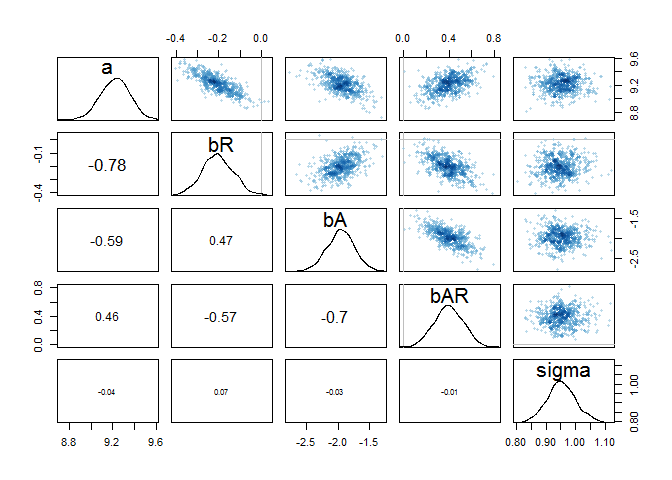

# Chapter 8
##Easy.

#8E1. Which of the following is a requirement of the simple Metropolis algorithm?

1. The parameters must be discrete.

2. The likelihood function must be Gaussian.

3. The proposal distribution must be symmetric.

```
3
```

#8E2. Gibbs sampling is more efficient than the Metropolis algorithm. How does it achieve this extra efficiency? Are there any limitations to the Gibbs sampling strategy?

Gibbs sampling is more efficient because it uses adaptive proposals in which the distributions of a proposed paramter can adjust itself depending on the values that parameter may have in the moment. Gibbs does this using conjugate pairs, which are combinations of prior distributions and likelihoods, and have analytical solutions of the posterior distribution for a single paramter.

The limiations to Gibbs are that it requires the use of conjugate priors and as model complexity increases Gibbs becomes inefficient.


#8E3. Which sort of parameters can Hamiltonian Monte Carlo not handle? Can you explain why?


HMC requires continuous parameters and can not handle discrete parameters, this is because it works by running over the data continuously and spending more time on areas where it is more likely.


#8E4. Explain the difference between the effective number of samples, n_eff as calculated by Stan,and the actual number of samples.

The effective number of samples is an estimate of the number of independent samples you managed to get from the posterior distribution.The effective number of samples matters more than the raw number of samples, as typically Markov chains are autocorrelated. (sequential samples are not independent)

#8E5. Which value should Rhat approach, when a chain is sampling the posterior distribution correctly?

1

#8E6. Sketch a good trace plot for a Markov chain, one that is effectively sampling from the posterior distribution. What is good about its shape? Then sketch a trace plot for a malfunctioning Markov chain. What about its shape indicates malfunction?


##Medium.


#8M1. Re-estimate the terrain ruggedness model from the chapter, but now using a uniform prior and an exponential prior for the standard deviation, sigma. The uniform prior should be dunif(0,10) and the exponential should be dexp(1). Do the different priors have any detectible influence on the posterior distribution?


```r
library(rethinking)
```

```
## Loading required package: rstan
```

```
## Warning: package 'rstan' was built under R version 3.2.5
```

```
## Loading required package: ggplot2
```

```
## Warning: package 'ggplot2' was built under R version 3.2.5
```

```
## Loading required package: StanHeaders
```

```
## Warning: package 'StanHeaders' was built under R version 3.2.5
```

```
## rstan (Version 2.10.1, packaged: 2016-06-24 13:22:16 UTC, GitRev: 85f7a56811da)
```

```
## For execution on a local, multicore CPU with excess RAM we recommend calling
## rstan_options(auto_write = TRUE)
## options(mc.cores = parallel::detectCores())
```

```
## Loading required package: parallel
```

```
## rethinking (Version 1.58)
```

```r
data(rugged)
d <- rugged
d$log_gdp <- log(d$rgdppc_2000)
dd <- d[ complete.cases(d$rgdppc_2000) , ]

dd.trim <- dd[ , c("log_gdp","rugged","cont_africa") ]
str(dd.trim)
```

```
## 'data.frame':	170 obs. of  3 variables:
##  $ log_gdp    : num  7.49 8.22 9.93 9.41 7.79 ...
##  $ rugged     : num  0.858 3.427 0.769 0.775 2.688 ...
##  $ cont_africa: int  1 0 0 0 0 0 0 0 0 1 ...
```

```r
m8.1stan_uniform <- map2stan( 
                      alist(
                        log_gdp ~ dnorm( mu , sigma ) ,
                        mu <- a + bR*rugged + bA*cont_africa + bAR*rugged*cont_africa ,
                        a ~ dnorm(0,100),
                        bR ~ dnorm(0,10),
                        bA ~ dnorm(0,10),
                        bAR ~ dnorm(0,10),
                        sigma ~ dunif(0,10)
                      ) ,
                      data=dd.trim )
```

```
## C:/Users/Jessica/Documents/R/win-library/3.2/StanHeaders/include/stan/math/rev/core/set_zero_all_adjoints.hpp:14:17: warning: 'void stan::math::set_zero_all_adjoints()' defined but not used [-Wunused-function]
## 
## SAMPLING FOR MODEL 'log_gdp ~ dnorm(mu, sigma)' NOW (CHAIN 1).
## 
## Chain 1, Iteration:    1 / 2000 [  0%]  (Warmup)
## Chain 1, Iteration:  200 / 2000 [ 10%]  (Warmup)
## Chain 1, Iteration:  400 / 2000 [ 20%]  (Warmup)
## Chain 1, Iteration:  600 / 2000 [ 30%]  (Warmup)
## Chain 1, Iteration:  800 / 2000 [ 40%]  (Warmup)
## Chain 1, Iteration: 1000 / 2000 [ 50%]  (Warmup)
## Chain 1, Iteration: 1001 / 2000 [ 50%]  (Sampling)
## Chain 1, Iteration: 1200 / 2000 [ 60%]  (Sampling)
## Chain 1, Iteration: 1400 / 2000 [ 70%]  (Sampling)
## Chain 1, Iteration: 1600 / 2000 [ 80%]  (Sampling)
## Chain 1, Iteration: 1800 / 2000 [ 90%]  (Sampling)
## Chain 1, Iteration: 2000 / 2000 [100%]  (Sampling)
##  Elapsed Time: 0.876 seconds (Warm-up)
##                0.764 seconds (Sampling)
##                1.64 seconds (Total)
## 
## 
## SAMPLING FOR MODEL 'log_gdp ~ dnorm(mu, sigma)' NOW (CHAIN 1).
## WARNING: No variance estimation is
##          performed for num_warmup < 20
## 
## 
## Chain 1, Iteration: 1 / 1 [100%]  (Sampling)
##  Elapsed Time: 0 seconds (Warm-up)
##                0 seconds (Sampling)
##                0 seconds (Total)
```

```
## Computing WAIC
```

```
## Constructing posterior predictions
```

```
## [ 100 / 1000 ]
[ 200 / 1000 ]
[ 300 / 1000 ]
[ 400 / 1000 ]
[ 500 / 1000 ]
[ 600 / 1000 ]
[ 700 / 1000 ]
[ 800 / 1000 ]
[ 900 / 1000 ]
[ 1000 / 1000 ]
```

```r
m8.1stan_exp <- map2stan( 
                      alist(
                        log_gdp ~ dnorm( mu , sigma ) ,
                        mu <- a + bR*rugged + bA*cont_africa + bAR*rugged*cont_africa ,
                        a ~ dnorm(0,100),
                        bR ~ dnorm(0,10),
                        bA ~ dnorm(0,10),
                        bAR ~ dnorm(0,10),
                        sigma ~ dexp(1)
                      ) ,
                      data=dd.trim )
```

```
## C:/Users/Jessica/Documents/R/win-library/3.2/StanHeaders/include/stan/math/rev/core/set_zero_all_adjoints.hpp:14:17: warning: 'void stan::math::set_zero_all_adjoints()' defined but not used [-Wunused-function]
## 
## SAMPLING FOR MODEL 'log_gdp ~ dnorm(mu, sigma)' NOW (CHAIN 1).
## 
## Chain 1, Iteration:    1 / 2000 [  0%]  (Warmup)
## Chain 1, Iteration:  200 / 2000 [ 10%]  (Warmup)
## Chain 1, Iteration:  400 / 2000 [ 20%]  (Warmup)
## Chain 1, Iteration:  600 / 2000 [ 30%]  (Warmup)
## Chain 1, Iteration:  800 / 2000 [ 40%]  (Warmup)
## Chain 1, Iteration: 1000 / 2000 [ 50%]  (Warmup)
## Chain 1, Iteration: 1001 / 2000 [ 50%]  (Sampling)
## Chain 1, Iteration: 1200 / 2000 [ 60%]  (Sampling)
## Chain 1, Iteration: 1400 / 2000 [ 70%]  (Sampling)
## Chain 1, Iteration: 1600 / 2000 [ 80%]  (Sampling)
## Chain 1, Iteration: 1800 / 2000 [ 90%]  (Sampling)
## Chain 1, Iteration: 2000 / 2000 [100%]  (Sampling)
##  Elapsed Time: 0.952 seconds (Warm-up)
##                0.655 seconds (Sampling)
##                1.607 seconds (Total)
## 
## 
## SAMPLING FOR MODEL 'log_gdp ~ dnorm(mu, sigma)' NOW (CHAIN 1).
## WARNING: No variance estimation is
##          performed for num_warmup < 20
## 
## 
## Chain 1, Iteration: 1 / 1 [100%]  (Sampling)
##  Elapsed Time: 0 seconds (Warm-up)
##                0 seconds (Sampling)
##                0 seconds (Total)
```

```
## Computing WAIC
## Constructing posterior predictions
```

```
## [ 100 / 1000 ]
[ 200 / 1000 ]
[ 300 / 1000 ]
[ 400 / 1000 ]
[ 500 / 1000 ]
[ 600 / 1000 ]
[ 700 / 1000 ]
[ 800 / 1000 ]
[ 900 / 1000 ]
[ 1000 / 1000 ]
```

```r
precis(m8.1stan_uniform)
```

```
##        Mean StdDev lower 0.89 upper 0.89 n_eff Rhat
## a      9.23   0.14       9.02       9.45   319    1
## bR    -0.21   0.08      -0.32      -0.08   328    1
## bA    -1.95   0.23      -2.31      -1.61   337    1
## bAR    0.40   0.13       0.18       0.59   349    1
## sigma  0.95   0.05       0.87       1.03   678    1
```

```r
precis(m8.1stan_exp)
```

```
##        Mean StdDev lower 0.89 upper 0.89 n_eff Rhat
## a      9.22   0.13       9.02       9.44   520    1
## bR    -0.20   0.08      -0.31      -0.07   479    1
## bA    -1.94   0.21      -2.26      -1.60   581    1
## bAR    0.39   0.13       0.18       0.59   512    1
## sigma  0.95   0.05       0.88       1.03   761    1
```

```r
pairs(m8.1stan_uniform)
```


```r
pairs(m8.1stan_exp)
```


#8M2. The Cauchy and exponential priors from the terrain ruggedness model are very weak. They can be made more informative by reducing their scale. Compare the dcauchy and dexp priors for progressively smaller values of the scaling parameter. As these priors become stronger, how does each influence the posterior distribution?


```r
#cauchy original
m8.1stan <- map2stan( 
                      alist(
                        log_gdp ~ dnorm( mu , sigma ) ,
                        mu <- a + bR*rugged + bA*cont_africa + bAR*rugged*cont_africa ,
                        a ~ dnorm(0,100),
                        bR ~ dnorm(0,10),
                        bA ~ dnorm(0,10),
                        bAR ~ dnorm(0,10),
                        sigma ~ dcauchy(0,2)
                      ) ,
                      data=dd.trim )
```

```
## C:/Users/Jessica/Documents/R/win-library/3.2/StanHeaders/include/stan/math/rev/core/set_zero_all_adjoints.hpp:14:17: warning: 'void stan::math::set_zero_all_adjoints()' defined but not used [-Wunused-function]
## 
## SAMPLING FOR MODEL 'log_gdp ~ dnorm(mu, sigma)' NOW (CHAIN 1).
## 
## Chain 1, Iteration:    1 / 2000 [  0%]  (Warmup)
## Chain 1, Iteration:  200 / 2000 [ 10%]  (Warmup)
## Chain 1, Iteration:  400 / 2000 [ 20%]  (Warmup)
## Chain 1, Iteration:  600 / 2000 [ 30%]  (Warmup)
## Chain 1, Iteration:  800 / 2000 [ 40%]  (Warmup)
## Chain 1, Iteration: 1000 / 2000 [ 50%]  (Warmup)
## Chain 1, Iteration: 1001 / 2000 [ 50%]  (Sampling)
## Chain 1, Iteration: 1200 / 2000 [ 60%]  (Sampling)
## Chain 1, Iteration: 1400 / 2000 [ 70%]  (Sampling)
## Chain 1, Iteration: 1600 / 2000 [ 80%]  (Sampling)
## Chain 1, Iteration: 1800 / 2000 [ 90%]  (Sampling)
## Chain 1, Iteration: 2000 / 2000 [100%]  (Sampling)
##  Elapsed Time: 0.652 seconds (Warm-up)
##                0.464 seconds (Sampling)
##                1.116 seconds (Total)
## 
## 
## SAMPLING FOR MODEL 'log_gdp ~ dnorm(mu, sigma)' NOW (CHAIN 1).
## WARNING: No variance estimation is
##          performed for num_warmup < 20
## 
## 
## Chain 1, Iteration: 1 / 1 [100%]  (Sampling)
##  Elapsed Time: 0 seconds (Warm-up)
##                0.001 seconds (Sampling)
##                0.001 seconds (Total)
```

```
## Computing WAIC
```

```
## Constructing posterior predictions
```

```
## [ 100 / 1000 ]
[ 200 / 1000 ]
[ 300 / 1000 ]
[ 400 / 1000 ]
[ 500 / 1000 ]
[ 600 / 1000 ]
[ 700 / 1000 ]
[ 800 / 1000 ]
[ 900 / 1000 ]
[ 1000 / 1000 ]
```

```r
#cauchy stricter prior
m8.1stan2 <- map2stan( 
                      alist(
                        log_gdp ~ dnorm( mu , sigma ) ,
                        mu <- a + bR*rugged + bA*cont_africa + bAR*rugged*cont_africa ,
                        a ~ dnorm(0,100),
                        bR ~ dnorm(0,10),
                        bA ~ dnorm(0,10),
                        bAR ~ dnorm(0,10),
                        sigma ~ dcauchy(0,1)
                      ) ,

                                           data=dd.trim )
```

```
## C:/Users/Jessica/Documents/R/win-library/3.2/StanHeaders/include/stan/math/rev/core/set_zero_all_adjoints.hpp:14:17: warning: 'void stan::math::set_zero_all_adjoints()' defined but not used [-Wunused-function]
## 
## SAMPLING FOR MODEL 'log_gdp ~ dnorm(mu, sigma)' NOW (CHAIN 1).
## 
## Chain 1, Iteration:    1 / 2000 [  0%]  (Warmup)
## Chain 1, Iteration:  200 / 2000 [ 10%]  (Warmup)
## Chain 1, Iteration:  400 / 2000 [ 20%]  (Warmup)
## Chain 1, Iteration:  600 / 2000 [ 30%]  (Warmup)
## Chain 1, Iteration:  800 / 2000 [ 40%]  (Warmup)
## Chain 1, Iteration: 1000 / 2000 [ 50%]  (Warmup)
## Chain 1, Iteration: 1001 / 2000 [ 50%]  (Sampling)
## Chain 1, Iteration: 1200 / 2000 [ 60%]  (Sampling)
## Chain 1, Iteration: 1400 / 2000 [ 70%]  (Sampling)
## Chain 1, Iteration: 1600 / 2000 [ 80%]  (Sampling)
## Chain 1, Iteration: 1800 / 2000 [ 90%]  (Sampling)
## Chain 1, Iteration: 2000 / 2000 [100%]  (Sampling)
##  Elapsed Time: 1.242 seconds (Warm-up)
##                0.857 seconds (Sampling)
##                2.099 seconds (Total)
## 
## 
## SAMPLING FOR MODEL 'log_gdp ~ dnorm(mu, sigma)' NOW (CHAIN 1).
## WARNING: No variance estimation is
##          performed for num_warmup < 20
## 
## 
## Chain 1, Iteration: 1 / 1 [100%]  (Sampling)
##  Elapsed Time: 0 seconds (Warm-up)
##                0.001 seconds (Sampling)
##                0.001 seconds (Total)
```

```
## Computing WAIC
## Constructing posterior predictions
```

```
## [ 100 / 1000 ]
[ 200 / 1000 ]
[ 300 / 1000 ]
[ 400 / 1000 ]
[ 500 / 1000 ]
[ 600 / 1000 ]
[ 700 / 1000 ]
[ 800 / 1000 ]
[ 900 / 1000 ]
[ 1000 / 1000 ]
```

```r
precis(m8.1stan)
```

```
##        Mean StdDev lower 0.89 upper 0.89 n_eff Rhat
## a      9.24   0.14       9.01       9.45   499 1.00
## bR    -0.21   0.08      -0.33      -0.09   445 1.00
## bA    -1.96   0.22      -2.30      -1.62   449 1.01
## bAR    0.40   0.12       0.22       0.59   448 1.00
## sigma  0.95   0.05       0.86       1.02   561 1.00
```

```r
precis(m8.1stan2)
```

```
##        Mean StdDev lower 0.89 upper 0.89 n_eff Rhat
## a      9.23   0.13       9.04       9.46   353 1.00
## bR    -0.21   0.08      -0.32      -0.09   328 1.01
## bA    -1.96   0.22      -2.33      -1.61   386 1.00
## bAR    0.40   0.13       0.18       0.60   364 1.00
## sigma  0.95   0.05       0.87       1.04   635 1.00
```

```r
pairs(m8.1stan)
```


```r
pairs(m8.1stan2)
```


```r
#exp original
precis(m8.1stan_exp)
```

```
##        Mean StdDev lower 0.89 upper 0.89 n_eff Rhat
## a      9.22   0.13       9.02       9.44   520    1
## bR    -0.20   0.08      -0.31      -0.07   479    1
## bA    -1.94   0.21      -2.26      -1.60   581    1
## bAR    0.39   0.13       0.18       0.59   512    1
## sigma  0.95   0.05       0.88       1.03   761    1
```

```r
#exp stricter prior
m8.1stan_exp <- map2stan( 
                      alist(
                        log_gdp ~ dnorm( mu , sigma ) ,
                        mu <- a + bR*rugged + bA*cont_africa + bAR*rugged*cont_africa ,
                        a ~ dnorm(0,100),
                        bR ~ dnorm(0,10),
                        bA ~ dnorm(0,10),
                        bAR ~ dnorm(0,10),
                        sigma ~ dexp(0.5)
                      ) ,
                      data=dd.trim )
```

```
## C:/Users/Jessica/Documents/R/win-library/3.2/StanHeaders/include/stan/math/rev/core/set_zero_all_adjoints.hpp:14:17: warning: 'void stan::math::set_zero_all_adjoints()' defined but not used [-Wunused-function]
## 
## SAMPLING FOR MODEL 'log_gdp ~ dnorm(mu, sigma)' NOW (CHAIN 1).
## 
## Chain 1, Iteration:    1 / 2000 [  0%]  (Warmup)
## Chain 1, Iteration:  200 / 2000 [ 10%]  (Warmup)
## Chain 1, Iteration:  400 / 2000 [ 20%]  (Warmup)
## Chain 1, Iteration:  600 / 2000 [ 30%]  (Warmup)
## Chain 1, Iteration:  800 / 2000 [ 40%]  (Warmup)
## Chain 1, Iteration: 1000 / 2000 [ 50%]  (Warmup)
## Chain 1, Iteration: 1001 / 2000 [ 50%]  (Sampling)
## Chain 1, Iteration: 1200 / 2000 [ 60%]  (Sampling)
## Chain 1, Iteration: 1400 / 2000 [ 70%]  (Sampling)
## Chain 1, Iteration: 1600 / 2000 [ 80%]  (Sampling)
## Chain 1, Iteration: 1800 / 2000 [ 90%]  (Sampling)
## Chain 1, Iteration: 2000 / 2000 [100%]  (Sampling)
##  Elapsed Time: 0.875 seconds (Warm-up)
##                0.733 seconds (Sampling)
##                1.608 seconds (Total)
## 
## 
## SAMPLING FOR MODEL 'log_gdp ~ dnorm(mu, sigma)' NOW (CHAIN 1).
## WARNING: No variance estimation is
##          performed for num_warmup < 20
## 
## 
## Chain 1, Iteration: 1 / 1 [100%]  (Sampling)
##  Elapsed Time: 0 seconds (Warm-up)
##                0 seconds (Sampling)
##                0 seconds (Total)
```

```
## Computing WAIC
## Constructing posterior predictions
```

```
## [ 100 / 1000 ]
[ 200 / 1000 ]
[ 300 / 1000 ]
[ 400 / 1000 ]
[ 500 / 1000 ]
[ 600 / 1000 ]
[ 700 / 1000 ]
[ 800 / 1000 ]
[ 900 / 1000 ]
[ 1000 / 1000 ]
```

```r
precis(m8.1stan_uniform)
```

```
##        Mean StdDev lower 0.89 upper 0.89 n_eff Rhat
## a      9.23   0.14       9.02       9.45   319    1
## bR    -0.21   0.08      -0.32      -0.08   328    1
## bA    -1.95   0.23      -2.31      -1.61   337    1
## bAR    0.40   0.13       0.18       0.59   349    1
## sigma  0.95   0.05       0.87       1.03   678    1
```

```r
precis(m8.1stan_exp)
```

```
##        Mean StdDev lower 0.89 upper 0.89 n_eff Rhat
## a      9.22   0.14       9.02       9.45   330 1.01
## bR    -0.20   0.08      -0.32      -0.08   317 1.01
## bA    -1.94   0.23      -2.27      -1.55   372 1.01
## bAR    0.39   0.13       0.19       0.59   361 1.00
## sigma  0.95   0.05       0.87       1.03   553 1.00
```

```r
pairs(m8.1stan_uniform)
```


```r
pairs(m8.1stan_exp)
```




#8M3. Re-estimate one of the Stan models from the chapter, but at different numbers of warmup iterations. Be sure to use the same number of sampling iterations in each case. Compare the n_eff values. How much warmup is enough?


```r
#original example from chapter
y <- rnorm( 100 , mean=0 , sd=1 )
m8.5 <- map2stan( 
alist(
y ~ dnorm( mu , sigma ) ,
mu <- a1 + a2 ,
a1 ~ dnorm( 0 , 10 ) ,
a2 ~ dnorm( 0 , 10 ) ,
sigma ~ dcauchy( 0 , 1 )
) ,
data=list(y=y) , start=list(a1=0,a2=0,sigma=1) ,
chains=2 , iter=4000 , warmup=1000 )
```

```
## C:/Users/Jessica/Documents/R/win-library/3.2/StanHeaders/include/stan/math/rev/core/set_zero_all_adjoints.hpp:14:17: warning: 'void stan::math::set_zero_all_adjoints()' defined but not used [-Wunused-function]
## 
## SAMPLING FOR MODEL 'y ~ dnorm(mu, sigma)' NOW (CHAIN 1).
## 
## Chain 1, Iteration:    1 / 4000 [  0%]  (Warmup)
## Chain 1, Iteration:  400 / 4000 [ 10%]  (Warmup)
## Chain 1, Iteration:  800 / 4000 [ 20%]  (Warmup)
## Chain 1, Iteration: 1001 / 4000 [ 25%]  (Sampling)
## Chain 1, Iteration: 1400 / 4000 [ 35%]  (Sampling)
## Chain 1, Iteration: 1800 / 4000 [ 45%]  (Sampling)
## Chain 1, Iteration: 2200 / 4000 [ 55%]  (Sampling)
## Chain 1, Iteration: 2600 / 4000 [ 65%]  (Sampling)
## Chain 1, Iteration: 3000 / 4000 [ 75%]  (Sampling)
## Chain 1, Iteration: 3400 / 4000 [ 85%]  (Sampling)
## Chain 1, Iteration: 3800 / 4000 [ 95%]  (Sampling)
## Chain 1, Iteration: 4000 / 4000 [100%]  (Sampling)
##  Elapsed Time: 2.907 seconds (Warm-up)
##                10.614 seconds (Sampling)
##                13.521 seconds (Total)
## 
## 
## SAMPLING FOR MODEL 'y ~ dnorm(mu, sigma)' NOW (CHAIN 2).
## 
## Chain 2, Iteration:    1 / 4000 [  0%]  (Warmup)
## Chain 2, Iteration:  400 / 4000 [ 10%]  (Warmup)
## Chain 2, Iteration:  800 / 4000 [ 20%]  (Warmup)
## Chain 2, Iteration: 1001 / 4000 [ 25%]  (Sampling)
## Chain 2, Iteration: 1400 / 4000 [ 35%]  (Sampling)
## Chain 2, Iteration: 1800 / 4000 [ 45%]  (Sampling)
## Chain 2, Iteration: 2200 / 4000 [ 55%]  (Sampling)
## Chain 2, Iteration: 2600 / 4000 [ 65%]  (Sampling)
## Chain 2, Iteration: 3000 / 4000 [ 75%]  (Sampling)
## Chain 2, Iteration: 3400 / 4000 [ 85%]  (Sampling)
## Chain 2, Iteration: 3800 / 4000 [ 95%]  (Sampling)
## Chain 2, Iteration: 4000 / 4000 [100%]  (Sampling)
##  Elapsed Time: 3.144 seconds (Warm-up)
##                10.616 seconds (Sampling)
##                13.76 seconds (Total)
## 
## 
## SAMPLING FOR MODEL 'y ~ dnorm(mu, sigma)' NOW (CHAIN 1).
## WARNING: No variance estimation is
##          performed for num_warmup < 20
## 
## 
## Chain 1, Iteration: 1 / 1 [100%]  (Sampling)
##  Elapsed Time: 0 seconds (Warm-up)
##                0.001 seconds (Sampling)
##                0.001 seconds (Total)
```

```
## Computing WAIC
```

```
## Constructing posterior predictions
```

```
## [ 600 / 6000 ]
[ 1200 / 6000 ]
[ 1800 / 6000 ]
[ 2400 / 6000 ]
[ 3000 / 6000 ]
[ 3600 / 6000 ]
[ 4200 / 6000 ]
[ 4800 / 6000 ]
[ 5400 / 6000 ]
[ 6000 / 6000 ]
```

```r
precis(m8.5)
```

```
##        Mean StdDev lower 0.89 upper 0.89 n_eff Rhat
## a1    -0.46   7.14     -11.85      10.51  1005    1
## a2     0.20   7.14     -10.82      11.57  1006    1
## sigma  1.01   0.07       0.90       1.13  1694    1
```

```r
#less warmup
m8.5_lesswarmup <- map2stan( 
alist(
y ~ dnorm( mu , sigma ) ,
mu <- a1 + a2 ,
a1 ~ dnorm( 0 , 10 ) ,
a2 ~ dnorm( 0 , 10 ) ,
sigma ~ dcauchy( 0 , 1 )
) ,
data=list(y=y) , start=list(a1=0,a2=0,sigma=1) ,
chains=2 , iter=4000 , warmup=500 )
```

```
## C:/Users/Jessica/Documents/R/win-library/3.2/StanHeaders/include/stan/math/rev/core/set_zero_all_adjoints.hpp:14:17: warning: 'void stan::math::set_zero_all_adjoints()' defined but not used [-Wunused-function]
## 
## SAMPLING FOR MODEL 'y ~ dnorm(mu, sigma)' NOW (CHAIN 1).
## 
## Chain 1, Iteration:    1 / 4000 [  0%]  (Warmup)
## Chain 1, Iteration:  400 / 4000 [ 10%]  (Warmup)
## Chain 1, Iteration:  501 / 4000 [ 12%]  (Sampling)
## Chain 1, Iteration:  900 / 4000 [ 22%]  (Sampling)
## Chain 1, Iteration: 1300 / 4000 [ 32%]  (Sampling)
## Chain 1, Iteration: 1700 / 4000 [ 42%]  (Sampling)
## Chain 1, Iteration: 2100 / 4000 [ 52%]  (Sampling)
## Chain 1, Iteration: 2500 / 4000 [ 62%]  (Sampling)
## Chain 1, Iteration: 2900 / 4000 [ 72%]  (Sampling)
## Chain 1, Iteration: 3300 / 4000 [ 82%]  (Sampling)
## Chain 1, Iteration: 3700 / 4000 [ 92%]  (Sampling)
## Chain 1, Iteration: 4000 / 4000 [100%]  (Sampling)
##  Elapsed Time: 1.437 seconds (Warm-up)
##                11.568 seconds (Sampling)
##                13.005 seconds (Total)
## 
## 
## SAMPLING FOR MODEL 'y ~ dnorm(mu, sigma)' NOW (CHAIN 2).
## 
## Chain 2, Iteration:    1 / 4000 [  0%]  (Warmup)
## Chain 2, Iteration:  400 / 4000 [ 10%]  (Warmup)
## Chain 2, Iteration:  501 / 4000 [ 12%]  (Sampling)
## Chain 2, Iteration:  900 / 4000 [ 22%]  (Sampling)
## Chain 2, Iteration: 1300 / 4000 [ 32%]  (Sampling)
## Chain 2, Iteration: 1700 / 4000 [ 42%]  (Sampling)
## Chain 2, Iteration: 2100 / 4000 [ 52%]  (Sampling)
## Chain 2, Iteration: 2500 / 4000 [ 62%]  (Sampling)
## Chain 2, Iteration: 2900 / 4000 [ 72%]  (Sampling)
## Chain 2, Iteration: 3300 / 4000 [ 82%]  (Sampling)
## Chain 2, Iteration: 3700 / 4000 [ 92%]  (Sampling)
## Chain 2, Iteration: 4000 / 4000 [100%]  (Sampling)
##  Elapsed Time: 1.353 seconds (Warm-up)
##                12.923 seconds (Sampling)
##                14.276 seconds (Total)
## 
## 
## SAMPLING FOR MODEL 'y ~ dnorm(mu, sigma)' NOW (CHAIN 1).
## WARNING: No variance estimation is
##          performed for num_warmup < 20
## 
## 
## Chain 1, Iteration: 1 / 1 [100%]  (Sampling)
##  Elapsed Time: 0 seconds (Warm-up)
##                0 seconds (Sampling)
##                0 seconds (Total)
```

```
## Computing WAIC
## Constructing posterior predictions
```

```
## [ 700 / 7000 ]
[ 1400 / 7000 ]
[ 2100 / 7000 ]
[ 2800 / 7000 ]
[ 3500 / 7000 ]
[ 4200 / 7000 ]
[ 4900 / 7000 ]
[ 5600 / 7000 ]
[ 6300 / 7000 ]
[ 7000 / 7000 ]
```

```r
precis(m8.5)
```

```
##        Mean StdDev lower 0.89 upper 0.89 n_eff Rhat
## a1    -0.46   7.14     -11.85      10.51  1005    1
## a2     0.20   7.14     -10.82      11.57  1006    1
## sigma  1.01   0.07       0.90       1.13  1694    1
```

```r
precis(m8.5_lesswarmup)
```

```
##        Mean StdDev lower 0.89 upper 0.89 n_eff Rhat
## a1    -0.06   7.36     -12.58      10.99  1175    1
## a2    -0.19   7.36     -11.20      12.36  1176    1
## sigma  1.02   0.07       0.90       1.13  1682    1
```

