# chapter 9


```r
# In class solving of the tomato problem and additional problems chapter 9

setwd("C:/Users/Jessica/Documents/Rclub-rethinking_Jessica.Tucci/Assignment_Chapter_09")

# load the data and libraries
data <- read.csv("TomatoR2CSHL.csv")

library(rethinking)
```

```
## Loading required package: rstan
```

```
## Loading required package: ggplot2
```

```
## Loading required package: StanHeaders
```

```
## rstan (Version 2.11.1, packaged: 2016-07-28 18:19:31 UTC, GitRev: 85f7a56811da)
```

```
## For execution on a local, multicore CPU with excess RAM we recommend calling
## rstan_options(auto_write = TRUE)
## options(mc.cores = parallel::detectCores())
```

```
## Loading required package: parallel
```

```
## rethinking (Version 1.59)
```

```r
library(ggplot2)
library(reshape2)

# take a look at the data
head(data)
```

```
##   shelf flat col row    acs trt days   date   hyp int1 int2 int3 int4
## 1     Z    1   B   1 LA2580   H   28 5/5/08 19.46 2.37 1.59 1.87 0.51
## 2     Z    1   C   1 LA1305   H   28 5/5/08 31.28 3.34 0.01 9.19 1.62
## 3     Z    1   D   1 LA1973   H   28 5/5/08 56.65 8.43 2.39 6.70 3.69
## 4     Z    1   E   1 LA2748   H   28 5/5/08 35.18 0.56 0.00 1.60 0.61
## 5     Z    1   F   1 LA2931   H   28 5/5/08 35.32 0.82 0.02 1.49 0.46
## 6     Z    1   G   1 LA1317   H   28 5/5/08 28.74 1.07 6.69 5.72 4.76
##   intleng totleng petleng leafleng leafwid leafnum ndvi      lat      lon
## 1    6.34   25.80   15.78    30.53   34.44       5  111  -9.5167 -78.0083
## 2   14.16   45.44   12.36    22.93   13.99       4  120 -13.3833 -75.3583
## 3   21.21   77.86   13.05    46.71   43.78       5  110 -16.2333 -71.7000
## 4    2.77   37.95    8.08    26.82   33.28       5  105 -20.4833 -69.9833
## 5    2.79   38.11    7.68    22.40   23.61       5  106 -20.9167 -69.0667
## 6   18.24   46.98   23.66    42.35   42.35       5  132 -13.4167 -73.8417
##    alt         species who
## 1  740    S. pennellii Dan
## 2 3360   S. peruvianum Dan
## 3 2585   S. peruvianum Dan
## 4 1020     S. chilense Dan
## 5 2460     S. chilense Dan
## 6 2000 S. chmielewskii Dan
```

```r
summary(data)
```

```
##  shelf        flat            col           row            acs     
##  U:161   Min.   : 1.00   G      :133   Min.   :1.00   LA1954 : 40  
##  V:174   1st Qu.: 9.00   H      :127   1st Qu.:2.00   LA2695 : 39  
##  W:178   Median :17.00   F      :125   Median :3.00   LA1361 : 37  
##  X:174   Mean   :17.89   C      :117   Mean   :2.56   LA2167 : 37  
##  Y:125   3rd Qu.:28.00   D      :117   3rd Qu.:4.00   LA2773 : 37  
##  Z:196   Max.   :36.00   E      :107   Max.   :4.00   LA1474 : 36  
##                          (Other):282                  (Other):782  
##  trt          days           date          hyp             int1      
##  H:495   Min.   :28.00   5/5/08:716   Min.   : 6.17   Min.   : 0.00  
##  L:513   1st Qu.:28.00   5/6/08:292   1st Qu.:26.81   1st Qu.: 1.74  
##          Median :28.00                Median :32.02   Median : 3.59  
##          Mean   :28.29                Mean   :33.36   Mean   : 4.71  
##          3rd Qu.:29.00                3rd Qu.:38.56   3rd Qu.: 6.46  
##          Max.   :29.00                Max.   :74.60   Max.   :39.01  
##                                                       NA's   :1      
##       int2             int3             int4           intleng      
##  Min.   : 0.000   Min.   : 0.010   Min.   : 0.030   Min.   : 0.000  
##  1st Qu.: 1.060   1st Qu.: 2.975   1st Qu.: 2.163   1st Qu.: 9.637  
##  Median : 3.120   Median : 5.625   Median : 3.995   Median :17.255  
##  Mean   : 4.287   Mean   : 6.794   Mean   : 5.102   Mean   :20.340  
##  3rd Qu.: 6.320   3rd Qu.: 9.367   3rd Qu.: 7.018   3rd Qu.:28.145  
##  Max.   :28.980   Max.   :27.760   Max.   :23.280   Max.   :92.420  
##  NA's   :1        NA's   :4        NA's   :102                      
##     totleng          petleng         leafleng        leafwid     
##  Min.   : 13.59   Min.   : 1.53   Min.   : 9.74   Min.   : 8.29  
##  1st Qu.: 39.25   1st Qu.:11.20   1st Qu.:27.43   1st Qu.:29.48  
##  Median : 50.98   Median :15.13   Median :34.59   Median :39.62  
##  Mean   : 53.70   Mean   :15.92   Mean   :35.54   Mean   :39.29  
##  3rd Qu.: 64.76   3rd Qu.:20.48   3rd Qu.:42.98   3rd Qu.:47.75  
##  Max.   :129.43   Max.   :44.44   Max.   :95.19   Max.   :90.27  
##                   NA's   :2       NA's   :1       NA's   :1      
##     leafnum           ndvi          lat               lon        
##  Min.   :3.000   Min.   :100   Min.   :-25.400   Min.   :-78.52  
##  1st Qu.:5.000   1st Qu.:108   1st Qu.:-16.607   1st Qu.:-75.92  
##  Median :5.000   Median :115   Median :-14.152   Median :-73.63  
##  Mean   :5.063   Mean   :118   Mean   :-14.490   Mean   :-73.71  
##  3rd Qu.:6.000   3rd Qu.:128   3rd Qu.:-12.450   3rd Qu.:-71.70  
##  Max.   :8.000   Max.   :137   Max.   : -5.767   Max.   :-68.07  
##  NA's   :1                                                       
##       alt                  species      who     
##  Min.   :   0   S. chilense    :207   Dan :402  
##  1st Qu.:1020   S. chmielewskii:226   Pepe:606  
##  Median :2240   S. habrochaites:226             
##  Mean   :2035   S. pennellii   :132             
##  3rd Qu.:3110   S. peruvianum  :217             
##  Max.   :3540                                   
## 
```

```r
# density plots
pl <- ggplot(data=data,aes(x=hyp,fill=trt))
pl <- pl + geom_density()
pl <- pl + facet_grid(species ~ trt)
pl
```

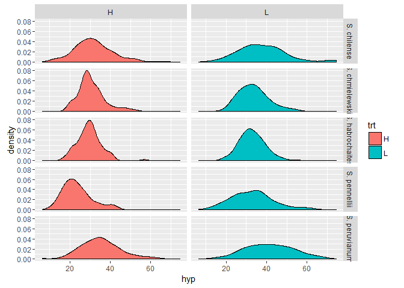<!-- -->

```r
# box plots
pl <- ggplot(data=data,aes(y=hyp,x=species,fill=trt))
pl <- pl + geom_boxplot()
pl
```

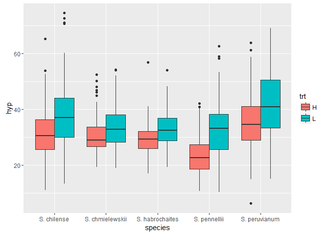<!-- -->

```r
# log2 transformation
pl <- ggplot(data=data,aes(x=log2(hyp),fill=trt))
pl <- pl + geom_density()
pl <- pl + facet_grid(species ~ trt)
pl + ggtitle("log2 transformed")
```

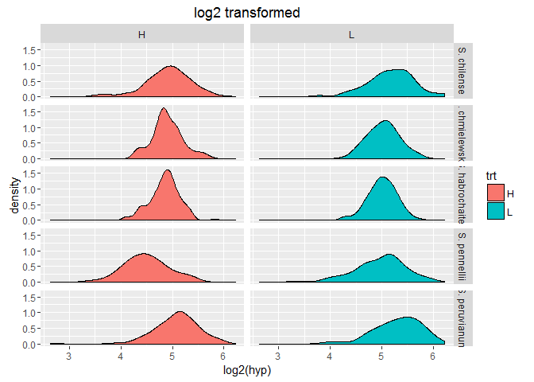<!-- -->

```r
# Square root transformation
pl <- ggplot(data=data,aes(x=sqrt(hyp),fill=trt))
pl <- pl + geom_density()
pl <- pl + facet_grid(species ~ trt)
pl + ggtitle("sqrt transformed")
```

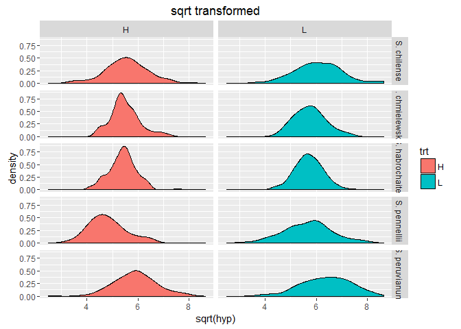<!-- -->

```r
#normality test
by(data$hyp,list(data$trt,data$species),shapiro.test)
```

```
## : H
## : S. chilense
## 
## 	Shapiro-Wilk normality test
## 
## data:  dd[x, ]
## W = 0.97615, p-value = 0.06157
## 
## -------------------------------------------------------- 
## : L
## : S. chilense
## 
## 	Shapiro-Wilk normality test
## 
## data:  dd[x, ]
## W = 0.96132, p-value = 0.003754
## 
## -------------------------------------------------------- 
## : H
## : S. chmielewskii
## 
## 	Shapiro-Wilk normality test
## 
## data:  dd[x, ]
## W = 0.93713, p-value = 6.374e-05
## 
## -------------------------------------------------------- 
## : L
## : S. chmielewskii
## 
## 	Shapiro-Wilk normality test
## 
## data:  dd[x, ]
## W = 0.97217, p-value = 0.01553
## 
## -------------------------------------------------------- 
## : H
## : S. habrochaites
## 
## 	Shapiro-Wilk normality test
## 
## data:  dd[x, ]
## W = 0.95978, p-value = 0.001285
## 
## -------------------------------------------------------- 
## : L
## : S. habrochaites
## 
## 	Shapiro-Wilk normality test
## 
## data:  dd[x, ]
## W = 0.98706, p-value = 0.3921
## 
## -------------------------------------------------------- 
## : H
## : S. pennellii
## 
## 	Shapiro-Wilk normality test
## 
## data:  dd[x, ]
## W = 0.93801, p-value = 0.004416
## 
## -------------------------------------------------------- 
## : L
## : S. pennellii
## 
## 	Shapiro-Wilk normality test
## 
## data:  dd[x, ]
## W = 0.97952, p-value = 0.2895
## 
## -------------------------------------------------------- 
## : H
## : S. peruvianum
## 
## 	Shapiro-Wilk normality test
## 
## data:  dd[x, ]
## W = 0.98393, p-value = 0.2357
## 
## -------------------------------------------------------- 
## : L
## : S. peruvianum
## 
## 	Shapiro-Wilk normality test
## 
## data:  dd[x, ]
## W = 0.99081, p-value = 0.6571
```

```r
by(sqrt(data$hyp),list(data$trt,data$species),shapiro.test)
```

```
## : H
## : S. chilense
## 
## 	Shapiro-Wilk normality test
## 
## data:  dd[x, ]
## W = 0.98965, p-value = 0.6224
## 
## -------------------------------------------------------- 
## : L
## : S. chilense
## 
## 	Shapiro-Wilk normality test
## 
## data:  dd[x, ]
## W = 0.98696, p-value = 0.3991
## 
## -------------------------------------------------------- 
## : H
## : S. chmielewskii
## 
## 	Shapiro-Wilk normality test
## 
## data:  dd[x, ]
## W = 0.96342, p-value = 0.004341
## 
## -------------------------------------------------------- 
## : L
## : S. chmielewskii
## 
## 	Shapiro-Wilk normality test
## 
## data:  dd[x, ]
## W = 0.9881, p-value = 0.399
## 
## -------------------------------------------------------- 
## : H
## : S. habrochaites
## 
## 	Shapiro-Wilk normality test
## 
## data:  dd[x, ]
## W = 0.97928, p-value = 0.06305
## 
## -------------------------------------------------------- 
## : L
## : S. habrochaites
## 
## 	Shapiro-Wilk normality test
## 
## data:  dd[x, ]
## W = 0.99519, p-value = 0.9731
## 
## -------------------------------------------------------- 
## : H
## : S. pennellii
## 
## 	Shapiro-Wilk normality test
## 
## data:  dd[x, ]
## W = 0.96999, p-value = 0.1457
## 
## -------------------------------------------------------- 
## : L
## : S. pennellii
## 
## 	Shapiro-Wilk normality test
## 
## data:  dd[x, ]
## W = 0.99243, p-value = 0.9467
## 
## -------------------------------------------------------- 
## : H
## : S. peruvianum
## 
## 	Shapiro-Wilk normality test
## 
## data:  dd[x, ]
## W = 0.97994, p-value = 0.1125
## 
## -------------------------------------------------------- 
## : L
## : S. peruvianum
## 
## 	Shapiro-Wilk normality test
## 
## data:  dd[x, ]
## W = 0.98796, p-value = 0.4209
```

```r
by(log2(data$hyp),list(data$trt,data$species),shapiro.test)
```

```
## : H
## : S. chilense
## 
## 	Shapiro-Wilk normality test
## 
## data:  dd[x, ]
## W = 0.97087, p-value = 0.02352
## 
## -------------------------------------------------------- 
## : L
## : S. chilense
## 
## 	Shapiro-Wilk normality test
## 
## data:  dd[x, ]
## W = 0.98253, p-value = 0.1827
## 
## -------------------------------------------------------- 
## : H
## : S. chmielewskii
## 
## 	Shapiro-Wilk normality test
## 
## data:  dd[x, ]
## W = 0.97867, p-value = 0.07747
## 
## -------------------------------------------------------- 
## : L
## : S. chmielewskii
## 
## 	Shapiro-Wilk normality test
## 
## data:  dd[x, ]
## W = 0.9949, p-value = 0.9493
## 
## -------------------------------------------------------- 
## : H
## : S. habrochaites
## 
## 	Shapiro-Wilk normality test
## 
## data:  dd[x, ]
## W = 0.98243, p-value = 0.123
## 
## -------------------------------------------------------- 
## : L
## : S. habrochaites
## 
## 	Shapiro-Wilk normality test
## 
## data:  dd[x, ]
## W = 0.99303, p-value = 0.8653
## 
## -------------------------------------------------------- 
## : H
## : S. pennellii
## 
## 	Shapiro-Wilk normality test
## 
## data:  dd[x, ]
## W = 0.98586, p-value = 0.7146
## 
## -------------------------------------------------------- 
## : L
## : S. pennellii
## 
## 	Shapiro-Wilk normality test
## 
## data:  dd[x, ]
## W = 0.97622, p-value = 0.1895
## 
## -------------------------------------------------------- 
## : H
## : S. peruvianum
## 
## 	Shapiro-Wilk normality test
## 
## data:  dd[x, ]
## W = 0.91602, p-value = 5.466e-06
## 
## -------------------------------------------------------- 
## : L
## : S. peruvianum
## 
## 	Shapiro-Wilk normality test
## 
## data:  dd[x, ]
## W = 0.96537, p-value = 0.005283
```

```r
#sqrt transformed is best

# categorical variable for trt
data$trtL <- ifelse(data$trt=="L",1,0)

# alternative way
levels(data$trt)
```

```
## [1] "H" "L"
```

```r
data$trt2 <- as.numeric(data$trt)-1 # 0 = H, 1 = L

#categorical variables for species
data$index <- 1:nrow(data)
data2 <- dcast(data,index + hyp + trt2 ~ species, value.var="species",fun.aggregate=length)

head(data2)
```

```
##   index   hyp trt2 S. chilense S. chmielewskii S. habrochaites
## 1     1 19.46    0           0               0               0
## 2     2 31.28    0           0               0               0
## 3     3 56.65    0           0               0               0
## 4     4 35.18    0           1               0               0
## 5     5 35.32    0           1               0               0
## 6     6 28.74    0           0               1               0
##   S. pennellii S. peruvianum
## 1            1             0
## 2            0             1
## 3            0             1
## 4            0             0
## 5            0             0
## 6            0             0
```

```r
#must subset the data frame to contain only the relevant columns
data2.trt <- data2[,c("hyp","trt2")]

head(data2.trt)
```

```
##     hyp trt2
## 1 19.46    0
## 2 31.28    0
## 3 56.65    0
## 4 35.18    0
## 5 35.32    0
## 6 28.74    0
```

```r
# trt model
hyp.stan <- map2stan(alist(
  hyp ~ dnorm(mu,sigma),
  mu <- a + bT * trt2,
  a ~ dnorm(0,100),
  bT ~ dnorm(0,10),
  sigma ~ dunif(0,20)),
  data2.trt,
  chains = 4)
```

```
## In file included from C:/Users/Jessica/Documents/R/win-library/3.3/StanHeaders/include/stan/math/prim/mat.hpp:36:0,
##                  from C:/Users/Jessica/Documents/R/win-library/3.3/StanHeaders/include/stan/math/rev/mat.hpp:9,
##                  from C:/Users/Jessica/Documents/R/win-library/3.3/StanHeaders/include/stan/math.hpp:4,
##                  from C:/Users/Jessica/Documents/R/win-library/3.3/StanHeaders/include/src/stan/model/model_header.hpp:4,
##                  from file1cb8435a628f.cpp:8:
## C:/Users/Jessica/Documents/R/win-library/3.3/StanHeaders/include/stan/math/prim/mat/err/check_positive_ordered.hpp: In function 'bool stan::math::check_positive_ordered(const char*, const char*, const Eigen::Matrix<Scalar, -1, 1>&)':
## C:/Users/Jessica/Documents/R/win-library/3.3/StanHeaders/include/stan/math/prim/mat/err/check_positive_ordered.hpp:39:67: warning: typedef 'size_type' locally defined but not used [-Wunused-local-typedefs]
##        typedef typename index_type<Matrix<T_y, Dynamic, 1> >::type size_type;
##                                                                    ^
## In file included from C:/Users/Jessica/Documents/R/win-library/3.3/BH/include/boost/multi_array/base.hpp:28:0,
##                  from C:/Users/Jessica/Documents/R/win-library/3.3/BH/include/boost/multi_array.hpp:21,
##                  from C:/Users/Jessica/Documents/R/win-library/3.3/BH/include/boost/numeric/odeint/util/multi_array_adaption.hpp:29,
##                  from C:/Users/Jessica/Documents/R/win-library/3.3/BH/include/boost/numeric/odeint.hpp:61,
##                  from C:/Users/Jessica/Documents/R/win-library/3.3/StanHeaders/include/stan/math/prim/arr/functor/integrate_ode_rk45.hpp:13,
##                  from C:/Users/Jessica/Documents/R/win-library/3.3/StanHeaders/include/stan/math/prim/arr.hpp:32,
##                  from C:/Users/Jessica/Documents/R/win-library/3.3/StanHeaders/include/stan/math/prim/mat.hpp:235,
##                  from C:/Users/Jessica/Documents/R/win-library/3.3/StanHeaders/include/stan/math/rev/mat.hpp:9,
##                  from C:/Users/Jessica/Documents/R/win-library/3.3/StanHeaders/include/stan/math.hpp:4,
##                  from C:/Users/Jessica/Documents/R/win-library/3.3/StanHeaders/include/src/stan/model/model_header.hpp:4,
##                  from file1cb8435a628f.cpp:8:
## C:/Users/Jessica/Documents/R/win-library/3.3/BH/include/boost/multi_array/concept_checks.hpp: In static member function 'static void boost::multi_array_concepts::detail::idgen_helper<N>::call(Array&, const IdxGen&, Call_Type)':
## C:/Users/Jessica/Documents/R/win-library/3.3/BH/include/boost/multi_array/concept_checks.hpp:42:43: warning: typedef 'index_range' locally defined but not used [-Wunused-local-typedefs]
##        typedef typename Array::index_range index_range;
##                                            ^
## C:/Users/Jessica/Documents/R/win-library/3.3/BH/include/boost/multi_array/concept_checks.hpp:43:37: warning: typedef 'index' locally defined but not used [-Wunused-local-typedefs]
##        typedef typename Array::index index;
##                                      ^
## C:/Users/Jessica/Documents/R/win-library/3.3/BH/include/boost/multi_array/concept_checks.hpp: In static member function 'static void boost::multi_array_concepts::detail::idgen_helper<0ull>::call(Array&, const IdxGen&, Call_Type)':
## C:/Users/Jessica/Documents/R/win-library/3.3/BH/include/boost/multi_array/concept_checks.hpp:53:43: warning: typedef 'index_range' locally defined but not used [-Wunused-local-typedefs]
##        typedef typename Array::index_range index_range;
##                                            ^
## C:/Users/Jessica/Documents/R/win-library/3.3/BH/include/boost/multi_array/concept_checks.hpp:54:37: warning: typedef 'index' locally defined but not used [-Wunused-local-typedefs]
##        typedef typename Array::index index;
##                                      ^
## In file included from C:/Users/Jessica/Documents/R/win-library/3.3/StanHeaders/include/stan/math/rev/core.hpp:42:0,
##                  from C:/Users/Jessica/Documents/R/win-library/3.3/StanHeaders/include/stan/math/rev/mat.hpp:4,
##                  from C:/Users/Jessica/Documents/R/win-library/3.3/StanHeaders/include/stan/math.hpp:4,
##                  from C:/Users/Jessica/Documents/R/win-library/3.3/StanHeaders/include/src/stan/model/model_header.hpp:4,
##                  from file1cb8435a628f.cpp:8:
## C:/Users/Jessica/Documents/R/win-library/3.3/StanHeaders/include/stan/math/rev/core/set_zero_all_adjoints.hpp: At global scope:
## C:/Users/Jessica/Documents/R/win-library/3.3/StanHeaders/include/stan/math/rev/core/set_zero_all_adjoints.hpp:14:17: warning: 'void stan::math::set_zero_all_adjoints()' defined but not used [-Wunused-function]
##      static void set_zero_all_adjoints() {
##                  ^
## 
## SAMPLING FOR MODEL 'hyp ~ dnorm(mu, sigma)' NOW (CHAIN 1).
## 
## Chain 1, Iteration:    1 / 2000 [  0%]  (Warmup)
## Chain 1, Iteration:  200 / 2000 [ 10%]  (Warmup)
## Chain 1, Iteration:  400 / 2000 [ 20%]  (Warmup)
## Chain 1, Iteration:  600 / 2000 [ 30%]  (Warmup)
## Chain 1, Iteration:  800 / 2000 [ 40%]  (Warmup)
## Chain 1, Iteration: 1000 / 2000 [ 50%]  (Warmup)
## Chain 1, Iteration: 1001 / 2000 [ 50%]  (Sampling)
## Chain 1, Iteration: 1200 / 2000 [ 60%]  (Sampling)
## Chain 1, Iteration: 1400 / 2000 [ 70%]  (Sampling)
## Chain 1, Iteration: 1600 / 2000 [ 80%]  (Sampling)
## Chain 1, Iteration: 1800 / 2000 [ 90%]  (Sampling)
## Chain 1, Iteration: 2000 / 2000 [100%]  (Sampling)
##  Elapsed Time: 0.687 seconds (Warm-up)
##                0.644 seconds (Sampling)
##                1.331 seconds (Total)
## 
## 
## SAMPLING FOR MODEL 'hyp ~ dnorm(mu, sigma)' NOW (CHAIN 2).
## 
## Chain 2, Iteration:    1 / 2000 [  0%]  (Warmup)
## Chain 2, Iteration:  200 / 2000 [ 10%]  (Warmup)
## Chain 2, Iteration:  400 / 2000 [ 20%]  (Warmup)
## Chain 2, Iteration:  600 / 2000 [ 30%]  (Warmup)
## Chain 2, Iteration:  800 / 2000 [ 40%]  (Warmup)
## Chain 2, Iteration: 1000 / 2000 [ 50%]  (Warmup)
## Chain 2, Iteration: 1001 / 2000 [ 50%]  (Sampling)
## Chain 2, Iteration: 1200 / 2000 [ 60%]  (Sampling)
## Chain 2, Iteration: 1400 / 2000 [ 70%]  (Sampling)
## Chain 2, Iteration: 1600 / 2000 [ 80%]  (Sampling)
## Chain 2, Iteration: 1800 / 2000 [ 90%]  (Sampling)
## Chain 2, Iteration: 2000 / 2000 [100%]  (Sampling)
##  Elapsed Time: 0.692 seconds (Warm-up)
##                0.609 seconds (Sampling)
##                1.301 seconds (Total)
## 
## 
## SAMPLING FOR MODEL 'hyp ~ dnorm(mu, sigma)' NOW (CHAIN 3).
## 
## Chain 3, Iteration:    1 / 2000 [  0%]  (Warmup)
## Chain 3, Iteration:  200 / 2000 [ 10%]  (Warmup)
## Chain 3, Iteration:  400 / 2000 [ 20%]  (Warmup)
## Chain 3, Iteration:  600 / 2000 [ 30%]  (Warmup)
## Chain 3, Iteration:  800 / 2000 [ 40%]  (Warmup)
## Chain 3, Iteration: 1000 / 2000 [ 50%]  (Warmup)
## Chain 3, Iteration: 1001 / 2000 [ 50%]  (Sampling)
## Chain 3, Iteration: 1200 / 2000 [ 60%]  (Sampling)
## Chain 3, Iteration: 1400 / 2000 [ 70%]  (Sampling)
## Chain 3, Iteration: 1600 / 2000 [ 80%]  (Sampling)
## Chain 3, Iteration: 1800 / 2000 [ 90%]  (Sampling)
## Chain 3, Iteration: 2000 / 2000 [100%]  (Sampling)
##  Elapsed Time: 0.78 seconds (Warm-up)
##                0.674 seconds (Sampling)
##                1.454 seconds (Total)
## 
## 
## SAMPLING FOR MODEL 'hyp ~ dnorm(mu, sigma)' NOW (CHAIN 4).
## 
## Chain 4, Iteration:    1 / 2000 [  0%]  (Warmup)
## Chain 4, Iteration:  200 / 2000 [ 10%]  (Warmup)
## Chain 4, Iteration:  400 / 2000 [ 20%]  (Warmup)
## Chain 4, Iteration:  600 / 2000 [ 30%]  (Warmup)
## Chain 4, Iteration:  800 / 2000 [ 40%]  (Warmup)
## Chain 4, Iteration: 1000 / 2000 [ 50%]  (Warmup)
## Chain 4, Iteration: 1001 / 2000 [ 50%]  (Sampling)
## Chain 4, Iteration: 1200 / 2000 [ 60%]  (Sampling)
## Chain 4, Iteration: 1400 / 2000 [ 70%]  (Sampling)
## Chain 4, Iteration: 1600 / 2000 [ 80%]  (Sampling)
## Chain 4, Iteration: 1800 / 2000 [ 90%]  (Sampling)
## Chain 4, Iteration: 2000 / 2000 [100%]  (Sampling)
##  Elapsed Time: 0.717 seconds (Warm-up)
##                0.691 seconds (Sampling)
##                1.408 seconds (Total)
## 
## 
## SAMPLING FOR MODEL 'hyp ~ dnorm(mu, sigma)' NOW (CHAIN 1).
## WARNING: No variance estimation is
##          performed for num_warmup < 20
## 
## 
## Chain 1, Iteration: 1 / 1 [100%]  (Sampling)
##  Elapsed Time: 0 seconds (Warm-up)
##                0.001 seconds (Sampling)
##                0.001 seconds (Total)
```

```
## Computing WAIC
```

```
## Constructing posterior predictions
```

```
## [ 400 / 4000 ]
[ 800 / 4000 ]
[ 1200 / 4000 ]
[ 1600 / 4000 ]
[ 2000 / 4000 ]
[ 2400 / 4000 ]
[ 2800 / 4000 ]
[ 3200 / 4000 ]
[ 3600 / 4000 ]
[ 4000 / 4000 ]
```

```r
plot(hyp.stan)
```

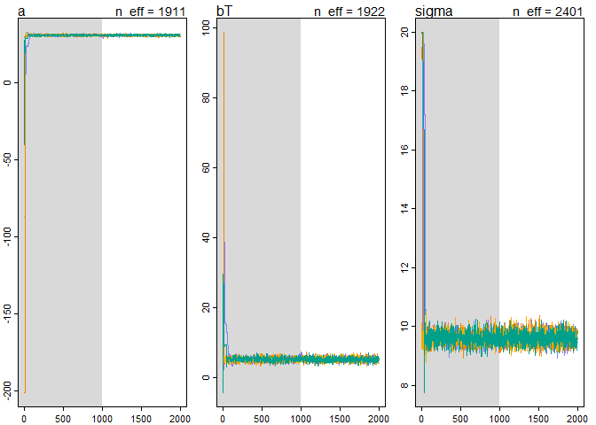<!-- -->

```r
precis(hyp.stan)
```

```
##        Mean StdDev lower 0.89 upper 0.89 n_eff Rhat
## a     30.66   0.41      30.08      31.37  1911    1
## bT     5.30   0.58       4.36       6.18  1922    1
## sigma  9.60   0.21       9.30       9.96  2401    1
```

```r
par(mfrow=c(1,1),mfcol=c(1,1))
plot(precis(hyp.stan))
```

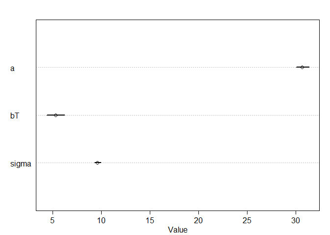<!-- -->

```r
head(data2)
```

```
##   index   hyp trt2 S. chilense S. chmielewskii S. habrochaites
## 1     1 19.46    0           0               0               0
## 2     2 31.28    0           0               0               0
## 3     3 56.65    0           0               0               0
## 4     4 35.18    0           1               0               0
## 5     5 35.32    0           1               0               0
## 6     6 28.74    0           0               1               0
##   S. pennellii S. peruvianum
## 1            1             0
## 2            0             1
## 3            0             1
## 4            0             0
## 5            0             0
## 6            0             0
```

```r
# fix species names to get rid of space
colnames(data2) <- sub(". ","_",colnames(data2))

# model where each species has its own intercept
data2.species.all <- data2[,c(2,4:8)]

head(data2.species.all)
```

```
##     hyp S_chilense S_chmielewskii S_habrochaites S_pennellii S_peruvianum
## 1 19.46          0              0              0           1            0
## 2 31.28          0              0              0           0            1
## 3 56.65          0              0              0           0            1
## 4 35.18          1              0              0           0            0
## 5 35.32          1              0              0           0            0
## 6 28.74          0              1              0           0            0
```

```r
species.stan <- map2stan(alist(
  hyp ~ dnorm(mu,sigma),
  mu <- bChil*S_chilense + bChmi*S_chmielewskii + bHab*S_habrochaites + bPen * S_pennellii + bPer*S_peruvianum,
  c(bChil,bChmi,bHab,bPen,bPer) ~ dnorm(33.35,20),
  sigma ~ dunif(0,20)),
  data2.species.all,
  chains = 4)
```

```
## In file included from C:/Users/Jessica/Documents/R/win-library/3.3/StanHeaders/include/stan/math/prim/mat.hpp:36:0,
##                  from C:/Users/Jessica/Documents/R/win-library/3.3/StanHeaders/include/stan/math/rev/mat.hpp:9,
##                  from C:/Users/Jessica/Documents/R/win-library/3.3/StanHeaders/include/stan/math.hpp:4,
##                  from C:/Users/Jessica/Documents/R/win-library/3.3/StanHeaders/include/src/stan/model/model_header.hpp:4,
##                  from file1cb861041261.cpp:8:
## C:/Users/Jessica/Documents/R/win-library/3.3/StanHeaders/include/stan/math/prim/mat/err/check_positive_ordered.hpp: In function 'bool stan::math::check_positive_ordered(const char*, const char*, const Eigen::Matrix<Scalar, -1, 1>&)':
## C:/Users/Jessica/Documents/R/win-library/3.3/StanHeaders/include/stan/math/prim/mat/err/check_positive_ordered.hpp:39:67: warning: typedef 'size_type' locally defined but not used [-Wunused-local-typedefs]
##        typedef typename index_type<Matrix<T_y, Dynamic, 1> >::type size_type;
##                                                                    ^
## In file included from C:/Users/Jessica/Documents/R/win-library/3.3/BH/include/boost/multi_array/base.hpp:28:0,
##                  from C:/Users/Jessica/Documents/R/win-library/3.3/BH/include/boost/multi_array.hpp:21,
##                  from C:/Users/Jessica/Documents/R/win-library/3.3/BH/include/boost/numeric/odeint/util/multi_array_adaption.hpp:29,
##                  from C:/Users/Jessica/Documents/R/win-library/3.3/BH/include/boost/numeric/odeint.hpp:61,
##                  from C:/Users/Jessica/Documents/R/win-library/3.3/StanHeaders/include/stan/math/prim/arr/functor/integrate_ode_rk45.hpp:13,
##                  from C:/Users/Jessica/Documents/R/win-library/3.3/StanHeaders/include/stan/math/prim/arr.hpp:32,
##                  from C:/Users/Jessica/Documents/R/win-library/3.3/StanHeaders/include/stan/math/prim/mat.hpp:235,
##                  from C:/Users/Jessica/Documents/R/win-library/3.3/StanHeaders/include/stan/math/rev/mat.hpp:9,
##                  from C:/Users/Jessica/Documents/R/win-library/3.3/StanHeaders/include/stan/math.hpp:4,
##                  from C:/Users/Jessica/Documents/R/win-library/3.3/StanHeaders/include/src/stan/model/model_header.hpp:4,
##                  from file1cb861041261.cpp:8:
## C:/Users/Jessica/Documents/R/win-library/3.3/BH/include/boost/multi_array/concept_checks.hpp: In static member function 'static void boost::multi_array_concepts::detail::idgen_helper<N>::call(Array&, const IdxGen&, Call_Type)':
## C:/Users/Jessica/Documents/R/win-library/3.3/BH/include/boost/multi_array/concept_checks.hpp:42:43: warning: typedef 'index_range' locally defined but not used [-Wunused-local-typedefs]
##        typedef typename Array::index_range index_range;
##                                            ^
## C:/Users/Jessica/Documents/R/win-library/3.3/BH/include/boost/multi_array/concept_checks.hpp:43:37: warning: typedef 'index' locally defined but not used [-Wunused-local-typedefs]
##        typedef typename Array::index index;
##                                      ^
## C:/Users/Jessica/Documents/R/win-library/3.3/BH/include/boost/multi_array/concept_checks.hpp: In static member function 'static void boost::multi_array_concepts::detail::idgen_helper<0ull>::call(Array&, const IdxGen&, Call_Type)':
## C:/Users/Jessica/Documents/R/win-library/3.3/BH/include/boost/multi_array/concept_checks.hpp:53:43: warning: typedef 'index_range' locally defined but not used [-Wunused-local-typedefs]
##        typedef typename Array::index_range index_range;
##                                            ^
## C:/Users/Jessica/Documents/R/win-library/3.3/BH/include/boost/multi_array/concept_checks.hpp:54:37: warning: typedef 'index' locally defined but not used [-Wunused-local-typedefs]
##        typedef typename Array::index index;
##                                      ^
## In file included from C:/Users/Jessica/Documents/R/win-library/3.3/StanHeaders/include/stan/math/rev/core.hpp:42:0,
##                  from C:/Users/Jessica/Documents/R/win-library/3.3/StanHeaders/include/stan/math/rev/mat.hpp:4,
##                  from C:/Users/Jessica/Documents/R/win-library/3.3/StanHeaders/include/stan/math.hpp:4,
##                  from C:/Users/Jessica/Documents/R/win-library/3.3/StanHeaders/include/src/stan/model/model_header.hpp:4,
##                  from file1cb861041261.cpp:8:
## C:/Users/Jessica/Documents/R/win-library/3.3/StanHeaders/include/stan/math/rev/core/set_zero_all_adjoints.hpp: At global scope:
## C:/Users/Jessica/Documents/R/win-library/3.3/StanHeaders/include/stan/math/rev/core/set_zero_all_adjoints.hpp:14:17: warning: 'void stan::math::set_zero_all_adjoints()' defined but not used [-Wunused-function]
##      static void set_zero_all_adjoints() {
##                  ^
## 
## SAMPLING FOR MODEL 'hyp ~ dnorm(mu, sigma)' NOW (CHAIN 1).
## 
## Chain 1, Iteration:    1 / 2000 [  0%]  (Warmup)
## Chain 1, Iteration:  200 / 2000 [ 10%]  (Warmup)
## Chain 1, Iteration:  400 / 2000 [ 20%]  (Warmup)
## Chain 1, Iteration:  600 / 2000 [ 30%]  (Warmup)
## Chain 1, Iteration:  800 / 2000 [ 40%]  (Warmup)
## Chain 1, Iteration: 1000 / 2000 [ 50%]  (Warmup)
## Chain 1, Iteration: 1001 / 2000 [ 50%]  (Sampling)
## Chain 1, Iteration: 1200 / 2000 [ 60%]  (Sampling)
## Chain 1, Iteration: 1400 / 2000 [ 70%]  (Sampling)
## Chain 1, Iteration: 1600 / 2000 [ 80%]  (Sampling)
## Chain 1, Iteration: 1800 / 2000 [ 90%]  (Sampling)
## Chain 1, Iteration: 2000 / 2000 [100%]  (Sampling)
##  Elapsed Time: 2.933 seconds (Warm-up)
##                1.718 seconds (Sampling)
##                4.651 seconds (Total)
## 
## 
## SAMPLING FOR MODEL 'hyp ~ dnorm(mu, sigma)' NOW (CHAIN 2).
## 
## Chain 2, Iteration:    1 / 2000 [  0%]  (Warmup)
## Chain 2, Iteration:  200 / 2000 [ 10%]  (Warmup)
## Chain 2, Iteration:  400 / 2000 [ 20%]  (Warmup)
## Chain 2, Iteration:  600 / 2000 [ 30%]  (Warmup)
## Chain 2, Iteration:  800 / 2000 [ 40%]  (Warmup)
## Chain 2, Iteration: 1000 / 2000 [ 50%]  (Warmup)
## Chain 2, Iteration: 1001 / 2000 [ 50%]  (Sampling)
## Chain 2, Iteration: 1200 / 2000 [ 60%]  (Sampling)
## Chain 2, Iteration: 1400 / 2000 [ 70%]  (Sampling)
## Chain 2, Iteration: 1600 / 2000 [ 80%]  (Sampling)
## Chain 2, Iteration: 1800 / 2000 [ 90%]  (Sampling)
## Chain 2, Iteration: 2000 / 2000 [100%]  (Sampling)
##  Elapsed Time: 2.738 seconds (Warm-up)
##                1.662 seconds (Sampling)
##                4.4 seconds (Total)
## 
## 
## SAMPLING FOR MODEL 'hyp ~ dnorm(mu, sigma)' NOW (CHAIN 3).
## 
## Chain 3, Iteration:    1 / 2000 [  0%]  (Warmup)
## Chain 3, Iteration:  200 / 2000 [ 10%]  (Warmup)
## Chain 3, Iteration:  400 / 2000 [ 20%]  (Warmup)
## Chain 3, Iteration:  600 / 2000 [ 30%]  (Warmup)
## Chain 3, Iteration:  800 / 2000 [ 40%]  (Warmup)
## Chain 3, Iteration: 1000 / 2000 [ 50%]  (Warmup)
## Chain 3, Iteration: 1001 / 2000 [ 50%]  (Sampling)
## Chain 3, Iteration: 1200 / 2000 [ 60%]  (Sampling)
## Chain 3, Iteration: 1400 / 2000 [ 70%]  (Sampling)
## Chain 3, Iteration: 1600 / 2000 [ 80%]  (Sampling)
## Chain 3, Iteration: 1800 / 2000 [ 90%]  (Sampling)
## Chain 3, Iteration: 2000 / 2000 [100%]  (Sampling)
##  Elapsed Time: 2.913 seconds (Warm-up)
##                1.566 seconds (Sampling)
##                4.479 seconds (Total)
## 
## 
## SAMPLING FOR MODEL 'hyp ~ dnorm(mu, sigma)' NOW (CHAIN 4).
## 
## Chain 4, Iteration:    1 / 2000 [  0%]  (Warmup)
## Chain 4, Iteration:  200 / 2000 [ 10%]  (Warmup)
## Chain 4, Iteration:  400 / 2000 [ 20%]  (Warmup)
## Chain 4, Iteration:  600 / 2000 [ 30%]  (Warmup)
## Chain 4, Iteration:  800 / 2000 [ 40%]  (Warmup)
## Chain 4, Iteration: 1000 / 2000 [ 50%]  (Warmup)
## Chain 4, Iteration: 1001 / 2000 [ 50%]  (Sampling)
## Chain 4, Iteration: 1200 / 2000 [ 60%]  (Sampling)
## Chain 4, Iteration: 1400 / 2000 [ 70%]  (Sampling)
## Chain 4, Iteration: 1600 / 2000 [ 80%]  (Sampling)
## Chain 4, Iteration: 1800 / 2000 [ 90%]  (Sampling)
## Chain 4, Iteration: 2000 / 2000 [100%]  (Sampling)
##  Elapsed Time: 2.825 seconds (Warm-up)
##                1.586 seconds (Sampling)
##                4.411 seconds (Total)
## 
## 
## SAMPLING FOR MODEL 'hyp ~ dnorm(mu, sigma)' NOW (CHAIN 1).
## WARNING: No variance estimation is
##          performed for num_warmup < 20
## 
## 
## Chain 1, Iteration: 1 / 1 [100%]  (Sampling)
##  Elapsed Time: 0 seconds (Warm-up)
##                0.001 seconds (Sampling)
##                0.001 seconds (Total)
```

```
## Computing WAIC
## Constructing posterior predictions
```

```
## [ 400 / 4000 ]
[ 800 / 4000 ]
[ 1200 / 4000 ]
[ 1600 / 4000 ]
[ 2000 / 4000 ]
[ 2400 / 4000 ]
[ 2800 / 4000 ]
[ 3200 / 4000 ]
[ 3600 / 4000 ]
[ 4000 / 4000 ]
```

```r
plot(species.stan)
```

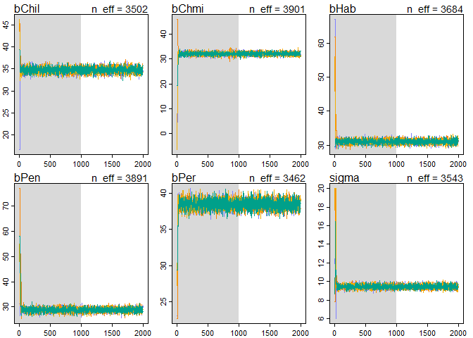<!-- -->

```r
precis(species.stan)
```

```
##        Mean StdDev lower 0.89 upper 0.89 n_eff Rhat
## bChil 34.76   0.61      33.79      35.71  3502    1
## bChmi 32.10   0.60      31.07      33.01  3901    1
## bHab  31.08   0.61      30.17      32.07  3684    1
## bPen  28.80   0.78      27.51      30.02  3891    1
## bPer  38.51   0.61      37.51      39.47  3462    1
## sigma  9.44   0.20       9.12       9.76  3543    1
```

```r
par(mfrow=c(1,1),mfcol=c(1,1))
plot(precis(species.stan))
```

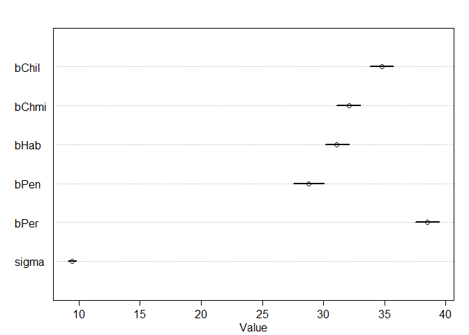<!-- -->

```r
# use S. chm as intercept

data2.species.intercept <- data2[,c(2,4,6:8)]

head(data2.species.intercept)
```

```
##     hyp S_chilense S_habrochaites S_pennellii S_peruvianum
## 1 19.46          0              0           1            0
## 2 31.28          0              0           0            1
## 3 56.65          0              0           0            1
## 4 35.18          1              0           0            0
## 5 35.32          1              0           0            0
## 6 28.74          0              0           0            0
```

```r
species.stan.intercept <- map2stan(alist(
  hyp ~ dnorm(mu,sigma),
  mu <- a + bChil*S_chilense + bHab*S_habrochaites + bPen * S_pennellii + bPer*S_peruvianum,
  a ~ dnorm(33.35,10),
  c(bChil,bHab,bPen,bPer) ~ dnorm(0,10),
  sigma ~ dunif(0,20)),
  data2.species.intercept,
  chains = 4)
```

```
## In file included from C:/Users/Jessica/Documents/R/win-library/3.3/StanHeaders/include/stan/math/prim/mat.hpp:36:0,
##                  from C:/Users/Jessica/Documents/R/win-library/3.3/StanHeaders/include/stan/math/rev/mat.hpp:9,
##                  from C:/Users/Jessica/Documents/R/win-library/3.3/StanHeaders/include/stan/math.hpp:4,
##                  from C:/Users/Jessica/Documents/R/win-library/3.3/StanHeaders/include/src/stan/model/model_header.hpp:4,
##                  from file1cb87d126bd0.cpp:8:
## C:/Users/Jessica/Documents/R/win-library/3.3/StanHeaders/include/stan/math/prim/mat/err/check_positive_ordered.hpp: In function 'bool stan::math::check_positive_ordered(const char*, const char*, const Eigen::Matrix<Scalar, -1, 1>&)':
## C:/Users/Jessica/Documents/R/win-library/3.3/StanHeaders/include/stan/math/prim/mat/err/check_positive_ordered.hpp:39:67: warning: typedef 'size_type' locally defined but not used [-Wunused-local-typedefs]
##        typedef typename index_type<Matrix<T_y, Dynamic, 1> >::type size_type;
##                                                                    ^
## In file included from C:/Users/Jessica/Documents/R/win-library/3.3/BH/include/boost/multi_array/base.hpp:28:0,
##                  from C:/Users/Jessica/Documents/R/win-library/3.3/BH/include/boost/multi_array.hpp:21,
##                  from C:/Users/Jessica/Documents/R/win-library/3.3/BH/include/boost/numeric/odeint/util/multi_array_adaption.hpp:29,
##                  from C:/Users/Jessica/Documents/R/win-library/3.3/BH/include/boost/numeric/odeint.hpp:61,
##                  from C:/Users/Jessica/Documents/R/win-library/3.3/StanHeaders/include/stan/math/prim/arr/functor/integrate_ode_rk45.hpp:13,
##                  from C:/Users/Jessica/Documents/R/win-library/3.3/StanHeaders/include/stan/math/prim/arr.hpp:32,
##                  from C:/Users/Jessica/Documents/R/win-library/3.3/StanHeaders/include/stan/math/prim/mat.hpp:235,
##                  from C:/Users/Jessica/Documents/R/win-library/3.3/StanHeaders/include/stan/math/rev/mat.hpp:9,
##                  from C:/Users/Jessica/Documents/R/win-library/3.3/StanHeaders/include/stan/math.hpp:4,
##                  from C:/Users/Jessica/Documents/R/win-library/3.3/StanHeaders/include/src/stan/model/model_header.hpp:4,
##                  from file1cb87d126bd0.cpp:8:
## C:/Users/Jessica/Documents/R/win-library/3.3/BH/include/boost/multi_array/concept_checks.hpp: In static member function 'static void boost::multi_array_concepts::detail::idgen_helper<N>::call(Array&, const IdxGen&, Call_Type)':
## C:/Users/Jessica/Documents/R/win-library/3.3/BH/include/boost/multi_array/concept_checks.hpp:42:43: warning: typedef 'index_range' locally defined but not used [-Wunused-local-typedefs]
##        typedef typename Array::index_range index_range;
##                                            ^
## C:/Users/Jessica/Documents/R/win-library/3.3/BH/include/boost/multi_array/concept_checks.hpp:43:37: warning: typedef 'index' locally defined but not used [-Wunused-local-typedefs]
##        typedef typename Array::index index;
##                                      ^
## C:/Users/Jessica/Documents/R/win-library/3.3/BH/include/boost/multi_array/concept_checks.hpp: In static member function 'static void boost::multi_array_concepts::detail::idgen_helper<0ull>::call(Array&, const IdxGen&, Call_Type)':
## C:/Users/Jessica/Documents/R/win-library/3.3/BH/include/boost/multi_array/concept_checks.hpp:53:43: warning: typedef 'index_range' locally defined but not used [-Wunused-local-typedefs]
##        typedef typename Array::index_range index_range;
##                                            ^
## C:/Users/Jessica/Documents/R/win-library/3.3/BH/include/boost/multi_array/concept_checks.hpp:54:37: warning: typedef 'index' locally defined but not used [-Wunused-local-typedefs]
##        typedef typename Array::index index;
##                                      ^
## In file included from C:/Users/Jessica/Documents/R/win-library/3.3/StanHeaders/include/stan/math/rev/core.hpp:42:0,
##                  from C:/Users/Jessica/Documents/R/win-library/3.3/StanHeaders/include/stan/math/rev/mat.hpp:4,
##                  from C:/Users/Jessica/Documents/R/win-library/3.3/StanHeaders/include/stan/math.hpp:4,
##                  from C:/Users/Jessica/Documents/R/win-library/3.3/StanHeaders/include/src/stan/model/model_header.hpp:4,
##                  from file1cb87d126bd0.cpp:8:
## C:/Users/Jessica/Documents/R/win-library/3.3/StanHeaders/include/stan/math/rev/core/set_zero_all_adjoints.hpp: At global scope:
## C:/Users/Jessica/Documents/R/win-library/3.3/StanHeaders/include/stan/math/rev/core/set_zero_all_adjoints.hpp:14:17: warning: 'void stan::math::set_zero_all_adjoints()' defined but not used [-Wunused-function]
##      static void set_zero_all_adjoints() {
##                  ^
## 
## SAMPLING FOR MODEL 'hyp ~ dnorm(mu, sigma)' NOW (CHAIN 1).
## 
## Chain 1, Iteration:    1 / 2000 [  0%]  (Warmup)
## Chain 1, Iteration:  200 / 2000 [ 10%]  (Warmup)
## Chain 1, Iteration:  400 / 2000 [ 20%]  (Warmup)
## Chain 1, Iteration:  600 / 2000 [ 30%]  (Warmup)
## Chain 1, Iteration:  800 / 2000 [ 40%]  (Warmup)
## Chain 1, Iteration: 1000 / 2000 [ 50%]  (Warmup)
## Chain 1, Iteration: 1001 / 2000 [ 50%]  (Sampling)
## Chain 1, Iteration: 1200 / 2000 [ 60%]  (Sampling)
## Chain 1, Iteration: 1400 / 2000 [ 70%]  (Sampling)
## Chain 1, Iteration: 1600 / 2000 [ 80%]  (Sampling)
## Chain 1, Iteration: 1800 / 2000 [ 90%]  (Sampling)
## Chain 1, Iteration: 2000 / 2000 [100%]  (Sampling)
##  Elapsed Time: 4.026 seconds (Warm-up)
##                2.623 seconds (Sampling)
##                6.649 seconds (Total)
## 
## 
## SAMPLING FOR MODEL 'hyp ~ dnorm(mu, sigma)' NOW (CHAIN 2).
## 
## Chain 2, Iteration:    1 / 2000 [  0%]  (Warmup)
## Chain 2, Iteration:  200 / 2000 [ 10%]  (Warmup)
## Chain 2, Iteration:  400 / 2000 [ 20%]  (Warmup)
## Chain 2, Iteration:  600 / 2000 [ 30%]  (Warmup)
## Chain 2, Iteration:  800 / 2000 [ 40%]  (Warmup)
## Chain 2, Iteration: 1000 / 2000 [ 50%]  (Warmup)
## Chain 2, Iteration: 1001 / 2000 [ 50%]  (Sampling)
## Chain 2, Iteration: 1200 / 2000 [ 60%]  (Sampling)
## Chain 2, Iteration: 1400 / 2000 [ 70%]  (Sampling)
## Chain 2, Iteration: 1600 / 2000 [ 80%]  (Sampling)
## Chain 2, Iteration: 1800 / 2000 [ 90%]  (Sampling)
## Chain 2, Iteration: 2000 / 2000 [100%]  (Sampling)
##  Elapsed Time: 3.628 seconds (Warm-up)
##                2.679 seconds (Sampling)
##                6.307 seconds (Total)
## 
## 
## SAMPLING FOR MODEL 'hyp ~ dnorm(mu, sigma)' NOW (CHAIN 3).
## 
## Chain 3, Iteration:    1 / 2000 [  0%]  (Warmup)
## Chain 3, Iteration:  200 / 2000 [ 10%]  (Warmup)
## Chain 3, Iteration:  400 / 2000 [ 20%]  (Warmup)
## Chain 3, Iteration:  600 / 2000 [ 30%]  (Warmup)
## Chain 3, Iteration:  800 / 2000 [ 40%]  (Warmup)
## Chain 3, Iteration: 1000 / 2000 [ 50%]  (Warmup)
## Chain 3, Iteration: 1001 / 2000 [ 50%]  (Sampling)
## Chain 3, Iteration: 1200 / 2000 [ 60%]  (Sampling)
## Chain 3, Iteration: 1400 / 2000 [ 70%]  (Sampling)
## Chain 3, Iteration: 1600 / 2000 [ 80%]  (Sampling)
## Chain 3, Iteration: 1800 / 2000 [ 90%]  (Sampling)
## Chain 3, Iteration: 2000 / 2000 [100%]  (Sampling)
##  Elapsed Time: 3.687 seconds (Warm-up)
##                2.688 seconds (Sampling)
##                6.375 seconds (Total)
## 
## 
## SAMPLING FOR MODEL 'hyp ~ dnorm(mu, sigma)' NOW (CHAIN 4).
## 
## Chain 4, Iteration:    1 / 2000 [  0%]  (Warmup)
## Chain 4, Iteration:  200 / 2000 [ 10%]  (Warmup)
## Chain 4, Iteration:  400 / 2000 [ 20%]  (Warmup)
## Chain 4, Iteration:  600 / 2000 [ 30%]  (Warmup)
## Chain 4, Iteration:  800 / 2000 [ 40%]  (Warmup)
## Chain 4, Iteration: 1000 / 2000 [ 50%]  (Warmup)
## Chain 4, Iteration: 1001 / 2000 [ 50%]  (Sampling)
## Chain 4, Iteration: 1200 / 2000 [ 60%]  (Sampling)
## Chain 4, Iteration: 1400 / 2000 [ 70%]  (Sampling)
## Chain 4, Iteration: 1600 / 2000 [ 80%]  (Sampling)
## Chain 4, Iteration: 1800 / 2000 [ 90%]  (Sampling)
## Chain 4, Iteration: 2000 / 2000 [100%]  (Sampling)
##  Elapsed Time: 3.674 seconds (Warm-up)
##                2.859 seconds (Sampling)
##                6.533 seconds (Total)
## 
## 
## SAMPLING FOR MODEL 'hyp ~ dnorm(mu, sigma)' NOW (CHAIN 1).
## WARNING: No variance estimation is
##          performed for num_warmup < 20
## 
## 
## Chain 1, Iteration: 1 / 1 [100%]  (Sampling)
##  Elapsed Time: 0 seconds (Warm-up)
##                0 seconds (Sampling)
##                0 seconds (Total)
```

```
## Computing WAIC
## Constructing posterior predictions
```

```
## [ 400 / 4000 ]
[ 800 / 4000 ]
[ 1200 / 4000 ]
[ 1600 / 4000 ]
[ 2000 / 4000 ]
[ 2400 / 4000 ]
[ 2800 / 4000 ]
[ 3200 / 4000 ]
[ 3600 / 4000 ]
[ 4000 / 4000 ]
```

```r
plot(species.stan.intercept)
```

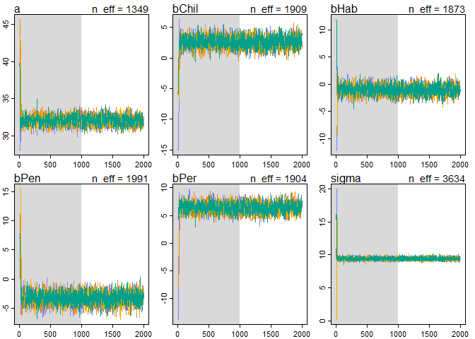<!-- -->

```r
precis(species.stan.intercept)
```

```
##        Mean StdDev lower 0.89 upper 0.89 n_eff Rhat
## a     32.11   0.60      31.08      33.00  1349    1
## bChil  2.63   0.87       1.27       4.06  1909    1
## bHab  -1.04   0.85      -2.45       0.26  1873    1
## bPen  -3.30   0.98      -4.79      -1.73  1991    1
## bPer   6.38   0.87       5.01       7.78  1904    1
## sigma  9.44   0.20       9.12       9.76  3634    1
```

```r
par(mfrow=c(1,1),mfcol=c(1,1))
plot(precis(species.stan.intercept))
```

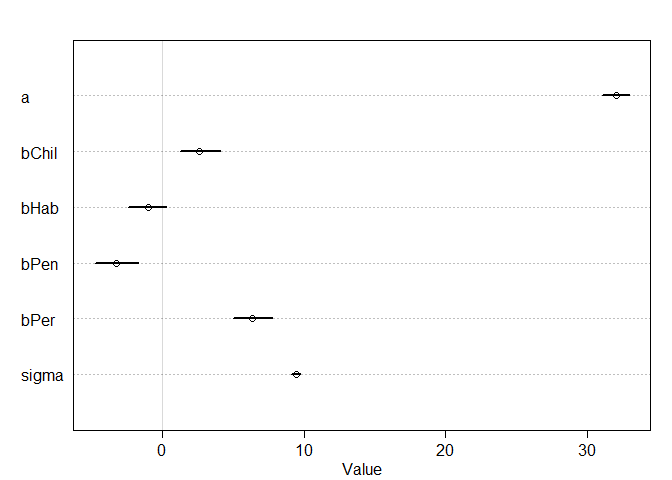<!-- -->

```r
# model with species and treatment

data2.species.trt <- data2[,c(2:4,6:8)]

head(data2.species.trt)
```

```
##     hyp trt2 S_chilense S_habrochaites S_pennellii S_peruvianum
## 1 19.46    0          0              0           1            0
## 2 31.28    0          0              0           0            1
## 3 56.65    0          0              0           0            1
## 4 35.18    0          1              0           0            0
## 5 35.32    0          1              0           0            0
## 6 28.74    0          0              0           0            0
```

```r
species.trt.stan <- map2stan(alist(
  hyp ~ dnorm(mu,sigma),
  mu <- a + bT*trt2 + bChil*S_chilense + bHab*S_habrochaites + bPen * S_pennellii + bPer*S_peruvianum,
  a ~ dnorm(33.35,10),
  c(bT,bChil,bHab,bPen,bPer) ~ dnorm(0,10),
  sigma ~ dunif(0,20)),
  data2.species.trt,
  chains = 4)
```

```
## In file included from C:/Users/Jessica/Documents/R/win-library/3.3/StanHeaders/include/stan/math/prim/mat.hpp:36:0,
##                  from C:/Users/Jessica/Documents/R/win-library/3.3/StanHeaders/include/stan/math/rev/mat.hpp:9,
##                  from C:/Users/Jessica/Documents/R/win-library/3.3/StanHeaders/include/stan/math.hpp:4,
##                  from C:/Users/Jessica/Documents/R/win-library/3.3/StanHeaders/include/src/stan/model/model_header.hpp:4,
##                  from file1cb87162436.cpp:8:
## C:/Users/Jessica/Documents/R/win-library/3.3/StanHeaders/include/stan/math/prim/mat/err/check_positive_ordered.hpp: In function 'bool stan::math::check_positive_ordered(const char*, const char*, const Eigen::Matrix<Scalar, -1, 1>&)':
## C:/Users/Jessica/Documents/R/win-library/3.3/StanHeaders/include/stan/math/prim/mat/err/check_positive_ordered.hpp:39:67: warning: typedef 'size_type' locally defined but not used [-Wunused-local-typedefs]
##        typedef typename index_type<Matrix<T_y, Dynamic, 1> >::type size_type;
##                                                                    ^
## In file included from C:/Users/Jessica/Documents/R/win-library/3.3/BH/include/boost/multi_array/base.hpp:28:0,
##                  from C:/Users/Jessica/Documents/R/win-library/3.3/BH/include/boost/multi_array.hpp:21,
##                  from C:/Users/Jessica/Documents/R/win-library/3.3/BH/include/boost/numeric/odeint/util/multi_array_adaption.hpp:29,
##                  from C:/Users/Jessica/Documents/R/win-library/3.3/BH/include/boost/numeric/odeint.hpp:61,
##                  from C:/Users/Jessica/Documents/R/win-library/3.3/StanHeaders/include/stan/math/prim/arr/functor/integrate_ode_rk45.hpp:13,
##                  from C:/Users/Jessica/Documents/R/win-library/3.3/StanHeaders/include/stan/math/prim/arr.hpp:32,
##                  from C:/Users/Jessica/Documents/R/win-library/3.3/StanHeaders/include/stan/math/prim/mat.hpp:235,
##                  from C:/Users/Jessica/Documents/R/win-library/3.3/StanHeaders/include/stan/math/rev/mat.hpp:9,
##                  from C:/Users/Jessica/Documents/R/win-library/3.3/StanHeaders/include/stan/math.hpp:4,
##                  from C:/Users/Jessica/Documents/R/win-library/3.3/StanHeaders/include/src/stan/model/model_header.hpp:4,
##                  from file1cb87162436.cpp:8:
## C:/Users/Jessica/Documents/R/win-library/3.3/BH/include/boost/multi_array/concept_checks.hpp: In static member function 'static void boost::multi_array_concepts::detail::idgen_helper<N>::call(Array&, const IdxGen&, Call_Type)':
## C:/Users/Jessica/Documents/R/win-library/3.3/BH/include/boost/multi_array/concept_checks.hpp:42:43: warning: typedef 'index_range' locally defined but not used [-Wunused-local-typedefs]
##        typedef typename Array::index_range index_range;
##                                            ^
## C:/Users/Jessica/Documents/R/win-library/3.3/BH/include/boost/multi_array/concept_checks.hpp:43:37: warning: typedef 'index' locally defined but not used [-Wunused-local-typedefs]
##        typedef typename Array::index index;
##                                      ^
## C:/Users/Jessica/Documents/R/win-library/3.3/BH/include/boost/multi_array/concept_checks.hpp: In static member function 'static void boost::multi_array_concepts::detail::idgen_helper<0ull>::call(Array&, const IdxGen&, Call_Type)':
## C:/Users/Jessica/Documents/R/win-library/3.3/BH/include/boost/multi_array/concept_checks.hpp:53:43: warning: typedef 'index_range' locally defined but not used [-Wunused-local-typedefs]
##        typedef typename Array::index_range index_range;
##                                            ^
## C:/Users/Jessica/Documents/R/win-library/3.3/BH/include/boost/multi_array/concept_checks.hpp:54:37: warning: typedef 'index' locally defined but not used [-Wunused-local-typedefs]
##        typedef typename Array::index index;
##                                      ^
## In file included from C:/Users/Jessica/Documents/R/win-library/3.3/StanHeaders/include/stan/math/rev/core.hpp:42:0,
##                  from C:/Users/Jessica/Documents/R/win-library/3.3/StanHeaders/include/stan/math/rev/mat.hpp:4,
##                  from C:/Users/Jessica/Documents/R/win-library/3.3/StanHeaders/include/stan/math.hpp:4,
##                  from C:/Users/Jessica/Documents/R/win-library/3.3/StanHeaders/include/src/stan/model/model_header.hpp:4,
##                  from file1cb87162436.cpp:8:
## C:/Users/Jessica/Documents/R/win-library/3.3/StanHeaders/include/stan/math/rev/core/set_zero_all_adjoints.hpp: At global scope:
## C:/Users/Jessica/Documents/R/win-library/3.3/StanHeaders/include/stan/math/rev/core/set_zero_all_adjoints.hpp:14:17: warning: 'void stan::math::set_zero_all_adjoints()' defined but not used [-Wunused-function]
##      static void set_zero_all_adjoints() {
##                  ^
## 
## SAMPLING FOR MODEL 'hyp ~ dnorm(mu, sigma)' NOW (CHAIN 1).
## 
## Chain 1, Iteration:    1 / 2000 [  0%]  (Warmup)
## Chain 1, Iteration:  200 / 2000 [ 10%]  (Warmup)
## Chain 1, Iteration:  400 / 2000 [ 20%]  (Warmup)
## Chain 1, Iteration:  600 / 2000 [ 30%]  (Warmup)
## Chain 1, Iteration:  800 / 2000 [ 40%]  (Warmup)
## Chain 1, Iteration: 1000 / 2000 [ 50%]  (Warmup)
## Chain 1, Iteration: 1001 / 2000 [ 50%]  (Sampling)
## Chain 1, Iteration: 1200 / 2000 [ 60%]  (Sampling)
## Chain 1, Iteration: 1400 / 2000 [ 70%]  (Sampling)
## Chain 1, Iteration: 1600 / 2000 [ 80%]  (Sampling)
## Chain 1, Iteration: 1800 / 2000 [ 90%]  (Sampling)
## Chain 1, Iteration: 2000 / 2000 [100%]  (Sampling)
##  Elapsed Time: 5.342 seconds (Warm-up)
##                3.704 seconds (Sampling)
##                9.046 seconds (Total)
## 
## 
## SAMPLING FOR MODEL 'hyp ~ dnorm(mu, sigma)' NOW (CHAIN 2).
## 
## Chain 2, Iteration:    1 / 2000 [  0%]  (Warmup)
## Chain 2, Iteration:  200 / 2000 [ 10%]  (Warmup)
## Chain 2, Iteration:  400 / 2000 [ 20%]  (Warmup)
## Chain 2, Iteration:  600 / 2000 [ 30%]  (Warmup)
## Chain 2, Iteration:  800 / 2000 [ 40%]  (Warmup)
## Chain 2, Iteration: 1000 / 2000 [ 50%]  (Warmup)
## Chain 2, Iteration: 1001 / 2000 [ 50%]  (Sampling)
## Chain 2, Iteration: 1200 / 2000 [ 60%]  (Sampling)
## Chain 2, Iteration: 1400 / 2000 [ 70%]  (Sampling)
## Chain 2, Iteration: 1600 / 2000 [ 80%]  (Sampling)
## Chain 2, Iteration: 1800 / 2000 [ 90%]  (Sampling)
## Chain 2, Iteration: 2000 / 2000 [100%]  (Sampling)
##  Elapsed Time: 5.744 seconds (Warm-up)
##                3.98 seconds (Sampling)
##                9.724 seconds (Total)
## 
## 
## SAMPLING FOR MODEL 'hyp ~ dnorm(mu, sigma)' NOW (CHAIN 3).
## 
## Chain 3, Iteration:    1 / 2000 [  0%]  (Warmup)
## Chain 3, Iteration:  200 / 2000 [ 10%]  (Warmup)
## Chain 3, Iteration:  400 / 2000 [ 20%]  (Warmup)
## Chain 3, Iteration:  600 / 2000 [ 30%]  (Warmup)
## Chain 3, Iteration:  800 / 2000 [ 40%]  (Warmup)
## Chain 3, Iteration: 1000 / 2000 [ 50%]  (Warmup)
## Chain 3, Iteration: 1001 / 2000 [ 50%]  (Sampling)
## Chain 3, Iteration: 1200 / 2000 [ 60%]  (Sampling)
## Chain 3, Iteration: 1400 / 2000 [ 70%]  (Sampling)
## Chain 3, Iteration: 1600 / 2000 [ 80%]  (Sampling)
## Chain 3, Iteration: 1800 / 2000 [ 90%]  (Sampling)
## Chain 3, Iteration: 2000 / 2000 [100%]  (Sampling)
##  Elapsed Time: 5.09 seconds (Warm-up)
##                3.518 seconds (Sampling)
##                8.608 seconds (Total)
## 
## 
## SAMPLING FOR MODEL 'hyp ~ dnorm(mu, sigma)' NOW (CHAIN 4).
## 
## Chain 4, Iteration:    1 / 2000 [  0%]  (Warmup)
## Chain 4, Iteration:  200 / 2000 [ 10%]  (Warmup)
## Chain 4, Iteration:  400 / 2000 [ 20%]  (Warmup)
## Chain 4, Iteration:  600 / 2000 [ 30%]  (Warmup)
## Chain 4, Iteration:  800 / 2000 [ 40%]  (Warmup)
## Chain 4, Iteration: 1000 / 2000 [ 50%]  (Warmup)
## Chain 4, Iteration: 1001 / 2000 [ 50%]  (Sampling)
## Chain 4, Iteration: 1200 / 2000 [ 60%]  (Sampling)
## Chain 4, Iteration: 1400 / 2000 [ 70%]  (Sampling)
## Chain 4, Iteration: 1600 / 2000 [ 80%]  (Sampling)
## Chain 4, Iteration: 1800 / 2000 [ 90%]  (Sampling)
## Chain 4, Iteration: 2000 / 2000 [100%]  (Sampling)
##  Elapsed Time: 5.85 seconds (Warm-up)
##                3.71 seconds (Sampling)
##                9.56 seconds (Total)
## 
## 
## SAMPLING FOR MODEL 'hyp ~ dnorm(mu, sigma)' NOW (CHAIN 1).
## WARNING: No variance estimation is
##          performed for num_warmup < 20
## 
## 
## Chain 1, Iteration: 1 / 1 [100%]  (Sampling)
##  Elapsed Time: 0 seconds (Warm-up)
##                0 seconds (Sampling)
##                0 seconds (Total)
```

```
## Computing WAIC
## Constructing posterior predictions
```

```
## [ 400 / 4000 ]
[ 800 / 4000 ]
[ 1200 / 4000 ]
[ 1600 / 4000 ]
[ 2000 / 4000 ]
[ 2400 / 4000 ]
[ 2800 / 4000 ]
[ 3200 / 4000 ]
[ 3600 / 4000 ]
[ 4000 / 4000 ]
```

```r
plot(species.trt.stan)
precis(species.trt.stan)
```

```
##        Mean StdDev lower 0.89 upper 0.89 n_eff Rhat
## a     29.35   0.64      28.36      30.37  1225    1
## bT     5.30   0.54       4.46       6.20  2613    1
## bChil  2.72   0.84       1.45       4.10  1912    1
## bHab  -0.77   0.82      -2.08       0.48  1745    1
## bPen  -3.43   0.96      -4.91      -1.83  2008    1
## bPer   6.40   0.84       5.06       7.71  1716    1
## sigma  9.06   0.19       8.76       9.36  3329    1
```

```r
par(mfrow=c(1,1),mfcol=c(1,1))
```

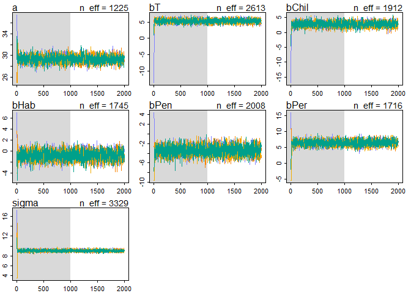<!-- -->

```r
plot(precis(species.trt.stan))
```

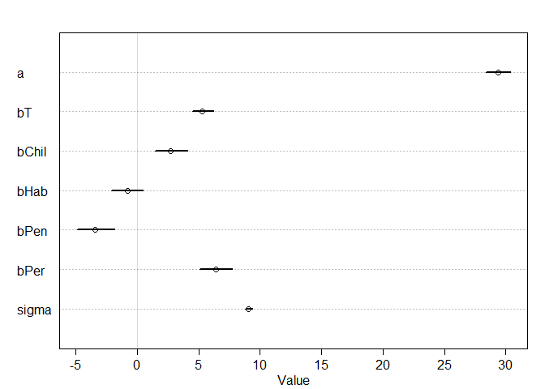<!-- -->

```r
#compare models

compare(hyp.stan,species.trt.stan,species.stan.intercept,species.stan)
```

```
##                          WAIC pWAIC dWAIC weight    SE   dSE
## species.trt.stan       7308.1   7.2   0.0      1 57.37    NA
## species.stan           7389.6   5.9  81.5      0 57.05 17.16
## species.stan.intercept 7390.0   6.2  81.9      0 57.13 17.17
## hyp.stan               7421.9   3.4 113.7      0 56.39 23.43
```

```r
plot(compare(hyp.stan,species.trt.stan,species.stan.intercept,species.stan))
```

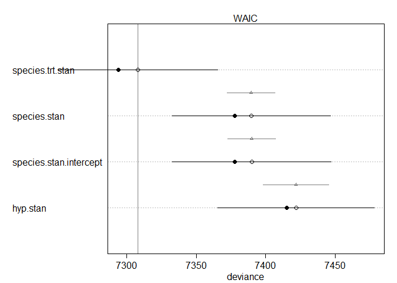<!-- -->

```r
compare(hyp.stan,species.trt.stan,species.stan.intercept,species.stan)
```

```
##                          WAIC pWAIC dWAIC weight    SE   dSE
## species.trt.stan       7308.1   7.2   0.0      1 57.37    NA
## species.stan           7389.6   5.9  81.5      0 57.05 17.16
## species.stan.intercept 7390.0   6.2  81.9      0 57.13 17.17
## hyp.stan               7421.9   3.4 113.7      0 56.39 23.43
```

```r
coeftab(hyp.stan,species.trt.stan,species.stan.intercept,species.stan)
```

```
##       hyp.stan species.trt.stan species.stan.intercept species.stan
## a       30.66    29.35            32.11                     NA     
## bT        5.3      5.3               NA                     NA     
## sigma    9.60     9.06             9.44                   9.44     
## bChil      NA     2.72             2.63                  34.76     
## bHab       NA    -0.77            -1.04                  31.08     
## bPen       NA    -3.43            -3.30                  28.80     
## bPer       NA     6.40             6.38                  38.51     
## bChmi      NA       NA               NA                   32.1     
## nobs     1008     1008             1008                   1008
```

```r
plot(coeftab(hyp.stan,species.trt.stan,species.stan.intercept,species.stan))
```

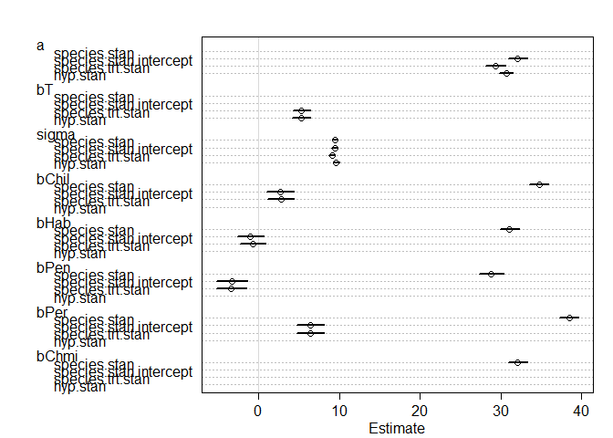<!-- -->

```r
# what can we say about the treatment effect? 

# get the posterior distrubution of bT, the treatment coefficient.

post.bT <- extract.samples(species.trt.stan)$bT

dens(post.bT,show.HPDI = 0.95) # the fact that the 95% HDPI intervals are far away from 0 is strong evidence that bT is positive
```

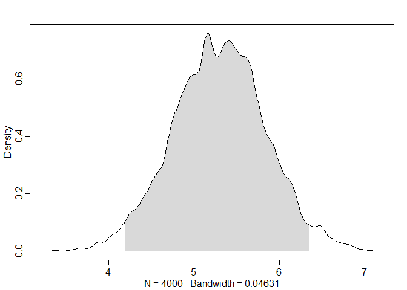<!-- -->

```r
# what percent of the posterior distribution of bT is less than or equal to ?
sum(post.bT <= 0) / length(post.bT) # None of the posterior distribution for bT is less than or equal to 0.
```

```
## [1] 0
```
#8/23/16
##2A

```r
#2a) Redo the tomato hyp analysis (or at least the final model with species and treatment) but using square root transformation.  Are model fits improved?  Does it change the parameter estimates?
# model with species and treatment using transformation sqrt:

# model with species and treatment sqrt
data2$hyp_sqrt=sqrt(data2$hyp)
data2.species.trt.sqrt <- data2[,c(3,4,6:9)]

head(data2.species.trt.sqrt)
```

```
##   trt2 S_chilense S_habrochaites S_pennellii S_peruvianum hyp_sqrt
## 1    0          0              0           1            0 4.411349
## 2    0          0              0           0            1 5.592853
## 3    0          0              0           0            1 7.526619
## 4    0          1              0           0            0 5.931273
## 5    0          1              0           0            0 5.943063
## 6    0          0              0           0            0 5.360970
```

```r
species.trt.stan.sqrt <- map2stan(alist(
  hyp_sqrt ~ dnorm(mu,sigma),
  mu <- a + bT*trt2 + bChil*S_chilense + bHab*S_habrochaites + bPen * S_pennellii + bPer*S_peruvianum,
  a ~ dnorm(33.35,10),
  c(bT,bChil,bHab,bPen,bPer) ~ dnorm(0,10),
  sigma ~ dunif(0,20)),
  data2.species.trt.sqrt,
  chains = 4)
```

```
## In file included from C:/Users/Jessica/Documents/R/win-library/3.3/StanHeaders/include/stan/math/prim/mat.hpp:36:0,
##                  from C:/Users/Jessica/Documents/R/win-library/3.3/StanHeaders/include/stan/math/rev/mat.hpp:9,
##                  from C:/Users/Jessica/Documents/R/win-library/3.3/StanHeaders/include/stan/math.hpp:4,
##                  from C:/Users/Jessica/Documents/R/win-library/3.3/StanHeaders/include/src/stan/model/model_header.hpp:4,
##                  from file1cb84b086c0f.cpp:8:
## C:/Users/Jessica/Documents/R/win-library/3.3/StanHeaders/include/stan/math/prim/mat/err/check_positive_ordered.hpp: In function 'bool stan::math::check_positive_ordered(const char*, const char*, const Eigen::Matrix<Scalar, -1, 1>&)':
## C:/Users/Jessica/Documents/R/win-library/3.3/StanHeaders/include/stan/math/prim/mat/err/check_positive_ordered.hpp:39:67: warning: typedef 'size_type' locally defined but not used [-Wunused-local-typedefs]
##        typedef typename index_type<Matrix<T_y, Dynamic, 1> >::type size_type;
##                                                                    ^
## In file included from C:/Users/Jessica/Documents/R/win-library/3.3/BH/include/boost/multi_array/base.hpp:28:0,
##                  from C:/Users/Jessica/Documents/R/win-library/3.3/BH/include/boost/multi_array.hpp:21,
##                  from C:/Users/Jessica/Documents/R/win-library/3.3/BH/include/boost/numeric/odeint/util/multi_array_adaption.hpp:29,
##                  from C:/Users/Jessica/Documents/R/win-library/3.3/BH/include/boost/numeric/odeint.hpp:61,
##                  from C:/Users/Jessica/Documents/R/win-library/3.3/StanHeaders/include/stan/math/prim/arr/functor/integrate_ode_rk45.hpp:13,
##                  from C:/Users/Jessica/Documents/R/win-library/3.3/StanHeaders/include/stan/math/prim/arr.hpp:32,
##                  from C:/Users/Jessica/Documents/R/win-library/3.3/StanHeaders/include/stan/math/prim/mat.hpp:235,
##                  from C:/Users/Jessica/Documents/R/win-library/3.3/StanHeaders/include/stan/math/rev/mat.hpp:9,
##                  from C:/Users/Jessica/Documents/R/win-library/3.3/StanHeaders/include/stan/math.hpp:4,
##                  from C:/Users/Jessica/Documents/R/win-library/3.3/StanHeaders/include/src/stan/model/model_header.hpp:4,
##                  from file1cb84b086c0f.cpp:8:
## C:/Users/Jessica/Documents/R/win-library/3.3/BH/include/boost/multi_array/concept_checks.hpp: In static member function 'static void boost::multi_array_concepts::detail::idgen_helper<N>::call(Array&, const IdxGen&, Call_Type)':
## C:/Users/Jessica/Documents/R/win-library/3.3/BH/include/boost/multi_array/concept_checks.hpp:42:43: warning: typedef 'index_range' locally defined but not used [-Wunused-local-typedefs]
##        typedef typename Array::index_range index_range;
##                                            ^
## C:/Users/Jessica/Documents/R/win-library/3.3/BH/include/boost/multi_array/concept_checks.hpp:43:37: warning: typedef 'index' locally defined but not used [-Wunused-local-typedefs]
##        typedef typename Array::index index;
##                                      ^
## C:/Users/Jessica/Documents/R/win-library/3.3/BH/include/boost/multi_array/concept_checks.hpp: In static member function 'static void boost::multi_array_concepts::detail::idgen_helper<0ull>::call(Array&, const IdxGen&, Call_Type)':
## C:/Users/Jessica/Documents/R/win-library/3.3/BH/include/boost/multi_array/concept_checks.hpp:53:43: warning: typedef 'index_range' locally defined but not used [-Wunused-local-typedefs]
##        typedef typename Array::index_range index_range;
##                                            ^
## C:/Users/Jessica/Documents/R/win-library/3.3/BH/include/boost/multi_array/concept_checks.hpp:54:37: warning: typedef 'index' locally defined but not used [-Wunused-local-typedefs]
##        typedef typename Array::index index;
##                                      ^
## In file included from C:/Users/Jessica/Documents/R/win-library/3.3/StanHeaders/include/stan/math/rev/core.hpp:42:0,
##                  from C:/Users/Jessica/Documents/R/win-library/3.3/StanHeaders/include/stan/math/rev/mat.hpp:4,
##                  from C:/Users/Jessica/Documents/R/win-library/3.3/StanHeaders/include/stan/math.hpp:4,
##                  from C:/Users/Jessica/Documents/R/win-library/3.3/StanHeaders/include/src/stan/model/model_header.hpp:4,
##                  from file1cb84b086c0f.cpp:8:
## C:/Users/Jessica/Documents/R/win-library/3.3/StanHeaders/include/stan/math/rev/core/set_zero_all_adjoints.hpp: At global scope:
## C:/Users/Jessica/Documents/R/win-library/3.3/StanHeaders/include/stan/math/rev/core/set_zero_all_adjoints.hpp:14:17: warning: 'void stan::math::set_zero_all_adjoints()' defined but not used [-Wunused-function]
##      static void set_zero_all_adjoints() {
##                  ^
## 
## SAMPLING FOR MODEL 'hyp_sqrt ~ dnorm(mu, sigma)' NOW (CHAIN 1).
## 
## Chain 1, Iteration:    1 / 2000 [  0%]  (Warmup)
## Chain 1, Iteration:  200 / 2000 [ 10%]  (Warmup)
## Chain 1, Iteration:  400 / 2000 [ 20%]  (Warmup)
## Chain 1, Iteration:  600 / 2000 [ 30%]  (Warmup)
## Chain 1, Iteration:  800 / 2000 [ 40%]  (Warmup)
## Chain 1, Iteration: 1000 / 2000 [ 50%]  (Warmup)
## Chain 1, Iteration: 1001 / 2000 [ 50%]  (Sampling)
## Chain 1, Iteration: 1200 / 2000 [ 60%]  (Sampling)
## Chain 1, Iteration: 1400 / 2000 [ 70%]  (Sampling)
## Chain 1, Iteration: 1600 / 2000 [ 80%]  (Sampling)
## Chain 1, Iteration: 1800 / 2000 [ 90%]  (Sampling)
## Chain 1, Iteration: 2000 / 2000 [100%]  (Sampling)
##  Elapsed Time: 3.957 seconds (Warm-up)
##                4.013 seconds (Sampling)
##                7.97 seconds (Total)
## 
## 
## SAMPLING FOR MODEL 'hyp_sqrt ~ dnorm(mu, sigma)' NOW (CHAIN 2).
## 
## Chain 2, Iteration:    1 / 2000 [  0%]  (Warmup)
## Chain 2, Iteration:  200 / 2000 [ 10%]  (Warmup)
## Chain 2, Iteration:  400 / 2000 [ 20%]  (Warmup)
## Chain 2, Iteration:  600 / 2000 [ 30%]  (Warmup)
## Chain 2, Iteration:  800 / 2000 [ 40%]  (Warmup)
## Chain 2, Iteration: 1000 / 2000 [ 50%]  (Warmup)
## Chain 2, Iteration: 1001 / 2000 [ 50%]  (Sampling)
## Chain 2, Iteration: 1200 / 2000 [ 60%]  (Sampling)
## Chain 2, Iteration: 1400 / 2000 [ 70%]  (Sampling)
## Chain 2, Iteration: 1600 / 2000 [ 80%]  (Sampling)
## Chain 2, Iteration: 1800 / 2000 [ 90%]  (Sampling)
## Chain 2, Iteration: 2000 / 2000 [100%]  (Sampling)
##  Elapsed Time: 3.681 seconds (Warm-up)
##                3.583 seconds (Sampling)
##                7.264 seconds (Total)
## 
## 
## SAMPLING FOR MODEL 'hyp_sqrt ~ dnorm(mu, sigma)' NOW (CHAIN 3).
## 
## Chain 3, Iteration:    1 / 2000 [  0%]  (Warmup)
## Chain 3, Iteration:  200 / 2000 [ 10%]  (Warmup)
## Chain 3, Iteration:  400 / 2000 [ 20%]  (Warmup)
## Chain 3, Iteration:  600 / 2000 [ 30%]  (Warmup)
## Chain 3, Iteration:  800 / 2000 [ 40%]  (Warmup)
## Chain 3, Iteration: 1000 / 2000 [ 50%]  (Warmup)
## Chain 3, Iteration: 1001 / 2000 [ 50%]  (Sampling)
## Chain 3, Iteration: 1200 / 2000 [ 60%]  (Sampling)
## Chain 3, Iteration: 1400 / 2000 [ 70%]  (Sampling)
## Chain 3, Iteration: 1600 / 2000 [ 80%]  (Sampling)
## Chain 3, Iteration: 1800 / 2000 [ 90%]  (Sampling)
## Chain 3, Iteration: 2000 / 2000 [100%]  (Sampling)
##  Elapsed Time: 3.858 seconds (Warm-up)
##                3.671 seconds (Sampling)
##                7.529 seconds (Total)
## 
## 
## SAMPLING FOR MODEL 'hyp_sqrt ~ dnorm(mu, sigma)' NOW (CHAIN 4).
## 
## Chain 4, Iteration:    1 / 2000 [  0%]  (Warmup)
## Chain 4, Iteration:  200 / 2000 [ 10%]  (Warmup)
## Chain 4, Iteration:  400 / 2000 [ 20%]  (Warmup)
## Chain 4, Iteration:  600 / 2000 [ 30%]  (Warmup)
## Chain 4, Iteration:  800 / 2000 [ 40%]  (Warmup)
## Chain 4, Iteration: 1000 / 2000 [ 50%]  (Warmup)
## Chain 4, Iteration: 1001 / 2000 [ 50%]  (Sampling)
## Chain 4, Iteration: 1200 / 2000 [ 60%]  (Sampling)
## Chain 4, Iteration: 1400 / 2000 [ 70%]  (Sampling)
## Chain 4, Iteration: 1600 / 2000 [ 80%]  (Sampling)
## Chain 4, Iteration: 1800 / 2000 [ 90%]  (Sampling)
## Chain 4, Iteration: 2000 / 2000 [100%]  (Sampling)
##  Elapsed Time: 3.707 seconds (Warm-up)
##                3.719 seconds (Sampling)
##                7.426 seconds (Total)
## 
## 
## SAMPLING FOR MODEL 'hyp_sqrt ~ dnorm(mu, sigma)' NOW (CHAIN 1).
## WARNING: No variance estimation is
##          performed for num_warmup < 20
## 
## 
## Chain 1, Iteration: 1 / 1 [100%]  (Sampling)
##  Elapsed Time: 0 seconds (Warm-up)
##                0.001 seconds (Sampling)
##                0.001 seconds (Total)
```

```
## Computing WAIC
```

```
## Constructing posterior predictions
```

```
## [ 400 / 4000 ]
[ 800 / 4000 ]
[ 1200 / 4000 ]
[ 1600 / 4000 ]
[ 2000 / 4000 ]
[ 2400 / 4000 ]
[ 2800 / 4000 ]
[ 3200 / 4000 ]
[ 3600 / 4000 ]
[ 4000 / 4000 ]
```

```r
plot(species.trt.stan.sqrt)
precis(species.trt.stan.sqrt)
```

```
##        Mean StdDev lower 0.89 upper 0.89 n_eff Rhat
## a      5.39   0.05       5.31       5.48  1270 1.01
## bT     0.46   0.05       0.39       0.53  3203 1.00
## bChil  0.20   0.07       0.08       0.30  1560 1.01
## bHab  -0.06   0.07      -0.17       0.05  1613 1.00
## bPen  -0.36   0.08      -0.49      -0.23  1773 1.01
## bPer   0.50   0.07       0.38       0.60  1621 1.01
## sigma  0.77   0.02       0.75       0.80  3612 1.00
```

```r
par(mfrow=c(1,1),mfcol=c(1,1))
```

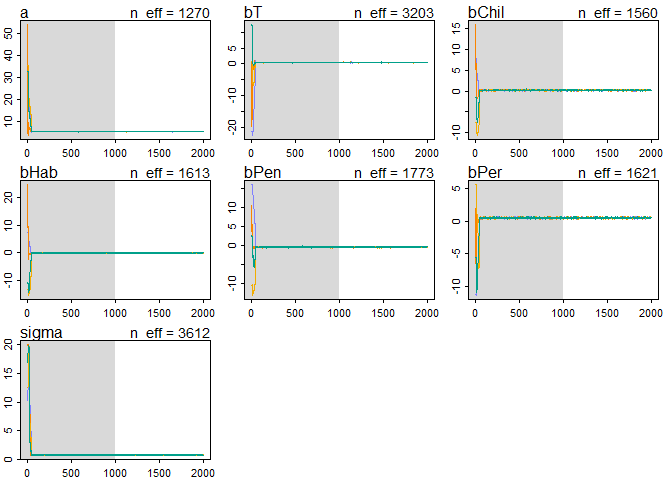<!-- -->

```r
plot(precis(species.trt.stan.sqrt))
```

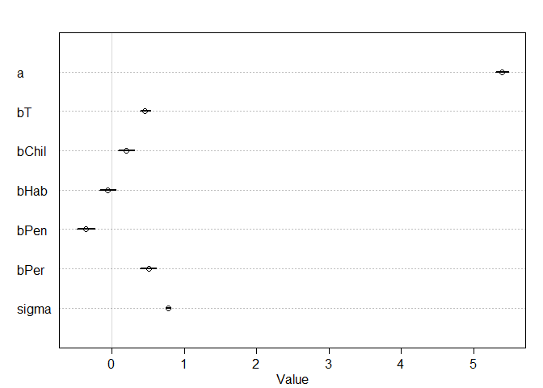<!-- -->

```r
#comparison of transformed vs untransformed

compare(species.trt.stan,species.trt.stan.sqrt)
```

```
##                         WAIC pWAIC  dWAIC weight    SE   dSE
## species.trt.stan.sqrt 2348.8   7.0    0.0      1 54.11    NA
## species.trt.stan      7308.1   7.2 4959.3      0 57.37 18.89
```

```r
coeftab(species.trt.stan,species.trt.stan.sqrt)
```

```
##       species.trt.stan species.trt.stan.sqrt
## a       29.35             5.39              
## bT       5.30             0.46              
## bChil    2.72             0.20              
## bHab    -0.77            -0.06              
## bPen    -3.43            -0.36              
## bPer      6.4              0.5              
## sigma    9.06             0.77              
## nobs     1008             1008
```

```r
plot(coeftab(species.trt.stan,species.trt.stan.sqrt))
```

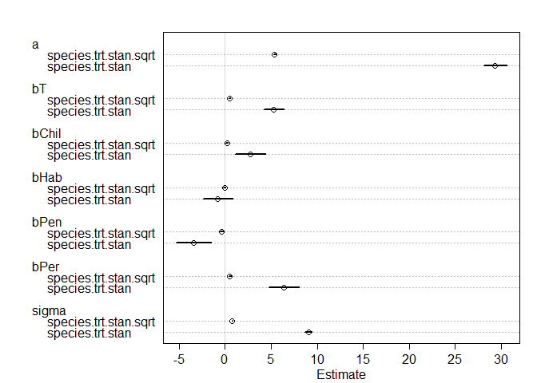<!-- -->

```r
##2b) Is WAIC an appropriate way to compare the model fits with untransformed and transformed data?  How can you test this? ---No


##2c) How do you get sqrt transformed parameter estimates (especially when they are < 1) back on the original scale (I don't know the answer to this) -??


##3)  Fit a model with a species by treatment interaction.  Which species have a trt response that is different from S. chm?

# model with species and treatment and interaction term

data2.species.trt <- data2[,c(2:4,6:8)]

head(data2.species.trt)
```

```
##     hyp trt2 S_chilense S_habrochaites S_pennellii S_peruvianum
## 1 19.46    0          0              0           1            0
## 2 31.28    0          0              0           0            1
## 3 56.65    0          0              0           0            1
## 4 35.18    0          1              0           0            0
## 5 35.32    0          1              0           0            0
## 6 28.74    0          0              0           0            0
```

```r
species.trt.stan_interaction <- map2stan(alist(
  hyp ~ dnorm(mu,sigma),
  mu <- a + bT*trt2 + bChil*S_chilense + bHab*S_habrochaites + bPen * S_pennellii + bPer*S_peruvianum + bChil_T*S_chilense*trt2 + bHab_T*S_habrochaites*trt2 + bPen_T * S_pennellii*trt2 + bPer_T*S_peruvianum*trt2,
  a ~ dnorm(33.35,10),
  c(bT,bChil,bHab,bPen,bPer,bChil_T,bHab_T,bPen_T,bPer_T) ~ dnorm(0,10),
  sigma ~ dunif(0,20)),
  data2.species.trt,
  chains = 4)
```

```
## In file included from C:/Users/Jessica/Documents/R/win-library/3.3/StanHeaders/include/stan/math/prim/mat.hpp:36:0,
##                  from C:/Users/Jessica/Documents/R/win-library/3.3/StanHeaders/include/stan/math/rev/mat.hpp:9,
##                  from C:/Users/Jessica/Documents/R/win-library/3.3/StanHeaders/include/stan/math.hpp:4,
##                  from C:/Users/Jessica/Documents/R/win-library/3.3/StanHeaders/include/src/stan/model/model_header.hpp:4,
##                  from file1cb82dd61668.cpp:8:
## C:/Users/Jessica/Documents/R/win-library/3.3/StanHeaders/include/stan/math/prim/mat/err/check_positive_ordered.hpp: In function 'bool stan::math::check_positive_ordered(const char*, const char*, const Eigen::Matrix<Scalar, -1, 1>&)':
## C:/Users/Jessica/Documents/R/win-library/3.3/StanHeaders/include/stan/math/prim/mat/err/check_positive_ordered.hpp:39:67: warning: typedef 'size_type' locally defined but not used [-Wunused-local-typedefs]
##        typedef typename index_type<Matrix<T_y, Dynamic, 1> >::type size_type;
##                                                                    ^
## In file included from C:/Users/Jessica/Documents/R/win-library/3.3/BH/include/boost/multi_array/base.hpp:28:0,
##                  from C:/Users/Jessica/Documents/R/win-library/3.3/BH/include/boost/multi_array.hpp:21,
##                  from C:/Users/Jessica/Documents/R/win-library/3.3/BH/include/boost/numeric/odeint/util/multi_array_adaption.hpp:29,
##                  from C:/Users/Jessica/Documents/R/win-library/3.3/BH/include/boost/numeric/odeint.hpp:61,
##                  from C:/Users/Jessica/Documents/R/win-library/3.3/StanHeaders/include/stan/math/prim/arr/functor/integrate_ode_rk45.hpp:13,
##                  from C:/Users/Jessica/Documents/R/win-library/3.3/StanHeaders/include/stan/math/prim/arr.hpp:32,
##                  from C:/Users/Jessica/Documents/R/win-library/3.3/StanHeaders/include/stan/math/prim/mat.hpp:235,
##                  from C:/Users/Jessica/Documents/R/win-library/3.3/StanHeaders/include/stan/math/rev/mat.hpp:9,
##                  from C:/Users/Jessica/Documents/R/win-library/3.3/StanHeaders/include/stan/math.hpp:4,
##                  from C:/Users/Jessica/Documents/R/win-library/3.3/StanHeaders/include/src/stan/model/model_header.hpp:4,
##                  from file1cb82dd61668.cpp:8:
## C:/Users/Jessica/Documents/R/win-library/3.3/BH/include/boost/multi_array/concept_checks.hpp: In static member function 'static void boost::multi_array_concepts::detail::idgen_helper<N>::call(Array&, const IdxGen&, Call_Type)':
## C:/Users/Jessica/Documents/R/win-library/3.3/BH/include/boost/multi_array/concept_checks.hpp:42:43: warning: typedef 'index_range' locally defined but not used [-Wunused-local-typedefs]
##        typedef typename Array::index_range index_range;
##                                            ^
## C:/Users/Jessica/Documents/R/win-library/3.3/BH/include/boost/multi_array/concept_checks.hpp:43:37: warning: typedef 'index' locally defined but not used [-Wunused-local-typedefs]
##        typedef typename Array::index index;
##                                      ^
## C:/Users/Jessica/Documents/R/win-library/3.3/BH/include/boost/multi_array/concept_checks.hpp: In static member function 'static void boost::multi_array_concepts::detail::idgen_helper<0ull>::call(Array&, const IdxGen&, Call_Type)':
## C:/Users/Jessica/Documents/R/win-library/3.3/BH/include/boost/multi_array/concept_checks.hpp:53:43: warning: typedef 'index_range' locally defined but not used [-Wunused-local-typedefs]
##        typedef typename Array::index_range index_range;
##                                            ^
## C:/Users/Jessica/Documents/R/win-library/3.3/BH/include/boost/multi_array/concept_checks.hpp:54:37: warning: typedef 'index' locally defined but not used [-Wunused-local-typedefs]
##        typedef typename Array::index index;
##                                      ^
## In file included from C:/Users/Jessica/Documents/R/win-library/3.3/StanHeaders/include/stan/math/rev/core.hpp:42:0,
##                  from C:/Users/Jessica/Documents/R/win-library/3.3/StanHeaders/include/stan/math/rev/mat.hpp:4,
##                  from C:/Users/Jessica/Documents/R/win-library/3.3/StanHeaders/include/stan/math.hpp:4,
##                  from C:/Users/Jessica/Documents/R/win-library/3.3/StanHeaders/include/src/stan/model/model_header.hpp:4,
##                  from file1cb82dd61668.cpp:8:
## C:/Users/Jessica/Documents/R/win-library/3.3/StanHeaders/include/stan/math/rev/core/set_zero_all_adjoints.hpp: At global scope:
## C:/Users/Jessica/Documents/R/win-library/3.3/StanHeaders/include/stan/math/rev/core/set_zero_all_adjoints.hpp:14:17: warning: 'void stan::math::set_zero_all_adjoints()' defined but not used [-Wunused-function]
##      static void set_zero_all_adjoints() {
##                  ^
## 
## SAMPLING FOR MODEL 'hyp ~ dnorm(mu, sigma)' NOW (CHAIN 1).
## 
## Chain 1, Iteration:    1 / 2000 [  0%]  (Warmup)
## Chain 1, Iteration:  200 / 2000 [ 10%]  (Warmup)
## Chain 1, Iteration:  400 / 2000 [ 20%]  (Warmup)
## Chain 1, Iteration:  600 / 2000 [ 30%]  (Warmup)
## Chain 1, Iteration:  800 / 2000 [ 40%]  (Warmup)
## Chain 1, Iteration: 1000 / 2000 [ 50%]  (Warmup)
## Chain 1, Iteration: 1001 / 2000 [ 50%]  (Sampling)
## Chain 1, Iteration: 1200 / 2000 [ 60%]  (Sampling)
## Chain 1, Iteration: 1400 / 2000 [ 70%]  (Sampling)
## Chain 1, Iteration: 1600 / 2000 [ 80%]  (Sampling)
## Chain 1, Iteration: 1800 / 2000 [ 90%]  (Sampling)
## Chain 1, Iteration: 2000 / 2000 [100%]  (Sampling)
##  Elapsed Time: 18.625 seconds (Warm-up)
##                13.343 seconds (Sampling)
##                31.968 seconds (Total)
## 
## 
## SAMPLING FOR MODEL 'hyp ~ dnorm(mu, sigma)' NOW (CHAIN 2).
## 
## Chain 2, Iteration:    1 / 2000 [  0%]  (Warmup)
## Chain 2, Iteration:  200 / 2000 [ 10%]  (Warmup)
## Chain 2, Iteration:  400 / 2000 [ 20%]  (Warmup)
## Chain 2, Iteration:  600 / 2000 [ 30%]  (Warmup)
## Chain 2, Iteration:  800 / 2000 [ 40%]  (Warmup)
## Chain 2, Iteration: 1000 / 2000 [ 50%]  (Warmup)
## Chain 2, Iteration: 1001 / 2000 [ 50%]  (Sampling)
## Chain 2, Iteration: 1200 / 2000 [ 60%]  (Sampling)
## Chain 2, Iteration: 1400 / 2000 [ 70%]  (Sampling)
## Chain 2, Iteration: 1600 / 2000 [ 80%]  (Sampling)
## Chain 2, Iteration: 1800 / 2000 [ 90%]  (Sampling)
## Chain 2, Iteration: 2000 / 2000 [100%]  (Sampling)
##  Elapsed Time: 21.881 seconds (Warm-up)
##                14.336 seconds (Sampling)
##                36.217 seconds (Total)
## 
## 
## SAMPLING FOR MODEL 'hyp ~ dnorm(mu, sigma)' NOW (CHAIN 3).
## 
## Chain 3, Iteration:    1 / 2000 [  0%]  (Warmup)
## Chain 3, Iteration:  200 / 2000 [ 10%]  (Warmup)
## Chain 3, Iteration:  400 / 2000 [ 20%]  (Warmup)
## Chain 3, Iteration:  600 / 2000 [ 30%]  (Warmup)
## Chain 3, Iteration:  800 / 2000 [ 40%]  (Warmup)
## Chain 3, Iteration: 1000 / 2000 [ 50%]  (Warmup)
## Chain 3, Iteration: 1001 / 2000 [ 50%]  (Sampling)
## Chain 3, Iteration: 1200 / 2000 [ 60%]  (Sampling)
## Chain 3, Iteration: 1400 / 2000 [ 70%]  (Sampling)
## Chain 3, Iteration: 1600 / 2000 [ 80%]  (Sampling)
## Chain 3, Iteration: 1800 / 2000 [ 90%]  (Sampling)
## Chain 3, Iteration: 2000 / 2000 [100%]  (Sampling)
##  Elapsed Time: 17.986 seconds (Warm-up)
##                16.472 seconds (Sampling)
##                34.458 seconds (Total)
## 
## 
## SAMPLING FOR MODEL 'hyp ~ dnorm(mu, sigma)' NOW (CHAIN 4).
## 
## Chain 4, Iteration:    1 / 2000 [  0%]  (Warmup)
## Chain 4, Iteration:  200 / 2000 [ 10%]  (Warmup)
## Chain 4, Iteration:  400 / 2000 [ 20%]  (Warmup)
## Chain 4, Iteration:  600 / 2000 [ 30%]  (Warmup)
## Chain 4, Iteration:  800 / 2000 [ 40%]  (Warmup)
## Chain 4, Iteration: 1000 / 2000 [ 50%]  (Warmup)
## Chain 4, Iteration: 1001 / 2000 [ 50%]  (Sampling)
## Chain 4, Iteration: 1200 / 2000 [ 60%]  (Sampling)
## Chain 4, Iteration: 1400 / 2000 [ 70%]  (Sampling)
## Chain 4, Iteration: 1600 / 2000 [ 80%]  (Sampling)
## Chain 4, Iteration: 1800 / 2000 [ 90%]  (Sampling)
## Chain 4, Iteration: 2000 / 2000 [100%]  (Sampling)
##  Elapsed Time: 21.58 seconds (Warm-up)
##                14.609 seconds (Sampling)
##                36.189 seconds (Total)
## 
## 
## SAMPLING FOR MODEL 'hyp ~ dnorm(mu, sigma)' NOW (CHAIN 1).
## WARNING: No variance estimation is
##          performed for num_warmup < 20
## 
## 
## Chain 1, Iteration: 1 / 1 [100%]  (Sampling)
##  Elapsed Time: 0 seconds (Warm-up)
##                0.002 seconds (Sampling)
##                0.002 seconds (Total)
```

```
## Computing WAIC
## Constructing posterior predictions
```

```
## [ 400 / 4000 ]
[ 800 / 4000 ]
[ 1200 / 4000 ]
[ 1600 / 4000 ]
[ 2000 / 4000 ]
[ 2400 / 4000 ]
[ 2800 / 4000 ]
[ 3200 / 4000 ]
[ 3600 / 4000 ]
[ 4000 / 4000 ]
```

```r
plot(species.trt.stan_interaction)
precis(species.trt.stan_interaction)
```

```
##          Mean StdDev lower 0.89 upper 0.89 n_eff Rhat
## a       30.48   0.78      29.23      31.73  1199 1.01
## bT       3.08   1.06       1.41       4.78  1219 1.00
## bChil    1.04   1.14      -0.71       2.93  1745 1.00
## bHab    -0.98   1.10      -2.78       0.75  1421 1.00
## bPen    -6.73   1.32      -8.98      -4.75  1762 1.00
## bPer     4.80   1.12       2.92       6.48  1537 1.01
## bChil_T  3.28   1.60       0.71       5.80  1728 1.00
## bHab_T   0.32   1.53      -2.09       2.79  1543 1.00
## bPen_T   6.23   1.79       3.44       9.11  1739 1.00
## bPer_T   3.18   1.53       0.85       5.69  1610 1.01
## sigma    9.00   0.19       8.69       9.30  3697 1.00
```

```r
par(mfrow=c(1,1),mfcol=c(1,1))
```

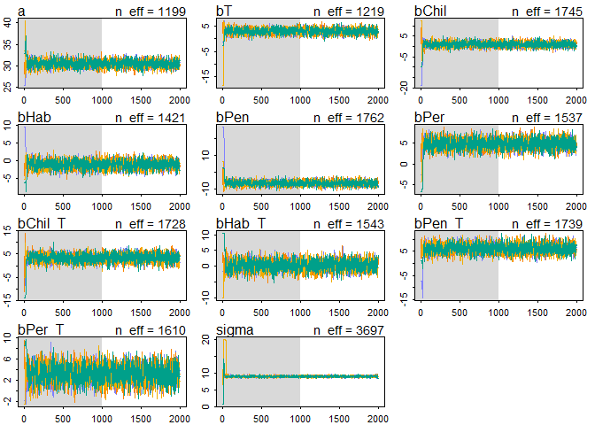<!-- -->

```r
plot(precis(species.trt.stan_interaction))
```

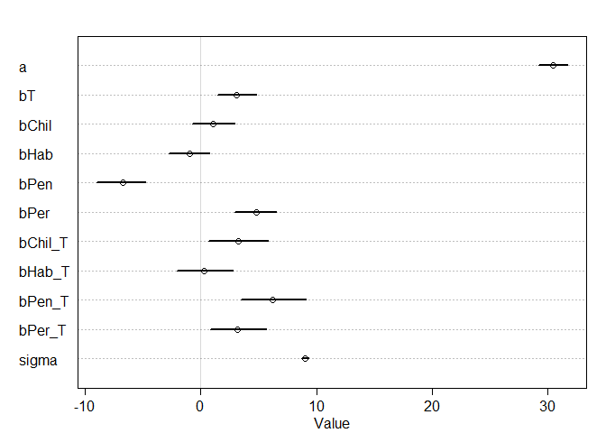<!-- -->
